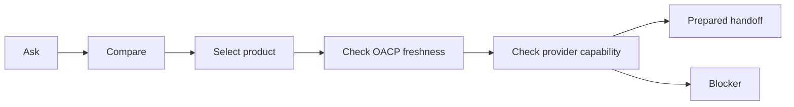

# The Buyer Journey From Question To Prepared Purchase Handoff

## Summary

OACP supports a safe buyer journey: ask, compare, select, check freshness, verify provider capability, then prepare a handoff or refuse.

## Target Audience

Buyer-experience designers, channel teams, and operators.

## Architecture Diagram

## End-To-End Flow

The buyer asks a product question. AgenticOrg answers from cache with source labels. The buyer asks to buy. AgenticOrg checks catalog, price, inventory, policy, mandate capability, protocol adapter, and freshness records. It returns a prepared handoff if allowed or a clear blocker.

## What Is Implemented Now

AgenticOrg has buyer Q&A, product listing, protocol adapters, bridge endpoints, provider capability verification, and purchase-preparation routes. Grantex authority artifacts support the source and policy inputs.

## What Requires External Approval Or Config

Provider rail execution, merchant order system integration, channel approvals, and public launch acceptance.

## Failure Modes

- Product no longer in valid cache.
- Price/inventory artifact missing.
- Provider evidence missing or stale.
- Buyer requests payment success from the agent.

## Safe User Wording Examples

- "I can prepare a handoff for review."
- "The provider capability evidence is stale; no payment was attempted."
- "The merchant system remains the source of order status."
