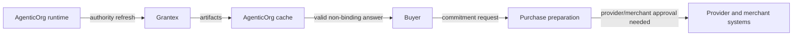

# Why Grantex Is Not A Transaction Toll Booth

## Summary

Grantex is the OACP authority, not a relay for every buyer message. Valid cached artifacts let AgenticOrg answer non-binding questions while commitment requests remain gated.

## Target Audience

Architects, operators, and platform buyers.

## Architecture Diagram

## End-To-End Flow

Grantex signs the trust artifact. AgenticOrg stores a scoped cache. Buyer questions use the cache until freshness or revocation fails. Purchase requests must use approved merchant/provider/channel paths and cannot be converted into success by cache alone.

## What Is Implemented Now

The authority endpoint issues/refuses artifacts. AgenticOrg cache and bridge routes consume them for Q&A and prepared handoff.

## What Requires External Approval Or Config

Public tenant launch, provider rail execution, and channel rollout.

## Failure Modes

- Cache used past TTL.
- Commitment request treated like a discovery request.
- Grantex outage misunderstood as permission to execute.

## Safe User Wording Examples

- "Grantex signed the source artifact; AgenticOrg answered from valid cache."
- "A valid cache supports discovery, not payment authority."
- "This request needs provider or merchant approval before execution."
