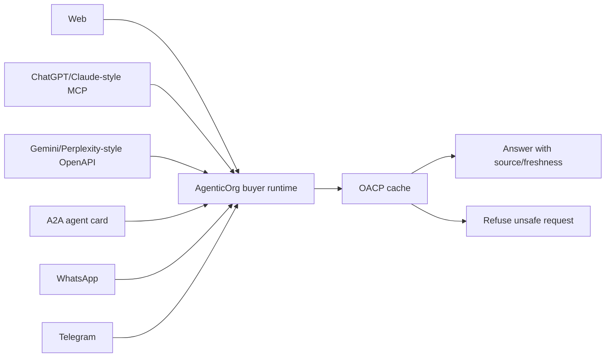

# How ChatGPT, Claude, Gemini, Perplexity, WhatsApp, And Telegram Can Shop Through Seller Agents

## Summary

Buyer surfaces differ in transport, not truth. AgenticOrg should route web, MCP, OpenAPI, A2A, WhatsApp, and Telegram through the same OACP cache-backed answer path.

## Target Audience

Developer platform teams, channel partners, and customer-success teams.

## Architecture Diagram

## End-To-End Flow

1. Channel receives buyer question.
2. AgenticOrg normalizes to the buyer-session ask path.
3. Runtime checks OACP cache and source labels.
4. Low-risk answers are returned consistently.
5. Commitment-bound requests use purchase preparation and provider capability checks.

## What Is Implemented Now

AgenticOrg exposes web ask, OpenAPI ask/schema, A2A card, surface matrix, WhatsApp webhook, Telegram webhook, product listing, protocol adapters, and purchase preparation routes.

## What Requires External Approval Or Config

Channel webhook secrets, channel policies, public client review, and provider rail approval.

## Failure Modes

- Webhook secret missing.
- Channel payload cannot be normalized.
- Cache is stale.
- Buyer requests commitment without valid provider evidence.

## Safe User Wording Examples

- "I found this from the merchant source snapshot."
- "This channel can prepare a handoff, but it cannot complete payment."
- "The Telegram/WhatsApp bridge needs verified webhook setup before it can accept messages."
