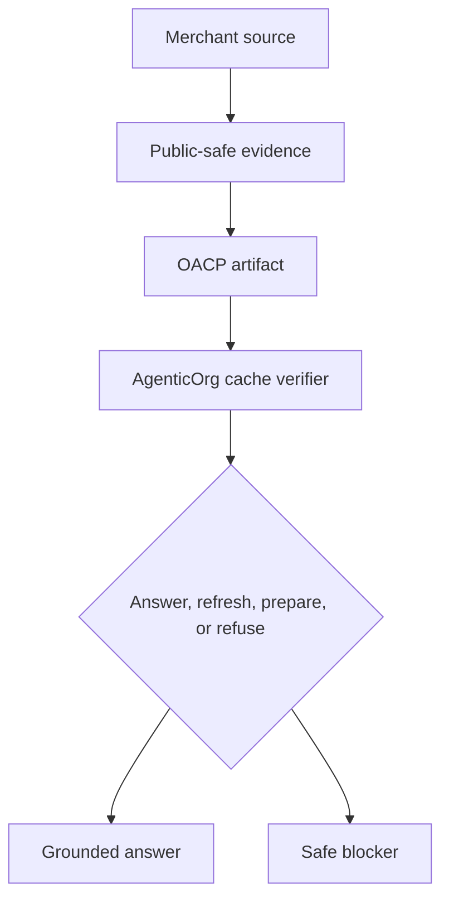

# Why OACP Keeps Buyer Agents Honest

## Summary

OACP gives buyer agents a hard evidence model: source refs, freshness, TTL, revocation posture, risk tier, and blocked capabilities. If those fields do not support the answer, the agent must refresh or refuse.

## Target Audience

Buyer-agent builders, safety reviewers, and commerce operators.

## Architecture Diagram

## End-To-End Flow

The buyer asks a question. AgenticOrg checks cached OACP artifacts for scope, source, freshness, revocation, and risk. Low-risk questions can be answered with labels. Commitment-bound questions require stricter checks and can only prepare handoff or refuse.

## What Is Implemented Now

Grantex emits artifact families and non-enablement flags. AgenticOrg checks cache records before answering and uses safe blockers for stale or unsupported requests.

## What Requires External Approval Or Config

Channel launch, provider capability checks, merchant policy scope, and any future execution controller path.

## Failure Modes

- Artifact missing from cache.
- Artifact expired.
- Revocation snapshot too old for the action.
- Buyer asks for payment/order/mandate without provider evidence.
- Source and adapter fields disagree.

## Safe User Wording Examples

- "I can answer from the current merchant source snapshot."
- "I cannot invent stock or price beyond the artifact."
- "No checkout, payment, or order has occurred."
