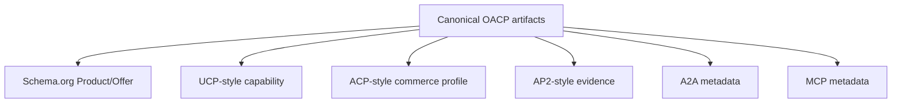

# How OACP Maps To Schema.org, UCP, ACP, AP2, A2A, And MCP

## Summary

OACP is the canonical trust artifact. Protocol adapters project OACP facts into known client and partner shapes while preserving source, freshness, and non-execution boundaries.

## Target Audience

Protocol partners, developers, and technical reviewers.

## Architecture Diagram

## End-To-End Flow

Grantex issues OACP artifacts. AgenticOrg caches them. Adapter payloads are generated from those artifacts for a channel. Unsupported fields stay unsupported instead of being filled with guessed execution state.

## What Is Implemented Now

Grantex contains Schema.org, UCP-style, ACP-style, and AP2-style preview helpers. AgenticOrg generates protocol adapter payloads including Schema.org, UCP-style, ACP-style, AP2-style, A2A, MCP, and OpenAPI views.

## What Requires External Approval Or Config

Any external program claim requires partner review and published evidence. Current docs describe compatibility mapping only.

## Failure Modes

- Adapter field has no canonical artifact lineage.
- Adapter implies checkout or payment execution.
- Source or freshness labels are dropped.

## Safe User Wording Examples

- "This is an OACP compatibility mapping."
- "The payload is buyer-safe metadata, not payment authority."
- "Unsupported execution fields are omitted or blocked."
