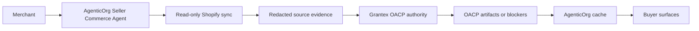

# How A Shopify Merchant Becomes An Agentic Commerce Seller

## Summary

A Shopify merchant becomes an agentic commerce seller through AgenticOrg merchant self-service configuration, Seller Commerce Agent onboarding, read-only Shopify sync, Grantex OACP authority artifacts, and buyer-safe cache consumption.

## Target Audience

Merchants, AgenticOrg operators, and Grantex reviewers.

## Architecture Diagram

## End-To-End Flow

1. Merchant saves tenant/merchant/store-scoped source, channel, provider, public publishing, and POS settings in AgenticOrg.
2. Merchant creates or updates a Seller Commerce Agent in AgenticOrg.
3. AgenticOrg stores Shopify credential custody outside Grantex.
4. AgenticOrg syncs public-safe catalog, price, image, and inventory evidence.
5. AgenticOrg requests Grantex C6Z authority artifacts.
6. Grantex issues or refuses OACP artifacts.
7. AgenticOrg caches artifacts and answers buyer questions with labels.
8. Purchase intent becomes a prepared provider/POS/merchant handoff or blocker.

## What Is Implemented Now

Grantex has the C6Z authority route, internal artifact issuance, adapter mapping, artifact verification helpers, and focused tests. AgenticOrg owns merchant self-service config, seller onboarding, Shopify sync, cache intake, buyer Q&A, bridge endpoints, public catalog publishing, Offline POS handoff, and Plural/Pine capability verification.

WooCommerce, ERP, PIM, OMS, WMS, custom API, bank-owned rail, fintech rail, and custom provider setup can be recorded in AgenticOrg as pending-adapter config. Grantex should not treat those refs as live source or payment execution until an approved adapter and evidence path exists.

## What Requires External Approval Or Config

Merchant Shopify credentials, AgenticOrg tenant allowlist, provider or bank rail approval, channel webhook approvals, POS callback approval, and partner review for any public program claim.

## Failure Modes

- Shopify credentials missing or invalid.
- Source evidence stale.
- Tenant not allowlisted.
- Artifact scope requests private or executable authority.
- Provider capability evidence missing or stale.

## Safe User Wording Examples

- "This answer is based on a Shopify snapshot authorized by Grantex."
- "I can prepare a review handoff, but no payment or order was created."
- "The source evidence is stale. I need a refresh before continuing."
