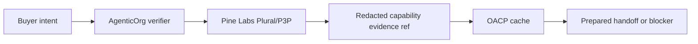

# How Pine Labs Plural/P3P Mandate Capability Fits Into Agentic Commerce

## Summary

Plural/Pine owns the mandate and payment rail. AgenticOrg verifies provider-owned capability metadata and Grantex can carry redacted evidence refs in OACP artifacts.

## Target Audience

Fintech partners, payment operators, and commerce risk teams.

## Architecture Diagram

## End-To-End Flow

AgenticOrg checks whether provider capability metadata is available for the merchant and requested action. The result becomes a redacted evidence ref. Grantex OACP policy can require that evidence before a handoff is prepared.

## What Is Implemented Now

AgenticOrg has a Plural/Pine capability verifier and purchase-preparation blocker. Grantex models mandate capability as an OACP artifact family and marks provider execution authority as provider-owned.

## What Requires External Approval Or Config

Provider credentials, environment approval, webhook/reconciliation path, merchant approval, and rollback owner.

## Failure Modes

- Provider config missing.
- Sandbox/non-production environment mismatch.
- Capability evidence older than allowed TTL.
- Buyer asks to create a mandate from cache only.

## Safe User Wording Examples

- "Provider capability evidence is present for preparation only."
- "No mandate, payment, or order was created."
- "Provider setup is missing; the request is blocked."
