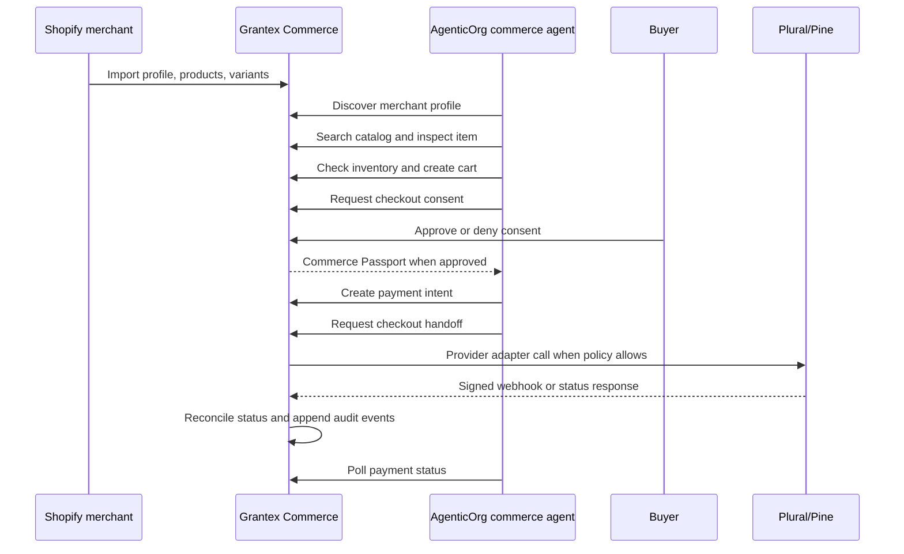

Grantex Commerce V1 is now live for the approved Shopify pilot merchant
`mch_shopify_mgx0n6_22`, imported from `mgx0n6-22.myshopify.com`.

The important design choice is still the same: the agent does not get direct
payment-provider credentials or private merchant-system access. AgenticOrg uses
Grantex commerce tools. Grantex owns the consent, Commerce Passport, merchant
policy, payment-control, webhook, reconciliation, and audit boundary.

## What Is Deployed

The live pilot currently has:

- Shopify merchant profile imported as `mch_shopify_mgx0n6_22`.
- Tenant `cten_shopify_mgx0n6_22`.
- AgenticOrg commerce agent `cag_agenticorg_mgx0n6_22`.
- Five Shopify products and five variants available through Grantex catalog
  search.
- Commerce discovery metadata at
  `https://api.grantex.dev/.well-known/grantex-commerce`.
- Plural webhook intake at
  `https://api.grantex.dev/v1/webhooks/providers/plural`.
- Live Commerce V1 runtime flags and live-readiness acknowledgements enabled.
- Reconciliation worker enabled.
- Operator health reporting green for database, mock adapter, Plural adapter,
  and reconciliation.

Plural credentials currently authenticate against Plural UAT-compatible rails.
That makes the adapter and webhook path operational for the pilot, but this post
does not claim production Plural settlement certification.

## End-To-End Flow



## Step 1: Import The Merchant

The pilot starts from the real Shopify shop profile. The importer reads the
shop profile and active products, normalizes the catalog into Grantex commerce
tables, archives stale Shopify-imported rows, and appends an audit event.

The production result is intentionally small and reviewable:

| Field | Value |
| --- | --- |
| Shopify shop | `mgx0n6-22.myshopify.com` |
| Merchant ID | `mch_shopify_mgx0n6_22` |
| Tenant ID | `cten_shopify_mgx0n6_22` |
| Currency | `INR` |
| Country | `IN` |
| Product count | 5 |
| Variant count | 5 |

No Shopify token, Grantex API key, provider credential, webhook secret, passport,
or database URL is included in docs or evidence.

## Step 2: Publish The Merchant Profile

Agents can retrieve the approved merchant profile through:

```bash
curl "https://api.grantex.dev/.well-known/grantex-commerce?merchant_id=mch_shopify_mgx0n6_22"
```

The profile tells agents which Grantex-native REST and MCP surfaces are
available. It also reports the live-pilot posture: live payments and live Plural
runtime flags are enabled for the approved pilot, while provider credentials
remain hidden.

## Step 3: Ground Catalog Search

AgenticOrg searches catalog through Grantex, not Shopify directly:

```http
POST /v1/commerce/catalog/search
Authorization: Bearer <agent-api-key>
Content-Type: application/json

{
  "merchant_id": "mch_shopify_mgx0n6_22",
  "limit": 5
}
```

The live smoke returns the five imported products. Agents must use returned
product and variant IDs; they must not invent price, stock, warranty, return, or
delivery facts.

## Step 4: Create Cart, Consent, And Passport

Checkout-affecting work is consent-first:

1. The agent creates a cart from grounded variant IDs.
2. The agent asks Grantex for a consent request.
3. The buyer approves or denies the request in Grantex.
4. Grantex issues a scoped Commerce Passport only after consent and policy pass.

The Commerce Passport is runtime-sensitive material. It should never appear in
logs, docs, screenshots, tickets, or chat.

## Step 5: Create Payment Intent And Checkout Handoff

The agent creates a provider-neutral payment intent through Grantex. Grantex
checks tenant ownership, merchant status, active policy, amount caps, passport
scope, idempotency, and live-readiness controls before any provider-affecting
work proceeds.

AgenticOrg never receives Plural credentials and never calls Pine or Plural
directly for this flow.

## Step 6: Receive Plural Webhook And Reconcile

Plural/Pine webhook callbacks are pointed at:

```text
https://api.grantex.dev/v1/webhooks/providers/plural
```

The route verifies provider headers and signature material before processing.
Unsigned or missing-header requests fail with `webhook_signature_invalid`.
That is the expected fail-closed result for unauthenticated probes.

Reconciliation runs as a background safety net and updates payment status from
safe provider state when needed.

## Step 7: Audit The Flow

Every protected transition writes safe audit evidence. Audit records may include
IDs, policy versions, decision references, hashes, provider reference IDs, and
normalized error codes. They must not include bearer tokens, raw passports, raw
credentials, webhook secrets, raw signatures, payment card data, database URLs,
Redis URLs, or plaintext idempotency keys.

## What This Launch Means

This is a live Grantex control-plane pilot for a named Shopify merchant. It
proves the end-to-end OACP path from merchant profile and catalog grounding to
AgenticOrg tool use, consent, Commerce Passport, payment intent, Plural webhook
intake, reconciliation, and audit.

It does not claim broad merchant self-service, provider certification, or
production Plural settlement while the available Plural credentials authenticate
against UAT-compatible rails.
