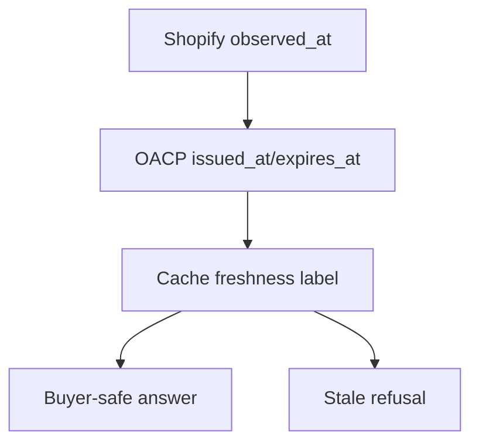

# Source, Freshness, And Trust In AI Commerce

## Summary

AI commerce fails when agents invent old prices, stale inventory, or unsupported payment outcomes. OACP makes source and freshness first-class fields.

## Target Audience

Product managers, buyer-agent designers, and operators.

## Architecture Diagram

## End-To-End Flow

Source systems timestamp facts. Grantex artifacts carry issue and expiry windows. AgenticOrg cache computes freshness labels. Buyer responses show source and freshness. Stale data blocks commitment-bound action.

## What Is Implemented Now

Artifact TTLs, source refs, freshness labels, revocation posture, cache verification, and stale blockers exist in Grantex and AgenticOrg runtime code.

## What Requires External Approval Or Config

Merchant-specific source precedence, public channel wording review, and source conflict policy.

## Failure Modes

- A source has not been refreshed.
- Different source systems disagree.
- The response hides source/freshness labels.
- A stale artifact is used for commitment.

## Safe User Wording Examples

- "Source: Shopify via Grantex artifact."
- "Freshness: current within the configured artifact window."
- "This snapshot is stale, so I cannot prepare purchase handoff."
