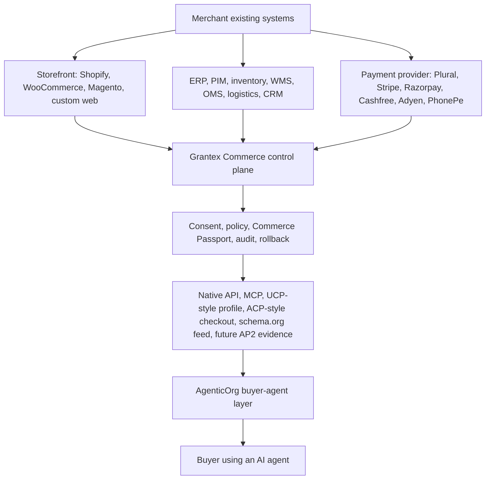

# Agentic Commerce Implementation PRD

This document explains what still needs to be built before merchants can
self-serve into agentic commerce using Grantex and AgenticOrg.

For the consolidated source of truth, read
`docs/guides/commerce-v1-agentic-commerce-prd.md`. This implementation PRD is a
supporting summary and must not diverge from that canonical document.

It is written for founders, merchants, operators, product teams, and engineers.
The short version is simple:

> Merchants should connect the systems they already run today. Grantex turns
> those systems into safe, governed commerce capabilities for AI agents.
> AgenticOrg uses only the Grantex-approved tools to help buyers discover,
> compare, draft carts, request consent, and follow the checkout journey.

This document is not a rollout approval. It does not enable production Commerce
V1, public discovery, checkout/payment creation, live payments, live Plural, or
any production allowlist.

## 1. Architecture In Plain English

Grantex is the merchant control plane. It owns merchant profile, tenant
boundary, catalog truth, inventory freshness, policy, consent, Commerce Passport,
payment-provider abstraction, audit, and operational rollback.

AgenticOrg is the agent and workflow layer. It may help users shop, ask
questions, draft carts, request consent, and display checkout state, but it must
not become the source of truth for merchants, products, inventory, price,
policy, payment credentials, settlement, or refunds.

### End-To-End Operating Flow

The detailed buyer and seller walkthrough is documented in
`docs/guides/commerce-v1-end-to-end-agentic-commerce-flow.mdx`.

Seller one-time setup:

1. Create Grantex merchant workspace, tenant boundary, owners, roles, and
   sandbox/live environment split.
2. Verify merchant identity and keep private artifacts outside repos.
3. Connect existing systems: storefront, catalog, ERP/PIM, inventory/WMS, OMS,
   logistics, payment provider, CRM/support, or CSV/API.
4. Declare source-of-truth precedence for catalog, price, inventory, order,
   fulfillment, support, and payment data.
5. Configure category preset, required public fields, return/warranty policy,
   tax, shipping, payment, support, and rollback ownership.
6. Select allowed agent capabilities and buyer channels.
7. Run scans, readiness scoring, human review gates, sandbox rehearsal, and
   rollback checks.
8. Request the smallest approved rollout, usually read-only discovery first.

Buyer one-time setup:

1. Choose an approved chat or agent surface, such as ChatGPT, Claude, Gemini,
   WhatsApp, Telegram, web/mobile, or a future channel.
2. Link or sign in to create a buyer-agent session.
3. Set safe preferences such as locale, currency, delivery region, notification
   path, and accessibility needs.
4. See what actions the channel can support and what remains blocked.
5. Approve or deny each payment-affecting action through Grantex consent.

Regular transaction:

1. Buyer asks the agent to discover, compare, or buy.
2. AgenticOrg asks Grantex for merchant and channel capability state.
3. AgenticOrg reads product, price, inventory, delivery, return, and checkout
   facts only from Grantex.
4. Grantex uses synced seller systems and canonical policy to return grounded
   answers or blocker codes.
5. AgenticOrg creates a cart draft only with exact Grantex variant IDs.
6. Grantex recalculates totals, policy, amount caps, inventory freshness, and
   eligibility.
7. Buyer approves or denies consent in the Grantex handoff.
8. Grantex issues scoped Commerce Passport status only when consent and policy
   pass.
9. AgenticOrg requests payment intent and checkout only through Grantex.
10. Grantex owns provider interaction, webhook reconciliation, order,
    fulfillment, support, return/refund handoff, settlement, audit, and rollback.
11. AgenticOrg shows buyer-safe status and refuses unsupported claims.

## 2. Current Implementation Snapshot

The repo already has important foundations:

| Capability | Current implementation evidence | Current state |
| --- | --- | --- |
| Merchant and tenant control plane | Commerce tenants, merchants, merchant API keys, operator and merchant caller resolution, emergency disable/re-enable, commerce dashboard pages. | Foundation exists; self-serve runtime onboarding is still incomplete. |
| Category presets | Commerce category preset migration and policy defaults. | Foundation exists; merchant-facing preset workflow needs hardening. |
| Catalog and variants | Product/variant create, list, search, item detail, bulk dry-run/upsert, patch, archive, CSV/JSON-oriented portal support. | Good V1 base; large async imports and real connector sync still pending. |
| Inventory | Variant availability buckets and freshness fields: `in_stock`, `out_of_stock`, `pre_order`, `back_order`, `unknown`, `last_synced_at`. | Enough for read-only discovery; not enough for reservations, location stock, delivery promise, or quantity accounting. |
| Consent and Commerce Passport | Consent request, exchange, verify, revoke, challenge flow, scoped passport checks. | Core trust layer exists; production delivery and AP2-style signed mandate evidence still pending. |
| Cart and payment intent | Cart draft and provider-neutral payment intent endpoints with idempotency and amount-cap checks. | Mock/sandbox path foundation exists; live provider path remains gated. |
| Provider credentials and webhooks | Provider credential storage/validation path, provider webhook intake, replay, reconciliation metadata, ops health. | Foundation exists; live Plural/provider readiness still requires approvals and stronger evidence. |
| Merchant webhooks | Signed merchant webhook source and `catalog.product.updated` intake. | Good first sync event; price-only, inventory-only, order, fulfillment, return, and support webhooks are pending. |
| MCP/native agent surface | `merchant.get_profile`, `catalog.search`, `catalog.get_item`, `inventory.check`, `cart.create`, `checkout.create`, `payment.create_intent`, `payment.get_status`. | Correct agent surface; public discovery remains fail-closed. |
| Docs navigation | Commerce V1 docs group exists in `docs/docs.json`. | Updated by this PRD pass to include this implementation PRD. |
| Deploy workflow guard | Auth-service and portal deploy workflows have path filters for runtime paths. | Docs-only changes should not trigger Grantex deploy workflows, but CI still runs broad validation. |

## 3. Target Merchant Journey

The full self-serve journey should feel like this:

1. Merchant creates a Grantex Commerce account.
2. Merchant chooses a business category such as electronics, fashion, home,
   grocery, pharmacy, services, or B2B.
3. Merchant connects an existing system or uploads a catalog.
4. Grantex shows a preview of the merchant profile, catalog, prices, inventory,
   warranty, return policy, and public discovery text.
5. Merchant selects what AI agents may do:
   - browse only;
   - create cart drafts;
   - request checkout consent;
   - read order status;
   - request support or return handling.
6. Grantex runs automated checks for secrets, private data, stale inventory,
   missing policies, overclaims, and unsupported live paths.
7. Legal, product, security, ops, rollback, smoke, and evidence owners approve
   the launch packet.
8. Merchant rehearses the sandbox flow with synthetic or sandbox data.
9. Merchant requests production rollout.
10. Grantex enables the smallest approved surface first, usually read-only
    discovery, then expands only after smoke evidence and rollback readiness.

## 4. Existing Merchant Systems

Merchants should not be asked to rebuild their businesses for agents. Grantex
must connect to the systems they already use.

| Existing merchant system | Data Grantex should use | Grantex target model | Fast-track approach |
| --- | --- | --- | --- |
| Shopify, WooCommerce, Magento, custom storefront | Product, variant, media, price, availability, categories, collections. | `CommerceProduct`, `CommerceProductVariant`, catalog readiness, public-safe feed. | Start with CSV/manual plus one high-priority connector family. Add webhook freshness. |
| ERP or PIM | Product master, brand, attributes, tax codes, SKU hierarchy, category truth. | Canonical catalog and category preset mapping. | Let merchant declare source-of-truth precedence. Record sync source and timestamp. |
| WMS or inventory system | Stock state, quantity, location, reservation, delivery feasibility. | Future inventory level and reservation models. | Keep V1 availability buckets for browse; require stronger model before checkout promises. |
| OMS | Order creation, order ID, status, cancellation, fulfillment, return status. | Future order and fulfillment timeline. | Required before live checkout at scale. Start with create/read/status webhook. |
| Logistics provider | Delivery slots, pickup slots, tracking, failed delivery events. | Fulfillment options, tracking events, delivery promise evidence. | Needed for UCP order/fulfillment capability and buyer trust. |
| Payment provider | Payment intent/order, hosted checkout, status webhook, settlement, refunds. | Provider-neutral payment intent, webhook event, reconciliation, payout reporting. | Credentials and webhooks stay in Grantex only. Start mock/sandbox, then approved provider. |
| CRM/support desk | Ticket ID, support conversation, refund request, return request. | Support handoff and post-purchase timeline. | Start with manual handoff/reference; automate only after policy gates. |

Connector rule:

> A connector imports data. It does not make a merchant live. Live agent access
> requires readiness checks, merchant approval, policy activation, consent, audit,
> and rollback ownership.

## 5. Standards And Protocol Fit

Grantex should maintain one canonical commerce model and publish protocol views
from it. The system must not create one separate database per protocol.

| Surface | Relevant external idea | Grantex implementation requirement |
| --- | --- | --- |
| Native Grantex API | First-party API for merchant, catalog, consent, payment, audit, and ops. | Continue as source of truth and enforcement surface. |
| MCP | Agent tool transport. UCP also lists MCP among supported transports. | Expose only policy-checked tools backed by Grantex APIs. |
| UCP-style capability profile | UCP discovery uses business/platform profiles, services, capabilities, negotiation, and transports such as REST, MCP, A2A, and embedded. See [UCP overview](https://ucp.dev/specification/overview/). | Publish profiles only from approved merchant capability state. Do not claim UCP certification until conformance tests exist. |
| ACP-style checkout | Stripe ACP describes agentic checkout create, retrieve, update, complete, cancel, order, and refund concepts. See [Stripe ACP specification](https://docs.stripe.com/agentic-commerce/protocol/specification). | Map Grantex cart/payment/order state into ACP-compatible shapes where provider and merchant support it. |
| AP2-style mandate evidence | AP2 secures agent-performed payments through authorization evidence and mandates. See [AP2 specification](https://ap2-protocol.org/ap2/specification/). | Map Commerce Passport, consent record, policy decision, checkout cart hash, amount cap, and audit hash into future signed evidence. |
| schema.org | Product, Offer, shipping, and return policy metadata are represented by schema.org types. See [Product](https://schema.org/Product), [Offer](https://schema.org/Offer), [OfferShippingDetails](https://schema.org/OfferShippingDetails), and [MerchantReturnPolicy](https://schema.org/MerchantReturnPolicy). | Generate public-safe JSON-LD/feed output from approved catalog and policy fields only. |

Do not claim certified UCP, ACP, AP2, MPP, A2A, live-provider, or schema.org
production readiness until implementation, tests, approvals, and release
evidence exist.

## 6. Comprehensive Gap Register

| Gap | User impact | Required implementation | Owning repo | Release gate |
| --- | --- | --- | --- | --- |
| Self-serve merchant signup | Merchant cannot join without operator work. | Signup, tenant creation, merchant profile, owner invite, category preset, sandbox/live environment split, onboarding checklist. | Grantex | Merchant can complete sandbox profile without engineering support. |
| KYB/KYC and legal evidence | Real merchant identity cannot be trusted. | Private artifact references, legal/compliance decision, verification state machine, evidence retention. | Grantex plus external reviewers | No live mode without approved identity and evidence references. |
| Merchant role model | Owners, developers, ops, support, and finance users need different powers. | RBAC for owner, developer, catalog manager, ops, support, finance, auditor, rollback owner. | Grantex | Sensitive actions require correct role and audit. |
| Existing-system connector framework | Merchants need their existing stores to sync. | Connector registry, source-of-truth precedence, credential isolation, sync jobs, webhook source health, retry and reconciliation. | Grantex | Connector cannot expose agent capabilities by itself. |
| Large catalog import | Real merchants have many SKUs. | Async import jobs, dry-run diff, row-level errors, duplicate handling, rollback, idempotency, import history. | Grantex | Import can be retried and audited without data loss. |
| Catalog data quality | Agents need complete public-safe product facts. | Required field checks by category, image validation, brand/model/specs, warranty summary, return summary, tax/GST metadata. | Grantex | Readiness score blocks missing critical fields. |
| Inventory depth | Agents must not promise unavailable stock. | Quantity, location, stock confidence, freshness TTL, source system, future reservation/stock hold. | Grantex | Checkout blocked or warned when stale/unknown. |
| Delivery and pickup promise | Buyers need delivery confidence before checkout. | Delivery options, pickup slots, address serviceability, shipping fee/tax, delivery ETA, carrier/logistics integration. | Grantex | No delivery promise without fresh evidence. |
| Pricing, tax, offers, EMI | Agents need correct totals. | Price freshness, tax inclusivity, GST slab, shipping/handling, coupons, discounts, EMI/affordability metadata behind provider adapter. | Grantex | Agent cannot invent discounts or affordability. |
| Cart update lifecycle | ACP and real checkout need update/cancel flows. | Cart update, recalculate totals, fulfillment option selection, cancel/expire, buyer messages. | Grantex | Idempotent update and audit coverage. |
| Order lifecycle | Payment without order operations is incomplete. | Order create/read/list, order status, order permalink/reference, status webhooks, manual review, cancellation. | Grantex | Paid checkout creates or references an order. |
| Fulfillment lifecycle | Merchant ops need shipment and pickup tracking. | Fulfillment status, shipment tracking, pickup/delivery slots, partial fulfillment, failed delivery event. | Grantex | Buyer-agent can read only verified status. |
| Returns and refund requests | Post-purchase trust needs a safe path. | Return/refund request, eligibility preview, manual approval, provider handoff, audit, future provider execution. | Grantex | No automatic refund execution until separately approved. |
| Settlement and payouts | Merchants need to know when they are paid. | Settlement/payout read model, provider reconciliation, fee/tax summary, payout export. | Grantex | No raw provider payload exposure. |
| Live provider readiness | Payments need approved credentials and webhooks. | Sandbox validation, live credential approval, webhook signature, replay window, provider outage handling, rollback. | Grantex | Live provider remains blocked until approvals exist. |
| Commerce Passport production delivery | Users need real consent challenge delivery. | Verified email/SMS/passkey challenge, revocation freshness, signed evidence, user-facing revocation history. | Grantex | No payment-affecting action without valid passport. |
| Policy simulator | Merchants need to understand agent permissions. | Simulate policy for product/category/amount/agent/channel before activation. | Grantex | Policy activation requires preview and audit. |
| UCP/ACP/schema.org adapters | Large agent platforms need standard surfaces. | Generate standard views from canonical objects, conformance fixtures, versioned capability profile. | Grantex | Adapter tests and no unsupported certification claims. |
| AP2-style evidence | Agent payments need non-repudiation. | Intent/cart/payment evidence mapping, hashes, signatures, key rotation, replay defense. | Grantex | Do not claim AP2 until deterministic verification exists. |
| AgenticOrg buyer workflow | Buyers need a safe assistant experience. | Grounded discovery, comparison, cart drafting, consent request, checkout state, refusal copy. | AgenticOrg | Agent never invents seller/product/price/inventory/payment state. |
| AgenticOrg merchant demo workflow | Merchants need to understand launch. | Demo scripts, status labels, capability preview, blocked-path examples, non-approval disclaimers. | AgenticOrg | Demo remains synthetic or sandbox until Grantex approves real data. |
| Ops and support dashboards | Teams need to fix failed runs. | Failed checkout, webhook replay, stale sync, stuck payment, policy denial, support handoff, incident runbook. | Grantex, AgenticOrg reads where needed | On-call and rollback owners assigned. |
| Analytics and attribution | Merchants need business value proof. | Agent channel attribution, funnel, conversion, refusal reasons, lost sale due to stale data, revenue by agent. | Grantex source, AgenticOrg contribution | Metrics are derived, not raw secrets. |
| Documentation coverage | Merchants and reviewers need a shared source of truth. | docs navigation, layman guides, API docs, runbooks, stop conditions, evidence templates, PRD links. | Both repos | Docs updated before implementation slices. |
| GitHub workflow safety | Docs-only planning should not build/push images. | Path guards for deploy-adjacent jobs, docs-only validation, workflow-change caveat handling. | Both repos | No cloud build/push on docs-only planning merges. |
| Landing page coverage | Prospects need clear positioning without overclaiming. | Merchant-facing page copy for "connect existing systems, preview agent surface, request approval"; no live/certified claims. | Product/web repos | Copy reviewed before public launch. |

## 7. Fast-Track Plan

| Slice | Goal | Merchant-visible result | Scope boundary |
| --- | --- | --- | --- |
| A. Self-serve sandbox onboarding | Merchant creates sandbox commerce profile. | Merchant sees checklist and "not live" state. | No public discovery or payments. |
| B. Catalog connector MVP | Merchant imports products from CSV/manual plus one priority connector. | Products and variants appear in Grantex preview. | No checkout promises yet. |
| C. Read-only discovery preview | Merchant sees what agents can read. | Public-safe profile/catalog preview and schema.org draft. | Fail-closed until approved. |
| D. Inventory freshness | Agent can warn/refuse stale stock. | Merchant sees stale SKUs and freshness score. | No quantity reservation yet. |
| E. Sandbox cart and consent | Buyer can rehearse cart and consent. | Commerce Passport demo with mock/sandbox provider. | No live provider. |
| F. Order and fulfillment backbone | Paid flow has operational home. | Order reference, status, cancellation, fulfillment events. | Required before broad checkout. |
| G. Return/refund request | Support has safe post-purchase path. | Manual return/refund request and audit. | No automatic refund execution. |
| H. Protocol adapters | Agent platforms see standard surfaces. | UCP-style profile, ACP-style checkout shapes, schema.org JSON-LD, AP2 evidence draft. | No certification claim until tests. |
| I. Controlled real merchant pilot | One merchant, category, geography, provider, and rollback owner. | Minimal approved live surface. | Separate rollout approval only. |

## 8. Implementation Requirements By Surface

| Surface | Minimum implementation requirement | Acceptance criteria |
| --- | --- | --- |
| Merchant dashboard | Onboarding checklist, category preset, connected systems, readiness score, preview, approvals, rollout state, rollback owner. | A non-engineer merchant can see what is missing and why launch is blocked. |
| Merchant API | Tenant-safe create/read/update for profile, catalog, inventory, policy, connector source, webhook source, and readiness status. | Every UI action has an equivalent API or is explicitly documented as operator-only. |
| Connector framework | Source type, credential reference, sync status, last run, last success, stale state, row-level errors, retry, disable. | A failed sync cannot silently publish stale facts to agents. |
| Catalog model | Product, variant, media, category, price, tax, warranty, return summary, source system, freshness. | Agent answers are grounded in exact product/variant IDs. |
| Inventory model | Availability bucket now; future quantity, location, reservation, confidence, TTL. | Unknown or stale inventory produces warning/refusal, not a guarantee. |
| Cart/checkout model | Cart draft, cart update, fulfillment option, consent request, passport, payment intent, checkout link, cancel/expire. | Checkout cannot progress without consent, policy, idempotency, and audit. |
| Order model | Order reference, status, line items, payment reference, fulfillment status, cancellation, support link. | Paid checkout has an operational record merchants can act on. |
| Return/refund model | Request, eligibility, manual approval, provider handoff, status, audit. | Refund execution remains blocked until separate provider approval. |
| Settlement model | Provider-neutral payout/settlement records, fees, taxes, reconciliation status, export. | Merchant can answer "when do I get paid?" without raw provider payloads. |
| Protocol adapters | UCP-style profile, MCP tools, ACP-style checkout/order mapping, schema.org feed, AP2 evidence draft. | Generated from canonical objects with conformance fixtures and no unsupported claims. |
| External buyer channels | Capability-safe channel metadata for ChatGPT, Claude, Gemini, WhatsApp, Telegram, web/mobile, and future agent surfaces. | A channel cannot show checkout/payment capability unless Grantex approves the merchant, tool scope, consent, and policy state for that channel. |
| Audit and observability | Append-only audit, redacted logs, metrics, runbooks, replay controls, incident severity. | No protected action is acknowledged without durable audit evidence. |
| Security and privacy | Credential isolation, secret redaction, tenant filtering, role checks, webhook signatures, rate limits. | Cross-tenant and secret-exposure tests fail closed. |

## 9. Release Acceptance Criteria

Before any real merchant pilot, all of these must be true:

- The merchant completed self-serve sandbox onboarding and selected a category
  preset.
- Legal/compliance, product wording, security, ops/support, rollback, smoke,
  and evidence retention owners are recorded as non-secret references.
- Existing-system connectors are either connected and healthy or explicitly
  replaced by approved manual/CSV maintenance.
- Catalog, price, tax, warranty, return policy, and inventory freshness checks
  pass for the selected category.
- schema.org output is generated only from approved public-safe fields.
- AgenticOrg sees only Grantex-published capabilities.
- Checkout/payment creation remains blocked until Commerce Passport consent,
  policy, audit, idempotency, provider readiness, and rollback checks pass.
- Orders, fulfillment, support, and refund handoff are available for any paid
  flow in the pilot category.
- UCP/ACP/AP2 compatibility language is backed by implementation and tests, or
  clearly described as planned/future compatibility.
- GitHub checks pass or skip by documented policy, and docs-only changes do not
  trigger cloud auth, image build, image push, deploy, or indexing jobs.

## 10. Public Landing Page Copy Draft

Use this as the safe public positioning once product/web owners decide to update
landing pages:

> Grantex Commerce helps merchants prepare for agentic commerce by connecting
> their existing store, catalog, inventory, payment, order, and support systems
> into one governed control plane. Merchants can preview what AI agents may see,
> choose allowed capabilities, run safety checks, and request approval before
> anything becomes public.

Safe bullets:

- Connect existing merchant systems instead of rebuilding your store.
- Preview the AI-agent-facing product and checkout surface before launch.
- Keep consent, policy, payment credentials, and audit inside Grantex.
- Let AgenticOrg agents use only approved Grantex commerce tools.
- Start with sandbox and read-only discovery before any live checkout.

Avoid these claims until separately approved:

- "Live payments enabled."
- "Certified UCP/ACP/AP2 compliant."
- "Public discovery enabled."
- "Automatic refunds."
- "No review required."
- "Works with every merchant system."

## 11. Documentation And Workflow Coverage

The implementation should update these surfaces as slices land:

| Surface | Required update |
| --- | --- |
| `GRANTEX_COMMERCE_PRD.md` | Keep target-state requirements and gap register current. |
| `GRANTEX_COMMERCE_V1_BUILD_SPEC.md` | Add only committed V1 contracts, not aspirational roadmap claims. |
| `docs/docs.json` | Keep merchant/developer/operator docs discoverable under Agentic Commerce V1. |
| Commerce overview guide | Link to this PRD and show current posture, allowed paths, and blocked paths. |
| End-to-end flow guide | Keep seller one-time setup, buyer one-time setup, regular transaction, exception paths, and source-of-truth rules current. |
| Developer guide | Document API and connector contracts after implementation exists. |
| Merchant/operator guide | Explain self-serve, approvals, category presets, and existing-system connectors. |
| Operations guide | Document rollback, incident, webhook replay, stale sync, and support handoff. |
| OpenAPI | Add endpoint contracts only when runtime endpoints exist or are approved for implementation. |
| GitHub workflows | Keep docs-only changes away from cloud auth/build/push/deploy jobs. |
| Landing pages | Use public-safe copy: "connect existing systems and preview agent-ready commerce." Avoid live, certified, or approved claims. |

## 12. Stop Conditions

Stop implementation or rollout if any of these occur:

- A real merchant identity is missing or unapproved.
- Private contracts, contacts, pricing terms, customer data, credentials, raw
  payloads, tokens, JWTs, DB/Redis URLs, private keys, or provider secrets enter
  Git or public docs.
- AgenticOrg gains a direct provider, Plural, Stripe, merchant private API, or
  payment credential path for commerce execution.
- Checkout can happen without user consent, Commerce Passport verification,
  policy approval, idempotency, and audit.
- Catalog, price, tax, inventory, delivery, warranty, or return data is stale or
  unverifiable but presented as guaranteed.
- Paid checkout is enabled before order, fulfillment, support, and refund
  handoff paths exist for the selected pilot category.
- Production flags, allowlists, public discovery, live provider paths, or live
  Plural are changed without a separate approved rollout.
- UCP, ACP, AP2, schema.org, A2A, MPP, or provider certification is claimed
  before implementation and conformance evidence exists.
