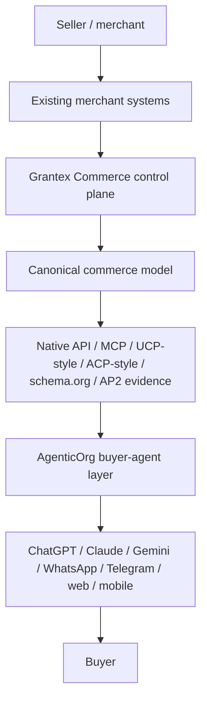
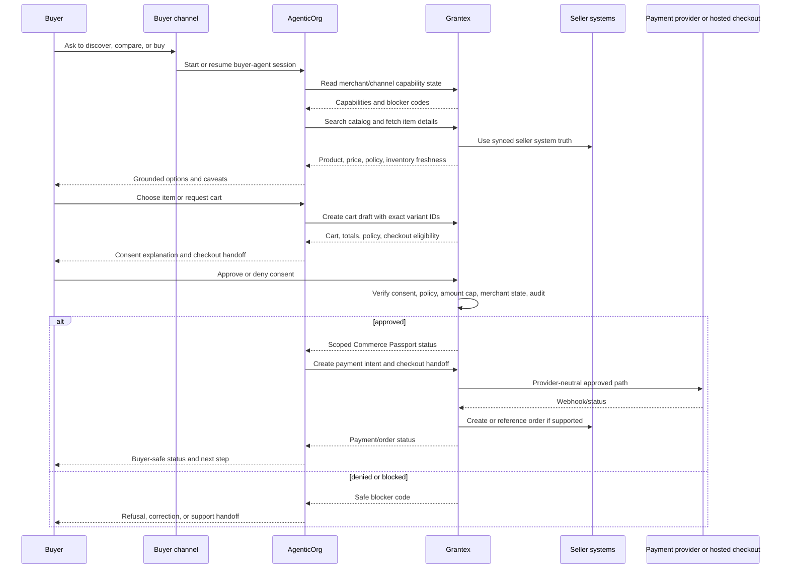

# Agentic Commerce PRD

This is the canonical consolidated PRD for Grantex Commerce and AgenticOrg
agentic commerce. It brings the seller journey, buyer journey, existing merchant
systems, buyer-agent channels, standards fit, safety gates, implementation gaps,
and fast-track roadmap into one place.

This document is planning and documentation only. It does not deploy, create
cloud resources, change production configuration, touch secrets, approve a real
merchant, enable public discovery, enable production Commerce V1, enable
checkout/payment creation, enable live payments, enable live Plural, or set a
production allowlist.

## 1. Product Thesis

Agentic commerce should let a buyer ask an AI agent to discover, compare, and
buy from a real merchant without the merchant rebuilding their business and
without the agent inventing commerce facts.

The product boundary is:

> Grantex is the seller and merchant control plane. AgenticOrg is the buyer and
> agent-facing workflow layer. AgenticOrg may help a buyer shop, but every
> commerce fact and every protected action must come from Grantex.

The finished product should allow:

- Sellers to self-serve into a sandbox merchant workspace.
- Sellers to connect systems they already use.
- Grantex to normalize those systems into governed commerce capabilities.
- Buyers to start from familiar chat or agent surfaces.
- AgenticOrg to run a buyer-agent session using only Grantex-approved tools.
- Grantex to enforce consent, policy, Commerce Passport, payment boundaries,
  audit, rollback, and merchant approval.
- Standards-facing surfaces to be generated from one canonical commerce model,
  not hand-maintained per platform.

## 2. Non-Negotiable Safety Boundary

An AI agent can initiate a commerce checkout through a payment provider only
when Grantex can verify:

- buyer consent;
- scope;
- merchant policy;
- revocation status;
- tenant boundary;
- agent identity;
- channel capability;
- amount cap;
- product/cart hash or equivalent cart evidence;
- idempotency;
- provider readiness;
- audit evidence;
- rollback readiness.

AgenticOrg must not:

- hold provider credentials;
- call Plural, Stripe, Pine, Razorpay, Cashfree, Adyen, PhonePe, or another
  payment provider directly for commerce execution;
- call Shopify, WooCommerce, Magento, ERP, OMS, WMS, logistics, CRM/support, or
  merchant private APIs directly for commerce execution;
- become the catalog, inventory, order, refund, settlement, or payout source of
  truth;
- store raw Commerce Passport values, JWTs, tokens, idempotency key values,
  webhook secrets, DB/Redis URLs, private keys, raw payloads, private merchant
  artifacts, pricing terms, contracts, or customer data;
- invent sellers, products, prices, discounts, stock, delivery promises, return
  eligibility, order status, payment status, settlement state, payout state, or
  refund outcomes.

## 3. Ownership Model

| Area | Grantex owns | AgenticOrg owns |
| --- | --- | --- |
| Merchant onboarding | Tenant, merchant workspace, verification, roles, category presets, sandbox/live split, approvals. | Merchant education and demo walkthroughs only. |
| Existing merchant systems | Connectors, credentials, sync jobs, source-of-truth precedence, webhooks, reconciliation. | No direct merchant-system execution path. |
| Catalog and inventory | Product, variant, price, tax, warranty, return summary, availability, freshness, future reservations. | Grounded read-only display through Grantex tools. |
| Policy and consent | Merchant policy, amount caps, consent request, Commerce Passport, revoke/verify, audit. | Buyer-facing explanation and Grantex consent handoff. |
| Payment and checkout | Provider-neutral payment intent, checkout handoff, provider webhooks, reconciliation, rollback. | Request payment/checkout only through Grantex. |
| Order and fulfillment | Order, cancellation, fulfillment, shipment, pickup/delivery, support, return/refund request, settlement/payout. | Buyer-facing status once Grantex exposes it. |
| Agent channels | Capability approval and channel limits. | ChatGPT, Claude, Gemini, WhatsApp, Telegram, web/mobile, and future channel adapters. |
| Standards | Native API, MCP, UCP-style, ACP-style, schema.org, AP2-evidence-ready publishing from canonical objects. | Consume Grantex-published capabilities and render buyer-safe state. |
| Audit and ops | Append-only audit, redacted evidence, webhook replay, provider health, rollback, incident runbooks. | Redacted agent session evidence and refusal evals. |

## 4. Current Implementation Snapshot

Status as of 2026-06-09:

- Grantex seller-control-plane work is implemented through the sandbox
  read-only discovery handoff path: C5Z, C6A, C6B, C6C, C6D, C6E, C6F, and
  C6G are merged on Grantex main.
- AgenticOrg read-only buyer discovery consumer foundation is merged through
  C6H. C6I buyer-session orchestration is merged on AgenticOrg main.
- Grantex protocol-adapter and connector foundations C6J, C6K, C6L, C6M, and
  C6N are merged on Grantex main.
- Grantex C6O preview conformance fixtures, validation, reporting, status,
  release gate, runbook, and launch-gap assessment are merged.
- Grantex C6P-C6Si connector dry-run, review, portal, evidence packet,
  remediation, persistence, queue, timeline, and operator triage foundations
  are in progress or merged as sandbox-only, non-live, non-enabling work.
- The open-protocol packaging draft is an internal docs-only PR refreshed on
  the merged C6I-C6N base. It is not public protocol publication, not
  certification, and not production approval.
- C6T adds an IETF/NIST publication-preparation track. It is not an IETF
  submission, not a NIST submission, not public protocol publication, and not
  standards approval.
- Public discovery, production Commerce V1, checkout/payment enablement, live
  payments, live Plural, production allowlists, certification claims, provider
  calls, and AgenticOrg direct merchant-system calls remain blocked.

### 4.1 Grantex Foundation

| Capability | Current state | Gap |
| --- | --- | --- |
| Merchant/tenant control plane | Seller sandbox onboarding, category readiness, catalog readiness, public-safe agent preview, review request, operator decision, rollout proposal dry run, and AgenticOrg sandbox handoff are implemented through C6G. | Full self-serve production onboarding, KYB/KYC, live approval, and public discovery rollout remain blocked. |
| Category presets | `electronics_appliances` readiness checklist and scoring exist for the sandbox path. | Multi-category presets and policy/eval defaults remain future work. |
| Catalog and variants | Product/variant APIs, search/detail, bulk dry-run/upsert, patch/archive, CSV/JSON-oriented portal support, catalog readiness preview, and public-safe sample preview exist. | Large async imports, connector sync, conflict handling, rollback, richer price/offer models, and quantity inventory remain pending. |
| Inventory | Variant availability and freshness exist. | Quantity, location, confidence, reservations, stock holds, and delivery feasibility are missing. |
| Consent and Commerce Passport | Consent request/exchange/verify/revoke/challenge foundation exists. C6M AP2-style deterministic unsigned evidence preview is merged. | Production challenge delivery, signed mandate evidence, independent AP2 conformance, and live payment approval are pending. |
| Cart/payment intent | Cart draft and provider-neutral payment intent foundation exists. C6L ACP-style cart/checkout shape preview is merged. | Cart update/cancel/expire, fulfillment selection, ACP conformance, and broad live checkout readiness are pending. |
| Provider/webhooks | Provider credential and webhook intake/replay/reconciliation foundations exist. | Live Plural/provider approval, signature evidence, outage handling, and rollback proof remain gated. |
| Merchant webhooks | Signed merchant webhook source and catalog update intake exist. | Inventory-only, price-only, order, fulfillment, support, return, and refund webhooks are pending. |
| Existing-system connectors | C6N metadata-only connector registry, source precedence, sync health, stale/conflict blockers, and no-credential/no-execution guardrails are merged. | Real Shopify/WooCommerce/Magento/ERP/OMS/WMS/logistics/support/payment sync adapters remain pending. |
| Standards adapters | C6J schema.org JSON-LD preview, C6K UCP-style capability profile preview, C6L ACP-style checkout shape preview, and C6M AP2-style evidence preview are merged. | Public publication, certification, conformance suites, live capability negotiation, and public discovery remain blocked. |
| MCP/native surface | Read and checkout-oriented tools exist behind Grantex; C6G adds sandbox AgenticOrg buyer discovery handoff. | Public discovery remains fail-closed; public standards conformance is not complete. |
| Docs and CI | Commerce docs, docs-only workflow guard, and internal open-protocol packaging draft exist. | Keep consolidated PRD, overview, guides, manifests, and nav current as stacked PRs merge. |

### 4.2 AgenticOrg Foundation

| Capability | Current state | Gap |
| --- | --- | --- |
| Grantex-only connector aliases | Merchant profile, catalog search/detail, inventory, cart, consent, payment intent, checkout, payment status, and read-only buyer discovery preview aliases exist. | Order, fulfillment, support, return, refund, settlement, and payout aliases wait on Grantex APIs. |
| Buyer discovery workflow | C6H read-only consumer foundation is merged. C6I channel-neutral buyer-session orchestration is merged. | Live channel adapters and write-capable buyer flows remain blocked. |
| Sales agent guardrails | Missing consent/passport, amount-cap breach, disabled merchant/agent, policy denial, no-direct-provider, and read-only buyer discovery refusal protections exist or are merged in C6I. | Guardrails must expand as Grantex adds order, fulfillment, support, return, refund, settlement, and payout capabilities. |
| Demo/evals | Demo, golden evals, hosted smoke, no-direct-provider regressions, and focused buyer discovery tests exist. | Channel-specific smoke and live buyer UX evals are pending. |
| Public discovery | Fail-closed behind AgenticOrg public discovery flag. | Real merchant public discovery requires Grantex approval and AgenticOrg gating. |
| Docs-only CI guard | Docs-only changes skip build/push/deploy-adjacent jobs. | Keep guard current, especially for workflow changes. |
| Buyer channel launch | Channel-neutral response model is merged in C6I. | ChatGPT, Claude, Gemini, WhatsApp, Telegram, web/mobile, and future live adapters are not launch-ready yet. |

## 5. End-To-End Architecture

Existing merchant systems may include:

- Shopify;
- WooCommerce;
- Magento;
- custom storefront;
- marketplace backend;
- ERP;
- PIM;
- inventory system;
- WMS;
- OMS;
- logistics provider;
- payment provider;
- CRM;
- support desk;
- finance/reconciliation system;
- CSV/API/manual maintenance process.

Those systems connect to Grantex. AgenticOrg does not connect to those systems
for commerce execution.

## 6. One-Time Seller Setup

The seller setup must be self-serve for preparation, but not self-approval for
live commerce.

| Step | Seller action | Grantex requirement | Status/gate |
| --- | --- | --- | --- |
| 1. Create workspace | Sign up and create commerce tenant. | Tenant boundary, merchant shell, owner role, sandbox/live split. | Required before any data import. |
| 2. Complete profile | Enter legal name, display name, category, country, currency, support info, public description. | Separate public-safe metadata from private artifacts. | Public fields must pass review. |
| 3. Verify merchant | Provide legal/compliance/KYB/KYC evidence outside repos. | Store only non-secret evidence references and decision state. | No live mode without approval. |
| 4. Choose category preset | Select category such as home goods, electronics, fashion, grocery, pharmacy, services, B2B. | Apply required fields, policy defaults, tax, return, warranty, and safety expectations. | Missing critical fields block readiness. |
| 5. Connect systems | Add storefront, ERP/PIM, inventory/WMS, OMS, logistics, payment, support, or CSV/API. | Credential isolation, connector registry, sync status, webhooks, retry, stale state. | Connector health required before use. |
| 6. Declare source of truth | Decide which source wins for catalog, price, inventory, order, fulfillment, support, refund, settlement. | Record precedence, timestamps, conflict handling, and rollback. | No silent conflict resolution. |
| 7. Prepare catalog | Fix title, description, image, brand, SKU, variants, category, price, tax, warranty, return summary. | Normalize to CommerceProduct and CommerceProductVariant. | Public-safe preview required. |
| 8. Prepare inventory/delivery | Configure stock state, freshness, delivery/pickup, shipping, serviceability, logistics source. | Block guarantees when stale, unknown, or unsupported. | Checkout blocked if evidence is insufficient. |
| 9. Configure agent permissions | Choose browse, compare, cart draft, checkout consent request, order status, support handoff, return/refund request. | Convert to policy, scopes, channel capabilities, amount caps, audit rules. | Each capability separately approved. |
| 10. Configure payment | Connect sandbox provider first; request live provider later. | Provider-neutral adapter, credential validation, webhook signature, replay window, reconciliation. | Live remains blocked until approved. |
| 11. Review previews | See AI-agent-facing profile, catalog, policy, schema.org, and channel labels. | Render exact public-safe payload and blocked paths. | Product wording and security review required. |
| 12. Run scans | Run secret/private-detail, overclaim, synthetic-ID, production-ID, config/allowlist, stale-data scans. | Produce redacted evidence and blocker codes. | Clean scans required for readiness. |
| 13. Assign owners | Merchant owner, legal, product, security, ops, backup/RPO, rollback, smoke, evidence retention, AgenticOrg dependency. | Store non-secret owner references and approval state. | Missing owners block rollout. |
| 14. Rehearse launch | Run sandbox/demo buyer journey and rollback drill. | Generate smoke evidence and rollback checklist. | Required before rollout proposal. |
| 15. Request rollout | Ask for smallest approved surface, usually read-only discovery first. | Keep fail-closed until explicit approval. | Separate rollout approval required. |

## 7. One-Time Buyer Setup

The buyer setup should feel like normal chat/app account linking.

| Step | Buyer action | AgenticOrg requirement | Grantex requirement |
| --- | --- | --- | --- |
| 1. Choose channel | Use ChatGPT, Claude, Gemini, WhatsApp, Telegram, web/mobile, or future approved channel. | Start the correct channel adapter. | Publish approved channel capability metadata. |
| 2. Link or sign in | Connect account if needed. | Create or resume buyer-agent session and bind channel identity. | Avoid exposing private merchant/provider data. |
| 3. Set preferences | Locale, currency, delivery region, notification path, accessibility, optional spend comfort. | Store only safe preferences for conversation and handoff. | Use preferences for policy and consent copy where needed. |
| 4. Understand actions | See browse, compare, draft cart, request checkout, read status, support handoff, blocked actions. | Render channel-specific capability labels. | Return approved capabilities and blocker reasons. |
| 5. Consent when needed | Approve or deny payment-affecting actions. | Never bypass consent or present it as already granted. | Issue scoped Commerce Passport only after consent and policy pass. |
| 6. Manage history | Ask what happened or revoke permission. | Show redacted agent session/evidence status. | Own revocation, protected action history, and audit. |

Buyer setup is not a standing payment approval. Every payment-affecting action
still needs Grantex consent, Commerce Passport evidence, policy approval,
idempotency, and audit.

## 8. Regular Agentic Commerce Transaction

Plain-English happy path:

1. Buyer asks an agent to find, compare, or buy.
2. AgenticOrg starts or resumes the buyer session.
3. AgenticOrg asks Grantex which merchant and channel actions are approved.
4. AgenticOrg searches catalog and checks inventory through Grantex only.
5. Grantex returns grounded product, price, policy, return, warranty, and stock
   freshness facts.
6. AgenticOrg explains options and caveats.
7. Buyer chooses an item.
8. AgenticOrg creates a Grantex cart draft with exact variant IDs.
9. Grantex recalculates totals, policy, amount caps, inventory freshness, and
   checkout eligibility.
10. Buyer approves or denies Grantex consent.
11. Grantex issues scoped Commerce Passport status only if consent and policy
   pass.
12. AgenticOrg requests payment intent and checkout handoff through Grantex.
13. Provider interaction happens through Grantex only.
14. Grantex receives webhooks, reconciles status, writes audit, and creates or
   references order state where supported.
15. AgenticOrg reports buyer-safe status.
16. Post-purchase order, delivery, support, return, refund, settlement, and
   payout answers come only from Grantex after those APIs exist and are approved.

## 9. Exception And Recovery Flows

| Situation | Buyer experience | Seller experience | Required behavior |
| --- | --- | --- | --- |
| Merchant not approved | Agent says merchant is not available for agentic commerce yet. | Seller sees missing approval state. | Grantex remains fail-closed. |
| Channel is read-only | Buyer can browse and gets safe handoff or unsupported-action copy. | Seller sees channel capability limit. | AgenticOrg cannot pretend write actions are available. |
| Product not found | Agent asks clarifying question or says unavailable. | Seller may see missing catalog coverage. | No guessed products. |
| Product data incomplete | Agent says it cannot verify enough detail. | Seller sees missing required fields. | Readiness score blocks launch or capability. |
| Price changed | Buyer sees updated total and must confirm again. | Seller sees audit and source timestamp. | Grantex invalidates stale cart totals. |
| Inventory stale/unknown | Buyer gets warning or checkout refusal. | Seller sees stale inventory blocker. | No stock or delivery guarantee. |
| Delivery unavailable | Buyer gets no delivery promise. | Seller sees logistics/serviceability blocker. | Checkout blocked if fulfillment proof required. |
| Consent denied/expired | Checkout stops. | Seller sees no payment attempt. | No passport issued or stale passport revoked. |
| Policy denied | Buyer sees safe reason without private policy. | Seller sees blocker code. | Audit written, private policy not leaked. |
| Payment failed/pending | Buyer sees status and next supported step. | Seller sees reconciliation state. | Provider webhook/replay remains Grantex-owned. |
| Order API missing | Buyer cannot get order promise. | Seller sees launch gap. | Broad paid rollout blocked. |
| Refund/return requested | Buyer gets manual support handoff now; future request/status later. | Seller handles in approved system. | No automatic refund execution until separately approved. |
| Settlement/payout question | Buyer usually does not see it; seller sees payout status when available. | Seller sees payout/reconciliation report. | No raw provider payload exposure. |

## 10. Existing Merchant APIs And Systems

Merchants should not rebuild for agents. They should connect the systems they
already run.

| System | Grantex should ingest | Canonical Grantex target | Notes |
| --- | --- | --- | --- |
| Shopify/WooCommerce/Magento/custom storefront | Products, variants, media, collections, availability, pricing. | CommerceProduct, CommerceProductVariant, catalog readiness, schema.org feed. | Start read-only; writeback only after approval. |
| ERP/PIM | Product master, attributes, tax codes, SKU hierarchy, category truth. | Catalog/category/policy mapping. | Merchant declares source-of-truth precedence. |
| Inventory/WMS | Stock state, quantity, location, reservation, confidence, reorder state. | Availability now; future inventory levels/reservations. | Browse can use buckets; checkout needs stronger freshness. |
| OMS | Order creation, order ID, status, cancellation, fulfillment, return status. | Future CommerceOrder and timeline. | Required before broad checkout. |
| Logistics | Delivery promise, shipping price, pickup slot, tracking, failed delivery. | Fulfillment options and tracking events. | Needed for buyer trust and UCP order capability. |
| Payment provider | Payment intent/order, hosted checkout, status webhook, settlement, refunds. | Provider-neutral payment intent, webhook event, reconciliation, settlement/payout. | Credentials stay in Grantex only. |
| CRM/support | Ticket, support status, return/refund escalation, customer communication. | Support/return/refund request timeline. | Start manual/reference, automate later. |
| CSV/manual/API | Bootstrap catalog, policy, inventory, and approval metadata. | Same canonical objects. | Must include dry-run, validation, history, and rollback. |

Connector rule:

> A connector imports or syncs data. It does not make a merchant live for
> agents. Live agent access requires readiness checks, policy activation,
> consent, human approval, audit, and rollback ownership.

## 11. Buyer Channel Requirements

Buyers should be able to launch from familiar surfaces, but no channel is
launch-ready until its platform-specific constraints and approval gates pass.

| Channel | Intended launch | Required work |
| --- | --- | --- |
| Web/mobile | AgenticOrg-hosted buyer session or merchant-embedded widget. | First controllable launch path, session resume, Grantex merchant selector, consent redirect, analytics attribution. |
| ChatGPT | Remote MCP-backed custom app/package where available. | App manifest, OAuth/account linking, action labels, confirmation copy, app review, fallback to read-only when writes unavailable. |
| Claude | Remote MCP connector. | Endpoint, auth, tool descriptions, least-privilege scopes, test harness, refusal behavior. |
| Gemini | Gemini API/function-calling or hosted wrapper. | Function declarations, tool execution loop, consent handoff, clear label for native support status. |
| WhatsApp | WhatsApp Business Platform bot/webhook adapter. | WABA setup, templates, session window, identity binding, consent link, rate limits, opt-out, human escalation. |
| Telegram | Telegram Bot API adapter. | Bot setup, webhook receiver, secret validation, identity mapping, inline buttons, consent link, rate limits. |
| Other channels | MCP, A2A, REST, webhook, or hosted handoff depending on platform. | Capability matrix, auth, consent, fallback, telemetry, smoke tests. |

Launch-ready acceptance:

- real user starts without developer setup;
- account/channel identity is bound safely;
- merchant discovery comes from Grantex;
- actions are labeled read-only, consent-required, checkout-capable, or blocked;
- Grantex-only tools execute commerce actions;
- consent and checkout copy is clear;
- platform write-action limitations are respected;
- redacted telemetry and audit evidence exist;
- smoke tests and refusal tests pass;
- fallback exists for unsupported actions.

## 12. Standards And Protocol Fit

The strategy is one canonical Grantex commerce model with protocol views
generated from it.

| Surface | Purpose | Requirement |
| --- | --- | --- |
| Native Grantex API | First-party control and enforcement. | Remains source of truth. |
| MCP | Agent tool transport. | Expose policy-checked tools backed by Grantex APIs. |
| UCP-style profile | Capability discovery and shopping capabilities. | Publish only approved merchant/channel capability state. |
| ACP-style checkout | Agentic checkout/session/order/refund shapes. | Map Grantex cart/payment/order state where provider and merchant support it. |
| AP2-style evidence | Signed authorization/mandate evidence for agent payments. | Map consent, Commerce Passport, cart hash, policy, amount cap, audit hash, and key rotation to future evidence. |
| schema.org | Public product/offer/shipping/return metadata. | Generate public-safe JSON-LD/feed from approved fields only. |
| A2A or future agent surfaces | Agent-to-agent discovery/handoff. | Use only Grantex-approved capability metadata and AgenticOrg channel guardrails. |

Do not claim certified UCP, ACP, AP2, A2A, MPP, schema.org production, or live
provider readiness until implementation, conformance tests, approvals, and
release evidence exist.

### 12.1 IETF And NIST Publication Tracks

The external standards strategy is split into two preparation tracks:

| Track | Intended artifact | Current posture | Required before external submission |
| --- | --- | --- | --- |
| IETF | Individual Internet-Draft candidate for an agentic commerce trust architecture. | C6T internal outline only; not submitted, not adopted, not an RFC, and not a standard. | Public-safe draft text, IPR/legal review, security/privacy considerations, non-Grantex-specific examples, and explicit approval to submit. |
| NIST | Security and risk reference-architecture whitepaper candidate. | C6T internal outline only; not submitted to NIST, not accepted by NCCoE, and not NIST-approved. | Threat model, NIST AI RMF/CSF control mapping, public-safe architecture, collaborator/project path, and explicit approval to engage. |

The IETF track should focus on protocol engineering: roles, message envelopes,
capability profiles, consent, policy, evidence, refusal semantics, and
interoperability with existing protocol surfaces.

The NIST track should focus on risk management: threat model, trust boundaries,
AI RMF mapping, cybersecurity controls, payment-provider boundary controls,
connector governance, audit evidence, privacy, incident response, and rollback.

Both tracks must describe Grantex and AgenticOrg as implementation experience
only. They must not make Grantex-specific APIs mandatory, must not claim
external certification, and must not describe sandbox evidence as production
approval.

## 13. Conceptual Data Model

The implementation should preserve these conceptual records. Some already exist
in V1 form; others are future gaps.

| Record | Owner | Purpose | Current posture |
| --- | --- | --- | --- |
| CommerceTenant | Grantex | Tenant boundary. | Foundation exists. |
| CommerceMerchant | Grantex | Seller identity and policy anchor. | Foundation exists. |
| CommerceCategoryPreset | Grantex | Category-required fields and defaults. | `electronics_appliances` readiness foundation exists. |
| CommerceConnectorSource | Grantex | Existing-system connection and health. | C6N metadata-only registry merged; no credentials or outbound sync. |
| CommerceImportJob | Grantex | Async import, dry-run, errors, rollback. | Gap. |
| CommerceProduct | Grantex | Product truth. | Foundation exists. |
| CommerceProductVariant | Grantex | SKU/variant/price/inventory anchor. | Foundation exists. |
| CommerceInventoryLevel | Grantex | Quantity/location/freshness/reservation. | Gap beyond availability buckets. |
| CommercePrice/Offer | Grantex | Tax, discount, EMI, coupon, offer freshness. | Gap beyond basic price fields. |
| CommercePolicy | Grantex | Merchant permissions and amount caps. | Foundation exists. |
| CommerceConsentRecord | Grantex | Buyer consent record. | Foundation exists. |
| CommercePassport | Grantex | Scoped checkout authorization. | Foundation exists. |
| CommerceCart | Grantex | Cart draft/update/cancel/expire. | Foundation exists; lifecycle gaps remain. |
| CommercePaymentIntent | Grantex | Provider-neutral payment intent. | Foundation exists. |
| CommerceOrder | Grantex | Post-payment order record. | Gap. |
| CommerceFulfillmentEvent | Grantex | Shipment/pickup/delivery status. | Gap. |
| CommerceReturnRequest | Grantex | Return workflow. | Gap. |
| CommerceRefundRequest | Grantex | Refund request and approval. | Gap. |
| CommerceSettlement/Payout | Grantex | Seller payment reporting. | Gap. |
| CommerceAuditEvent | Grantex | Append-only evidence. | Foundation exists. |
| CommerceAgentSession | AgenticOrg/Grantex boundary | Buyer-agent session attribution and channel state. | C6I channel-neutral session orchestration merged; live channels pending. |
| ChannelAdapterConfig | AgenticOrg | Platform launch and capability limits. | Gap. |

## 14. Product Requirements By Surface

| Surface | Requirement | Acceptance |
| --- | --- | --- |
| Merchant dashboard | Checklist, profile, category, systems, readiness score, preview, approvals, rollout, rollback. | Non-engineer can see what is missing and why launch is blocked. |
| Merchant API | Tenant-safe create/read/update for profile, catalog, inventory, policy, connector source, webhook source, readiness. | Every UI action has API equivalent or is explicitly operator-only. |
| Connector framework | Source type, credential reference, sync status, last run, stale state, row errors, retry, disable. | Failed sync cannot silently publish stale facts. |
| Catalog | Product, variant, media, category, price, tax, warranty, return, source, freshness. | Agent answers grounded in exact IDs. |
| Inventory | Availability now; future quantity, location, reservation, confidence, TTL. | Unknown/stale inventory warns or blocks, never guarantees. |
| Cart/checkout | Cart draft/update/cancel, fulfillment option, consent, passport, payment intent, checkout link. | Checkout cannot progress without consent, policy, idempotency, audit. |
| Order | Order reference, status, line items, payment reference, fulfillment status, cancellation, support link. | Paid checkout has an operational record. |
| Returns/refunds | Request, eligibility, manual approval, provider handoff, status, audit. | Execution blocked until separate provider approval. |
| Settlement | Payout/read model, fees, taxes, reconciliation, export. | Seller can answer "when do I get paid?" without raw provider payloads. |
| Protocol adapters | UCP-style, MCP, ACP-style, schema.org, AP2 evidence draft. | Generated from canonical objects with tests and no unsupported claims. |
| Buyer channels | Web/mobile, ChatGPT, Claude, Gemini, WhatsApp, Telegram, future adapters. | Each has launch, auth, consent, fallback, smoke evidence. |
| Audit/ops | Append-only audit, redacted logs, metrics, runbooks, replay, incident severity. | No protected action acknowledged without durable evidence. |
| Security/privacy | Credential isolation, secret redaction, tenant filtering, role checks, webhook signatures, rate limits. | Cross-tenant and secret-exposure tests fail closed. |

## 15. Comprehensive Gap Register

| Gap | Impact | Owner | Fast-track output | Blocker if skipped |
| --- | --- | --- | --- | --- |
| Self-serve merchant signup | Merchants need to join without engineering tickets. | Grantex | Sandbox workspace, roles, category, checklist. | Operator-only onboarding does not scale. |
| Merchant verification | Real merchant identity must be trusted. | Grantex + reviewers | Private evidence refs and review workflow. | No live approval. |
| Existing-system connectors | Merchants will not duplicate data manually. | Grantex | C6N metadata-only connector registry merged; real sync adapters next. | Stale or manual-only launch. |
| Large catalog imports | Real sellers have many SKUs. | Grantex | Async import, dry-run, row errors, rollback. | Timeouts and silent data loss. |
| Source-of-truth precedence | Systems can disagree. | Grantex | Conflict rules and sync timestamps. | Wrong price/stock/order facts. |
| Inventory depth | Agents must not promise stock incorrectly. | Grantex | Quantity/location/freshness/reservation model. | Unsafe checkout promises. |
| Delivery/pickup | Buyers need fulfillment confidence. | Grantex | Serviceability, slots, fees, ETA, carrier data. | False delivery promises. |
| Pricing/tax/offers/EMI | Agents need correct totals. | Grantex | Fresh price, tax, coupons, discounts, EMI metadata. | Invented discounts or totals. |
| Cart lifecycle | Checkout needs update/cancel/expire. | Grantex | Cart update, recalc, fulfillment selection, expire. | Stale cart risk. |
| Order lifecycle | Payment without order ops is incomplete. | Grantex | Order create/read/status/cancel. | Paid launch unsafe. |
| Fulfillment lifecycle | Buyers ask where items are. | Grantex | Shipment, pickup, partial fulfillment, failed delivery. | Agent invents delivery. |
| Returns/refunds | Post-purchase trust. | Grantex | Request, eligibility, manual approval, audit. | Unsafe refund claims. |
| Settlement/payouts | Sellers need money visibility. | Grantex | Provider-neutral payout reporting. | Merchant ops blind spot. |
| Live provider readiness | Payments need approval. | Grantex | Sandbox validation, live credential approval, webhook signatures. | Live provider risk. |
| Commerce Passport production delivery | Real consent needs delivery. | Grantex | Email/SMS/passkey challenge, revocation, signed evidence. | Weak authorization. |
| Policy simulator | Merchants need confidence. | Grantex | Preview policy by product/category/channel/amount. | Accidental capability exposure. |
| Standards adapters | Major platforms need standard surfaces. | Grantex publishes; AgenticOrg consumes | C6J-C6M previews, C6O conformance, and C6T IETF/NIST preparation are in place or in review; external publication remains blocked. | Fragmented protocol state or premature external claims. |
| Buyer channel launch | Buyers need easy entry. | AgenticOrg + Grantex approval | C6I channel-neutral response merged; live channel adapters next. | Agentic commerce hard to use. |
| Buyer UX | Buyers need understandable flow. | AgenticOrg | C6I read-only buyer session merged; cart/consent/checkout UX remains future. | Confusing or unsafe agent behavior. |
| Merchant demo UX | Sellers need education. | AgenticOrg | Demo walkthroughs and blocked-path examples. | Misunderstanding production readiness. |
| Evals/regressions | Guardrails must remain true. | AgenticOrg | No invention, no direct-provider, stale/refusal tests. | Regression risk. |
| Ops/support dashboards | Teams need recovery. | Both | Policy denial, stale sync, stuck payment, webhook replay, support handoff. | Incidents are hard to resolve. |
| Analytics/attribution | Sellers need value proof. | Grantex source + AgenticOrg contribution | Channel attribution, conversion, refusal reasons. | No ROI visibility. |
| Docs and workflows | Teams need shared truth. | Both | This consolidated PRD, guides, runbooks, docs nav. | Drift and duplicated plans. |
| CI/deploy safety | Docs-only changes should not deploy. | Both | Path guards and docs-only checks. | Planning merges create cloud/build side effects. |

## 16. Fast-Track Roadmap

| Phase | Goal | Deliverables | Guardrail |
| --- | --- | --- | --- |
| 1. Consolidated PRD and docs alignment | One source of truth. | This PRD, docs nav, overview links, AgenticOrg pointers. Status: merged. | Docs-only. |
| 2. Seller sandbox onboarding | Merchant can prepare without engineers. | Workspace, profile, category, owner roles, checklist. Status: merged through C6G handoff. | No live enablement. |
| 3. Catalog connector MVP | Merchant data enters Grantex. | CSV/manual readiness and C6N connector registry foundation merged; real sync adapters pending. | No automatic live publish. |
| 4. Public-safe preview | Merchant sees what agents can see. | Catalog/profile preview, schema.org draft, readiness score, and protocol previews merged through C6J-C6M. | Fail-closed until approved. |
| 5. Buyer web/mobile channel | First controllable buyer launch. | C6H and C6I merged for channel-neutral read-only session; hosted widget/app pending. | Read-only first. |
| 6. ChatGPT/Claude MCP | Major AI chat surfaces. | Channel-neutral response model merged; remote MCP/app connector pending. | Respect platform write limits. |
| 7. WhatsApp/Telegram | Messaging channels. | Channel-neutral response model merged; bot/webhook adapters pending. | Secrets outside Git. |
| 8. Gemini channel | Gemini-powered buyer sessions. | Channel-neutral response model merged; function-calling wrapper pending. | Label native support accurately. |
| 9. Inventory freshness and cart | Safe product selection. | Freshness TTL, stale refusal, exact-ID cart draft. | No checkout promise if stale. |
| 10. Sandbox consent/checkout | Full rehearsal. | Consent, Passport, mock/provider-neutral checkout. | No live provider. |
| 11. Order/fulfillment backbone | Operational paid flow. | Order, shipment, pickup/delivery, cancellation. | Required before broad checkout. |
| 12. Return/refund request | Safe post-purchase support. | Request, eligibility, manual approval, audit. | No automatic refund execution. |
| 13. Settlement/payout reporting | Seller finance visibility. | Reconciliation and payout read model. | No raw provider payloads. |
| 14. Standards hardening | Platform interoperability. | C6J-C6M preview adapters, C6O preview conformance, and C6T IETF/NIST publication-preparation outlines exist or are in review. | No submission, publication, or certification claims without explicit approval and evidence. |
| 15. Controlled pilot | Minimal real launch. | One merchant, category, channel, provider, geography, rollback owner. | Separate explicit approval. |

Current sequencing decision:

1. C6I-C6N are merged in dependency order across AgenticOrg and Grantex.
2. The open-protocol packaging draft is refreshed on the actual merged commits
   and remains internal, preview-only, non-publication, and non-certifying.
3. C6O conformance and C6P-C6Si connector dry-run/remediation foundations are
   the current runtime-hardening chain.
4. C6T starts the standards-publication preparation track for IETF and NIST
   without external submission, public publication, or certification claims.

## 17. Release Acceptance Criteria

Before a real merchant pilot:

- Merchant workspace, identity, category, and owners are approved.
- Existing-system connector or approved manual maintenance path is healthy.
- Catalog, price, tax, warranty, return, inventory, delivery, and support data
  pass category requirements.
- AgenticOrg can only see Grantex-approved capabilities.
- Buyer channel has auth, account/session linking, capability labels, consent
  handoff, fallback behavior, telemetry, and smoke evidence.
- Checkout/payment creation remains blocked until Commerce Passport consent,
  policy, audit, idempotency, provider readiness, and rollback checks pass.
- Paid flow has order, fulfillment, support, and return/refund handoff.
- Live provider approval, webhook signature evidence, outage handling, and
  rollback are complete for any live checkout scope.
- UCP/ACP/AP2/schema.org/A2A language is backed by implementation and tests, or
  clearly marked future/planned.
- Docs-only changes do not trigger cloud auth, image build, image push, deploy,
  e2e, or indexing jobs.
- No private merchant artifacts, secrets, raw payloads, tokens, JWTs, DB/Redis
  URLs, provider credentials, production config values, or concrete allowlist
  values are committed.

## 18. Stop Conditions

Stop implementation or rollout if any of these occur:

- real merchant identity is missing or unapproved;
- private artifacts, customer data, secrets, raw payloads, tokens, JWTs, DB/Redis
  URLs, private keys, provider credentials, or production config values appear
  in Git or public docs;
- AgenticOrg adds a direct provider or private merchant-system execution path;
- checkout can happen without consent, Commerce Passport, policy, idempotency,
  audit, and amount-cap checks;
- catalog, price, tax, inventory, delivery, return, warranty, order, payment,
  or refund data is stale or unverifiable but presented as guaranteed;
- paid checkout is enabled before order, fulfillment, support, return/refund
  handoff, and rollback are ready for the pilot scope;
- synthetic/demo data is treated as production approval;
- public discovery, production Commerce V1, checkout/payment creation, live
  payments, live Plural, or allowlist values are enabled without separate
  approval;
- certification or compliance with UCP, ACP, AP2, A2A, MPP, schema.org, or a
  provider program is claimed before evidence exists;
- docs-only changes trigger cloud build/push/deploy-adjacent work without an
  explicit policy decision.

## 19. Documentation And Workflow Updates

| Surface | Requirement |
| --- | --- |
| This PRD | Canonical cross-repo product truth. |
| Grantex overview | Link to this PRD as the source of truth. |
| Grantex implementation PRD and end-to-end guide | Keep as supporting summaries, not divergent product truth. |
| Grantex docs.json | Keep this PRD discoverable in Agentic Commerce V1 nav. |
| AgenticOrg overview and implementation PRD | Point back to this PRD and preserve AgenticOrg-specific responsibilities. |
| AgenticOrg developer guide | Keep direct-provider bans, channel adapter rules, and Grantex-only alias rules current. |
| Merchant/operator guide | Explain seller one-time setup, approval gates, existing-system connectors, and rollback. |
| Operations guide | Explain stale sync, webhook replay, payment reconciliation, support handoff, rollback, and incidents. |
| Landing pages | Use public-safe copy: connect existing systems, preview agent-ready commerce, request approval. No live/certification claims. |
| GitHub workflows | Preserve docs-only guard and treat workflow changes as non-docs-only. |

## 20. End-To-End Review Checklist

This PRD has been reviewed against the requested coverage:

- seller one-time setup covered;
- buyer one-time setup covered;
- regular transaction flow covered;
- failure and recovery paths covered;
- Grantex and AgenticOrg responsibilities covered;
- existing merchant APIs and systems covered;
- ChatGPT, Claude, Gemini, WhatsApp, Telegram, web/mobile, and future channels
  covered as launch surfaces;
- MCP, UCP-style, ACP-style, AP2-style, schema.org, and future agent surfaces
  covered without unsupported certification claims;
- catalog, inventory, pricing, tax, delivery, order, fulfillment, support,
  return, refund, settlement, payout, audit, analytics, and ops gaps covered;
- self-serve onboarding, scans, review gates, smoke evidence, and rollout gates
  covered;
- safety boundaries, stop conditions, and production gates covered;
- documentation/navigation/workflow coverage covered;
- next implementation sequencing covered.

Remaining decision for the team: continue the C6P-C6Si connector
dry-run/remediation chain for real merchant readiness while C6T prepares
public-safe IETF and NIST draft materials. The next implementation chain should
avoid external submission, public protocol publication, certification claims,
public discovery, and live checkout until explicit approvals and evidence exist.
