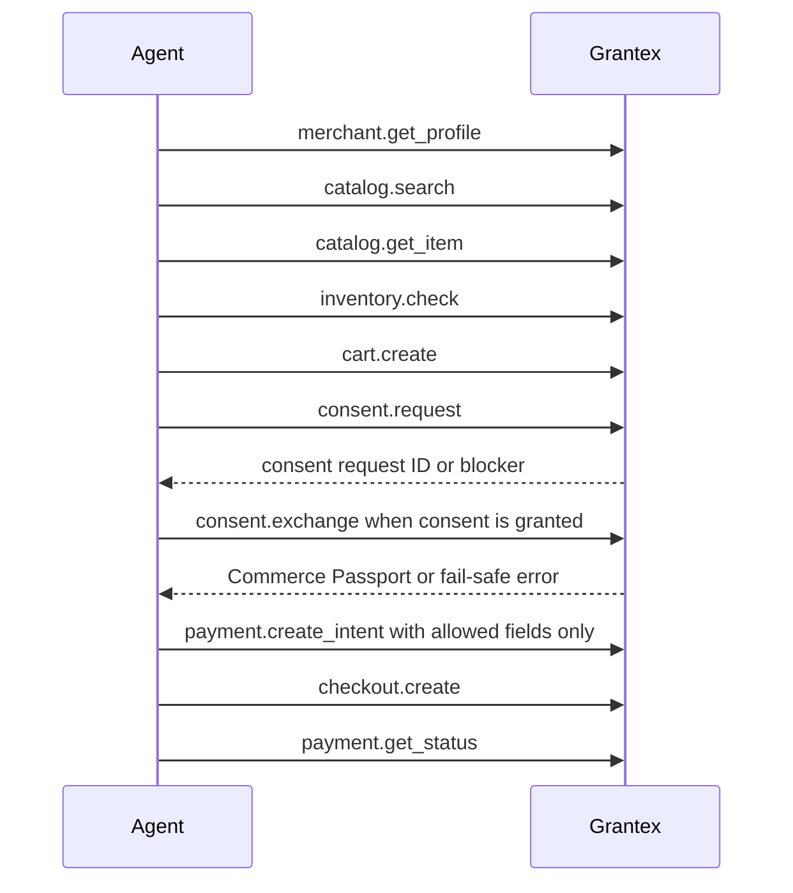

# Commerce V1 Developer Guide

This guide explains how developers should reason about the Grantex Commerce V1
contract. It is safe documentation only. It does not enable production Commerce
V1, live payments, live Plural, or production discovery.

## API And MCP Surface

Developers should use the OpenAPI contract in
`docs/api/grantex-commerce-v1.openapi.yaml` plus the MCP tool surface exposed by
the Commerce service. The current AgenticOrg integration uses these Grantex-only
aliases:

| Area | Tool or API responsibility |
| --- | --- |
| Merchant profile | Fetch merchant policy and status metadata. |
| Catalog search | Search grounded merchant products. |
| Catalog get item | Retrieve a specific product or variant. |
| Inventory check | Confirm availability before cart or checkout. |
| Cart create | Create a cart draft from grounded catalog IDs. |
| Consent request | Ask for the user permission required for checkout. |
| Consent exchange | Exchange granted consent for a Commerce Passport when a granted consent fixture exists. |
| Payment intent | Create a provider-neutral payment intent with passport and policy checks. |
| Checkout create | Create a checkout handoff through Grantex. |
| Payment status | Poll Grantex payment status, not a provider directly. |

### Schema.org JSON-LD Preview

Operators and owning merchants can inspect the C6J schema.org JSON-LD preview
through:

`GET /v1/commerce/merchants/{merchant_id}/schemaorg-jsonld-preview`

The endpoint is tenant-scoped and sandbox-only. It returns a preview-only
`https://schema.org` JSON-LD graph generated from canonical Grantex merchant,
catalog, and readiness state. The adapter serializes only sanitized evidence
for schema.org `Product`, `Offer`, `MerchantReturnPolicy`, and
`OfferShippingDetails` fields. It does not expose exact internal tenant,
merchant, product, variant, or SKU IDs.

The response includes explicit non-enabling flags:

- `schemaorg_publication_enabled: false`
- `public_discovery_enabled: false`
- `checkout_payment_enabled: false`
- `live_provider_enabled: false`
- `live_plural_enabled: false`
- `production_allowlist_written: false`
- `certification_claims: []`

CommerceAgent and service callers are denied. Live merchants return a blocking
error. Missing or unsafe catalog evidence is omitted and reported through
`blockers`, `omitted_types`, and `remediation_items`; clients must not fill in
missing seller, product, price, inventory, shipping, refund, launch, payment, or
certification facts.

### UCP-Style Capability Profile Preview

Operators and owning merchants can inspect the C6K UCP-style capability profile
preview through:

`GET /v1/commerce/merchants/{merchant_id}/ucp-capability-profile-preview`

The endpoint is tenant-scoped and sandbox-only. It returns services,
capabilities, transports, controls, blockers, and evidence summary fields from
canonical Grantex merchant/catalog/readiness state. Every capability ID uses the
Grantex-owned namespace:

`dev.grantex.commerce.discovery.preview`

The endpoint must not publish `dev.ucp.*`, must not claim UCP certification,
and must not enable a public discovery route. Response controls explicitly keep
public discovery, checkout/payment creation, live provider access, live Plural,
production allowlist writes, UCP publication, and UCP certification disabled.

Read-only discovery capabilities can be marked `preview_available` when Grantex
has public-safe profile and catalog evidence. Checkout, payment, fulfillment,
refund/return execution, provider credentials, and live paths remain `blocked`
metadata only.

## Auth And Caller Model

Commerce callers are modeled as agents operating for a tenant, merchant, and
user. A caller must be authenticated through an approved Grantex auth source in
runtime configuration. Auth material is runtime-sensitive and must not be
committed or printed.

The important IDs are not equivalent:

| Identifier | Purpose |
| --- | --- |
| Tenant ID | Owns isolation and policy boundaries. |
| Merchant ID | Owns catalog, provider configuration status, and merchant policy. |
| Agent ID | Identifies the delegated agent allowed to use commerce tools. |
| User/principal | The person whose consent controls checkout. |
| Commerce Passport | Scoped, usable runtime material created after approved consent or smoke fixture export. |

Synthetic tenant, merchant, user, product, and variant IDs may appear in evidence
when they are non-production fixtures. Usable passports, bearer tokens,
idempotency key values, secrets, and provider credentials remain sensitive.

## Consent-First Checkout Sequence

During fixture-backed smoke runs, AgenticOrg may already have a checkout passport
exported by the Grantex smoke runner. In that case, AgenticOrg evidence treats
`consent_exchange` as skipped only when the blocker is exactly
`preexported_checkout_passport_without_granted_consent_fixture`.

## Payment Intent Shape

Payment intent calls must send only fields supported by the Grantex Commerce
contract. Local fixture guardrail data, such as amount cap metadata used by
AgenticOrg preflight checks, must not be forwarded to Grantex as arbitrary
top-level request fields.

Keep idempotency values out of docs and logs. Evidence may record that an
idempotency mechanism was used, but never the value.

## Webhooks And Replay

Grantex owns provider webhook ingestion, verification, replay controls, and
reconciliation status. Current smoke evidence uses the mock-provider path only.
Failed webhook replay is an operator-only capability and remains mock-provider
only until the live provider contract and signature behavior are approved.

Replay safety rules:

- do not log raw provider payloads;
- do not store or expose webhook secrets in documentation;
- preserve original signature metadata only in protected runtime storage;
- replay only through operator-approved controls;
- treat live provider replay as blocked until provider/legal/ops gates pass.

## Error Handling

Commerce clients should treat validation and policy failures as explicit
outcomes, not retry storms. Important classes include:

| Class | Expected handling |
| --- | --- |
| `validation_failed` | Fix request shape or unsupported field usage. |
| `consent_not_granted` | Do not proceed without granted consent or an approved checkout passport fixture. |
| `consent_denied` | Stop the checkout path. |
| Amount-cap or policy breach | Fail safely before payment/provider work. |
| Disabled merchant or untrusted agent | Stop and surface an operator-safe blocker. |

## Sandbox And Mock Provider

Use mock-provider/internal sandbox flows for development. Production Commerce V1,
live payments, and live Plural are disabled. Approved temporary Option A smoke
uses isolated Cloud Run, Cloud SQL, Redis, smoke secrets, and mock provider
resources that are deleted immediately after evidence capture.

Developers should use:

- `docs/guides/commerce-v1-repeatable-option-a-smoke-workflow.md` for the
  approval-gated smoke path;
- `docs/examples/commerce-option-a-smoke.runbook.json` for runbook fields;
- the internal Option A smoke evidence record (operator-internal,
  kept in `docs/internal/commerce-v1/` and available to authorized
  reviewers via `security@grantex.dev`);
- the internal production-discovery readiness record (same access
  path) for the current posture.

## Blocked Until Future Approval

- Production Commerce V1 discovery enablement.
- External pilot readiness claims.
- Production checkout or live payment execution.
- Live Plural or live provider credentials.
- Direct provider calls from AgenticOrg commerce.
- Public docs that imply AP2, UCP, ACP, Plural, payment-provider, or external
  pilot certification.
