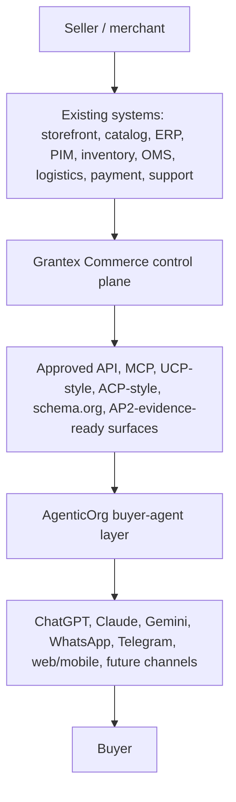
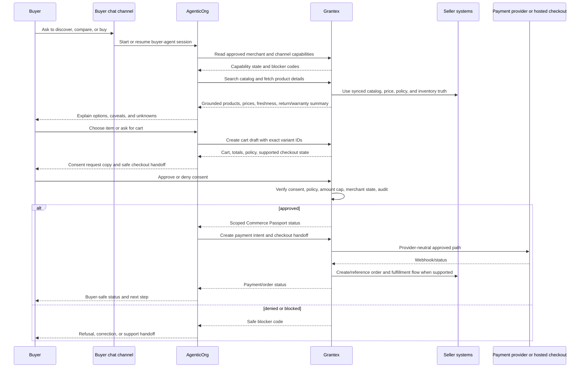

# End-To-End Agentic Commerce Flow

This guide explains how agentic commerce should work from the perspective of
both sellers and buyers. It is documentation only. It does not enable production
Commerce V1, public discovery, checkout/payment creation, live payments, live
Plural, merchant approval, or a production allowlist.

## One-Sentence Architecture

Sellers connect their existing commerce systems to Grantex; buyers start from
their preferred agent or chat surface; AgenticOrg helps the buyer shop; Grantex
enforces merchant truth, consent, payment, policy, audit, and rollback.

## What Sellers Do One Time

The seller one-time journey should be self-serve, but not self-approval. The
seller can prepare and request launch; Grantex and human reviewers still control
approval.

| Step | Seller action | Grantex responsibility | Launch gate |
| --- | --- | --- | --- |
| 1. Create workspace | Sign up, create tenant, invite owner/admin users. | Create tenant boundary, merchant shell, roles, sandbox/live split. | Tenant isolation and owner audit event. |
| 2. Complete merchant profile | Enter legal name, display name, category, country, currency, support contact, business policies. | Store canonical merchant profile and public-safe display fields separately from private artifacts. | No public discovery until profile is reviewed. |
| 3. Verify business | Provide legal/compliance artifacts in a private evidence system outside Git. | Store only non-secret evidence references and review state. | KYB/KYC/legal/compliance approval required for live. |
| 4. Choose category preset | Select home goods, electronics, fashion, grocery, pharmacy, services, B2B, or another preset. | Apply required field checklist, policy defaults, tax/return/warranty expectations. | Category-specific critical fields must pass. |
| 5. Connect existing systems | Connect Shopify, WooCommerce, Magento, custom storefront, ERP/PIM, WMS, OMS, logistics, payment provider, CRM/support, or upload CSV/API data. | Normalize data into canonical catalog, inventory, policy, order, fulfillment, payment, support, and audit models. | Connector health and credential isolation required. |
| 6. Define source of truth | Decide whether storefront, ERP/PIM, WMS, OMS, or another system wins for each data type. | Record source precedence, freshness timestamps, sync history, and conflict rules. | No silent overwrite or stale publish. |
| 7. Prepare catalog | Fix titles, descriptions, images, brand, variants, SKU, price, tax, warranty, return summary, category, availability. | Validate required fields, generate public-safe preview, schema.org draft, MCP/native output. | Missing critical catalog data blocks launch. |
| 8. Prepare inventory and delivery | Configure stock state, freshness TTL, delivery/pickup promises, shipping fees, serviceability, logistics source. | Block guarantees when stock or delivery data is stale, unknown, or unsupported. | Checkout blocked when inventory/delivery evidence is insufficient. |
| 9. Configure agent permissions | Choose browse, compare, cart draft, checkout consent request, order status, support handoff, return/refund request. | Convert choices into merchant policy, channel capabilities, scopes, amount caps, and audit rules. | Each capability requires explicit approval. |
| 10. Configure payment path | Connect sandbox provider first; request live provider only after legal/security/ops approval. | Keep provider credentials isolated, validate webhooks, use provider-neutral payment intent. | Live provider remains blocked until approved. |
| 11. Review buyer preview | See exactly what agents and buyers may see. | Render public payload preview and blocked-path warnings. | Product wording and security approval required. |
| 12. Run scans | Run secret/private-detail, overclaim, merchant-ID/name, synthetic-ID, config/allowlist, stale-data, and policy scans. | Produce redacted evidence and blocker codes. | Clean scans required for intake readiness. |
| 13. Assign owners | Assign merchant owner, legal, product wording, security, ops/support, backup/RPO, rollback, smoke, evidence retention, AgenticOrg dependency owner. | Record non-secret owner references and approval state. | Missing owners block rollout. |
| 14. Rehearse launch | Run sandbox/demo buyer journey with blocked checkout/live paths clearly labeled. | Produce smoke evidence and rollback checklist. | Smoke evidence required before proposal. |
| 15. Request rollout | Request smallest approved surface, normally read-only discovery first. | Keep fail-closed until approval and rollback readiness exist. | Separate rollout approval required. |

## What Buyers Do One Time

The buyer should not need to know how merchant systems work. Their setup should
look like normal account linking and permission control.

| Step | Buyer action | AgenticOrg responsibility | Grantex responsibility |
| --- | --- | --- | --- |
| 1. Choose a channel | Open ChatGPT, Claude, Gemini, WhatsApp, Telegram, web/mobile, or another approved surface. | Start the matching channel adapter. | Publish approved capabilities for that channel. |
| 2. Link or sign in | Connect AgenticOrg identity if needed. | Create or resume buyer-agent session and bind it to channel identity. | Do not expose private merchant/provider data. |
| 3. Set preferences | Provide locale, currency, delivery region, notification path, accessibility preferences, and optional spend comfort. | Use preferences for conversation and handoff only. | Use preferences for policy checks and consent copy where needed. |
| 4. Understand capabilities | See what the agent can do: browse, compare, draft cart, request checkout, read order status, or support handoff. | Show channel-specific action labels and limitations. | Return approved capability state and blocker reasons. |
| 5. Consent when needed | Approve or deny payment-affecting actions in the Grantex consent flow. | Never bypass consent. | Issue scoped Commerce Passport only after consent and policy pass. |
| 6. Manage history/revocation | Ask what happened or revoke permissions. | Show redacted session state and safe summaries. | Own revocation, audit evidence, and protected action history. |

Buyer setup is not a standing payment approval. Checkout/payment must still pass
fresh consent, merchant policy, amount cap, idempotency, and audit.

## Regular Transaction Flow

## Happy Path In Plain English

1. Buyer asks an agent to help find, compare, or buy.
2. AgenticOrg starts the buyer-agent session in the buyer's chosen channel.
3. AgenticOrg asks Grantex which merchant and channel actions are approved.
4. AgenticOrg searches Grantex catalog and checks inventory through Grantex.
5. Grantex returns only grounded product, price, policy, return, warranty, and
   inventory freshness facts.
6. AgenticOrg explains options and warns about unknown or stale information.
7. Buyer chooses an item.
8. AgenticOrg asks Grantex to create a cart draft using exact product/variant IDs.
9. Grantex recalculates totals, policy, amount caps, inventory freshness, and
   checkout eligibility.
10. AgenticOrg presents Grantex-provided consent and checkout copy.
11. Buyer approves or denies in the Grantex consent handoff.
12. Grantex issues a scoped Commerce Passport only when consent and policy pass.
13. AgenticOrg asks Grantex to create payment intent and checkout handoff.
14. Provider interaction happens through Grantex's provider-neutral adapter.
15. Grantex receives webhooks, reconciles status, writes audit, and creates or
   references order state when supported.
16. AgenticOrg reports buyer-safe status and next steps.
17. Post-purchase order, delivery, support, return, refund, settlement, and payout
   views remain Grantex-owned and are exposed to agents only after implementation
   and approval.

## Exception Flows

| Exception | Buyer experience | Seller experience | System behavior |
| --- | --- | --- | --- |
| Merchant not approved | Agent says the merchant is not available for agentic commerce yet. | Seller sees missing approval state. | Grantex remains fail-closed. |
| Channel is read-only | Buyer can browse but gets a safe checkout handoff or "not supported here" message. | Seller sees channel capability limit. | AgenticOrg cannot pretend write actions are available. |
| Product data incomplete | Agent asks clarifying questions or says the product is unavailable. | Seller sees missing required fields. | Grantex blocks or lowers readiness score. |
| Price changed | Buyer sees updated total and must confirm again. | Seller sees audit and source system timestamp. | Grantex recalculates and invalidates stale cart totals. |
| Inventory stale | Buyer gets warning or checkout refusal. | Seller sees stale inventory blocker. | Grantex blocks promises and may block checkout. |
| Consent denied | Checkout stops. | Seller sees no payment attempt. | Grantex records denial and no passport is issued. |
| Policy denied | Buyer sees safe reason such as "this purchase is not allowed by merchant policy." | Seller sees policy blocker code. | Grantex writes audit without leaking private policy. |
| Payment pending/failed | Buyer sees pending/failed status and next safe step. | Seller sees reconciliation status. | Provider webhook/replay remains Grantex-owned. |
| Order/fulfillment missing | Buyer cannot get a delivery promise. | Seller sees order/fulfillment gap. | Paid launch should be blocked until operational path exists. |
| Refund/return requested | Buyer gets manual support handoff now; future request/status later. | Seller handles refund in approved system. | No automatic refund execution until separately approved. |

## Source Of Truth Rules

| Data or action | Source of truth |
| --- | --- |
| Merchant identity and approval | Grantex |
| Product and variant data | Grantex canonical catalog sourced from merchant systems |
| Price, tax, discount, EMI, offer | Grantex canonical pricing/offer model |
| Inventory and delivery promise | Grantex inventory/logistics model |
| Buyer conversation | AgenticOrg channel/session layer |
| Consent and Commerce Passport | Grantex |
| Payment intent and checkout handoff | Grantex |
| Provider credentials and webhooks | Grantex |
| Order, fulfillment, return, refund, settlement | Grantex |
| Buyer-facing explanation | AgenticOrg, grounded only in Grantex responses |
| Audit and protected action evidence | Grantex, with AgenticOrg redacted session evidence where relevant |

## Production Gates

Do not go live unless all required gates pass:

- Merchant identity and category are approved.
- Existing-system connectors or manual maintenance process are healthy.
- Catalog, price, tax, warranty, return, inventory, and delivery fields meet
  category requirements.
- Agent channel capability is approved for that merchant.
- Buyer consent and Commerce Passport flow is verified.
- Checkout/payment path is approved for sandbox or live as appropriate.
- Order, fulfillment, support, return, and refund handoff exist for paid flows.
- Legal, product, security, ops, rollback, smoke, and evidence owners are set.
- Rollback is rehearsed and can disable the channel or merchant capability.
- No private merchant artifacts, secrets, raw payloads, provider credentials, or
  production config values are committed to Git.

## Fast-Track Build Order

1. Seller self-serve sandbox workspace and checklist.
2. CSV/manual catalog plus one priority storefront connector.
3. Public-safe preview and read-only agent discovery.
4. Buyer web/mobile launch surface.
5. ChatGPT/Claude remote MCP channel.
6. WhatsApp/Telegram bot adapters.
7. Gemini function-calling or hosted wrapper path.
8. Inventory freshness, stale refusal, and safe cart draft.
9. Sandbox consent, Commerce Passport, and checkout rehearsal.
10. Order and fulfillment backbone.
11. Return/refund request workflow.
12. Settlement/payout reporting.
13. UCP/ACP/schema.org/AP2-compatible adapter hardening.
14. One real merchant, one category, one provider, one geography, one rollback
    owner pilot proposal.
