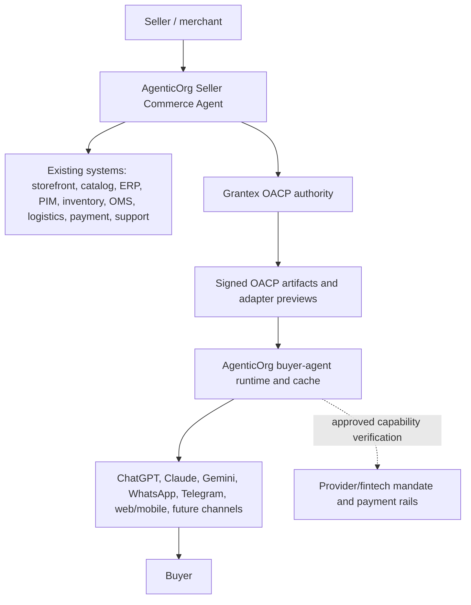
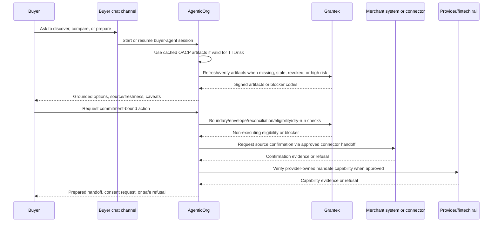

# End-To-End Agentic Commerce Flow

This guide explains how agentic commerce should work from the perspective of
both sellers and buyers. It is documentation only. It does not enable production
Commerce V1, public discovery, checkout/payment creation, live payments, live
provider rails, merchant approval, or a production allowlist.

## Current OACP Runtime Closure Boundary

The launch-closure runtime path is narrower than the full future commerce
journey below. The current OACP runtime proof is: AgenticOrg creates a Seller
Commerce Agent onboarding packet, performs read-only Shopify Admin GraphQL sync
when merchant credentials are valid, sends a Grantex authority request, receives
internal signed OACP artifacts, caches them, and answers non-binding buyer
questions with source and freshness labels. Checkout, payment, order, mandate,
refund, return, shipment, inventory hold, public discovery publication, and live
provider execution remain outside this runtime proof.

Any cart, checkout, consent, Commerce Passport, order, return, refund,
fulfillment, or payment-control wording in this guide describes separate future
or Grantex Commerce payment-control pilot scope. It is not evidence that OACP
runtime artifacts enable transaction execution.

For the consolidated PRD that governs this flow, read
`docs/guides/commerce-v1-agentic-commerce-prd.md`.

## One-Sentence Architecture

Sellers start in AgenticOrg Seller Commerce Agent and connect existing merchant
systems through approved connector custody. Grantex validates public-safe facts
into signed OACP artifacts and policy decisions. Buyers start from their
preferred agent or chat surface. Provider and fintech rails own mandate and
payment execution.

For the C6Z live-runtime path, AgenticOrg calls Grantex through
`POST /v1/commerce/oacp/c6z/authority-requests`. Production should use the
dedicated AgenticOrg C6Z authority service token, limited to that route and to
tenant ids configured in `COMMERCE_C6Z_AUTHORITY_SERVICE_TENANTS`. Grantex
issues the full C6Z artifact set: merchant profile, seller agent card,
connector evidence, catalog snapshot, offer/price snapshot, inventory snapshot,
policy scope, public-discovery state, mandate capability, protocol adapter, and
authority-request status.

## What Sellers Do One Time

The OACP runtime seller journey starts in AgenticOrg Seller Commerce Agent. The
seller can prepare an onboarding packet and connector evidence; Grantex controls
artifact authority and policy decisions. Merchant approval, public launch, and
transaction execution require separate approvals outside this runtime proof.

| Step | Seller action | Grantex responsibility | Launch gate |
| --- | --- | --- | --- |
| 1. Create workspace | Sign up, create tenant, invite owner/admin users. | Create tenant boundary, merchant shell, roles, sandbox/live split. | Tenant isolation and owner audit event. |
| 2. Complete merchant profile | Enter legal name, display name, category, country, currency, support contact, business policies. | Store canonical merchant profile and public-safe display fields separately from private artifacts. | No public discovery until profile is reviewed. |
| 3. Verify business | Provide legal/compliance artifacts in a private evidence system outside Git. | Store only non-secret evidence references and review state. | KYB/KYC/legal/compliance approval required for live. |
| 4. Choose category preset | Select home goods, electronics, fashion, grocery, pharmacy, services, B2B, or another preset. | Apply required field checklist, policy defaults, tax/return/warranty expectations. | Category-specific critical fields must pass. |
| 5. Connect existing systems | Use AgenticOrg Seller Commerce Agent, merchant-owned connectors, external integration providers, or CSV/API to connect Shopify, WooCommerce, Magento, custom storefront, ERP/PIM, WMS, OMS, logistics, payment provider, CRM/support, or upload CSV/API data. | Validate public-safe facts, source/freshness, and non-sensitive evidence refs into OACP artifacts. | Connector health and credential isolation required; Grantex does not need raw connector credentials by default. |
| 6. Define source of truth | Decide whether storefront, ERP/PIM, WMS, OMS, or another system wins for each data type. | Record source precedence, freshness timestamps, sync history, and conflict rules. | No silent overwrite or stale publish. |
| 7. Prepare catalog | Fix titles, descriptions, images, brand, variants, SKU, price, tax, warranty, return summary, category, availability. | Validate required fields, generate public-safe preview, schema.org draft, MCP/native output. | Missing critical catalog data blocks launch. |
| 8. Prepare inventory and delivery | Configure stock state, freshness TTL, delivery/pickup promises, shipping fees, serviceability, logistics source. | Block guarantees when stock or delivery data is stale, unknown, or unsupported. | Checkout blocked when inventory/delivery evidence is insufficient. |
| 9. Configure agent permissions | Choose browse, compare, cart draft, checkout consent request, order status, support handoff, return/refund request. | Convert choices into merchant policy, channel capabilities, scopes, amount caps, and audit rules. | Each capability requires explicit approval. |
| 10. Configure mandate/payment path | Configure provider-owned mandate or payment rails outside Grantex; request live rail only after legal/security/ops approval. | Validate non-sensitive capability/evidence refs only where policy or artifact lineage requires them. | Live provider remains blocked until approved. |
| 11. Review buyer preview | See exactly what agents and buyers may see. | Render public payload preview and blocked-path warnings. | Product wording and security approval required. |
| 12. Run scans | Run secret/private-detail, overclaim, merchant-ID/name, synthetic-ID, config/allowlist, stale-data, and policy scans. | Produce redacted evidence and blocker codes. | Clean scans required for intake readiness. |
| 13. Assign owners | Assign merchant owner, legal, product wording, security, ops/support, backup/RPO, rollback, smoke, evidence retention, AgenticOrg dependency owner. | Record non-secret owner references and approval state. | Missing owners block rollout. |
| 14. Rehearse launch | Run sandbox/demo buyer journey with blocked checkout/live paths clearly labeled. | Produce smoke evidence and rollback checklist. | Smoke evidence required before proposal. |
| 15. Request rollout | Request smallest approved surface, normally read-only discovery first. | Keep fail-closed until approval and rollback readiness exist. | Separate rollout approval required. |

## What Buyers Do One Time

The buyer should not need to know how merchant systems work. Their setup should
look like normal account linking and permission control.

| Step | Buyer action | AgenticOrg responsibility | Grantex responsibility |
| --- | --- | --- | --- |
| 1. Choose a channel | Open ChatGPT, Claude, Gemini, WhatsApp, Telegram, web/mobile, or another approved surface. | Start the matching channel adapter. | Publish approved capabilities for that channel. |
| 2. Link or sign in | Connect AgenticOrg identity if needed. | Create or resume buyer-agent session and bind it to channel identity. | Do not expose private merchant/provider data. |
| 3. Set preferences | Provide locale, currency, delivery region, notification path, accessibility preferences, and optional spend comfort. | Use preferences for conversation and handoff only. | Use preferences for policy checks and consent copy where needed. |
| 4. Understand capabilities | See what the agent can do: browse, compare, draft cart, request checkout, read order status, or support handoff. | Show channel-specific action labels and limitations. | Return approved capability state and blocker reasons. |
| 5. Consent when needed | Approve or deny payment-affecting actions in the Grantex consent flow. | Never bypass consent. | Issue scoped Commerce Passport only after consent and policy pass. |
| 6. Manage history/revocation | Ask what happened or revoke permissions. | Show redacted session state and safe summaries. | Own revocation, audit evidence, and protected action history. |

Buyer setup is not a standing payment approval. Commitment-bound actions must
still pass fresh consent, merchant policy, amount cap, idempotency,
source/freshness, provider-owned mandate/payment capability, and audit evidence.

## Regular Transaction Flow

## Happy Path In Plain English

1. Buyer asks an agent to help find, compare, or prepare.
2. AgenticOrg starts the buyer-agent session in the buyer's chosen channel.
3. AgenticOrg reads valid cached OACP artifacts when TTL, revocation, and risk
   rules allow.
4. AgenticOrg asks Grantex to refresh or verify artifacts when facts are stale,
   missing, revoked, ambiguous, or high risk.
5. AgenticOrg explains grounded facts and warns about unknown or stale
   information.
6. If the buyer requests a commitment-bound action, AgenticOrg uses C6W5-C6W9
   style boundary, envelope, reconciliation, eligibility, and dry-run checks.
7. Merchant-system confirmation happens through approved connector handoff or
   merchant-owned systems.
8. Provider-owned mandate/payment capability verification stays with the
   provider/fintech rail and may be verified directly by AgenticOrg where
   approved.
9. Current OACP work stops at prepared handoff/dry-run. It does not create
   orders, holds, checkout/payment, mandates, refunds, returns, shipments,
   settlement, or payout actions.

## Exception Flows

| Exception | Buyer experience | Seller experience | System behavior |
| --- | --- | --- | --- |
| Merchant not approved | Agent says the merchant is not available for agentic commerce yet. | Seller sees missing approval state. | Grantex remains fail-closed. |
| Channel is read-only | Buyer can browse but gets a safe checkout handoff or "not supported here" message. | Seller sees channel capability limit. | AgenticOrg cannot pretend write actions are available. |
| Product data incomplete | Agent asks clarifying questions or says the product is unavailable. | Seller sees missing required fields. | Grantex blocks or lowers readiness score. |
| Price changed | Buyer sees updated total and must confirm again. | Seller sees audit and source system timestamp. | Grantex recalculates and invalidates stale cart totals. |
| Inventory stale | Buyer gets warning or checkout refusal. | Seller sees stale inventory blocker. | Grantex blocks promises and may block checkout. |
| Consent denied | Checkout stops. | Seller sees no payment attempt. | Grantex records denial and no passport is issued. |
| Policy denied | Buyer sees safe reason such as "this purchase is not allowed by merchant policy." | Seller sees policy blocker code. | Grantex writes audit without leaking private policy. |
| Payment pending/failed | Buyer sees pending/failed status and next safe step. | Seller sees reconciliation status. | Provider/fintech rail remains payment authority; Grantex uses non-sensitive evidence refs where required. |
| Order/fulfillment missing | Buyer cannot get a delivery promise. | Seller sees order/fulfillment gap. | Paid launch should be blocked until operational path exists. |
| Refund/return requested | Buyer gets manual support handoff now; future request/status later. | Seller handles refund in approved system. | No automatic refund execution until separately approved. |

## Source Of Truth Rules

| Data or action | Source of truth |
| --- | --- |
| Merchant identity and approval | Grantex |
| Product and variant data | Merchant systems, validated into Grantex/OACP public-safe artifacts |
| Price, tax, discount, EMI, offer | Merchant systems/provider rails, validated into OACP source/freshness artifacts |
| Inventory and delivery promise | Merchant WMS/OMS/logistics, validated into OACP source/freshness artifacts |
| Buyer conversation | AgenticOrg channel/session layer |
| Consent and Commerce Passport | Grantex |
| Payment mandate and execution | Provider/fintech rail |
| Provider capability evidence refs | Provider/fintech rail, optionally referenced by Grantex/OACP policy |
| Order, fulfillment, return, refund, settlement | Merchant OMS/support/provider systems, exposed through approved artifacts only |
| Buyer-facing explanation | AgenticOrg, grounded only in OACP artifacts and approved source evidence |
| Audit and protected action evidence | Grantex artifact rules plus AgenticOrg redacted session evidence where relevant |

## Production Gates

Do not go live unless all required gates pass:

- Merchant identity and category are approved.
- Existing-system connectors or manual maintenance process are healthy.
- Catalog, price, tax, warranty, return, inventory, and delivery fields meet
  category requirements.
- Agent channel capability is approved for that merchant.
- Buyer consent and Commerce Passport flow is verified.
- Checkout/payment path is approved for sandbox or live as appropriate.
- Order, fulfillment, support, return, and refund handoff exist for paid flows.
- Legal, product, security, ops, rollback, smoke, and evidence owners are set.
- Rollback is rehearsed and can disable the channel or merchant capability.
- No private merchant artifacts, secrets, raw payloads, provider credentials, or
  production config values are committed to Git.

## Fast-Track Build Order

1. Seller self-serve sandbox workspace and checklist.
2. CSV/manual catalog plus one priority storefront connector.
3. Public-safe preview and read-only agent discovery.
4. Buyer web/mobile launch surface.
5. ChatGPT/Claude remote MCP channel.
6. WhatsApp/Telegram bot adapters.
7. Gemini function-calling or hosted wrapper path.
8. Inventory freshness, stale refusal, and safe cart draft.
9. Sandbox consent, Commerce Passport, and checkout rehearsal.
10. Order and fulfillment backbone.
11. Return/refund request workflow.
12. Settlement/payout reporting.
13. UCP/ACP/schema.org/AP2-compatible adapter hardening.
14. One real merchant, one category, one provider, one geography, one rollback
    owner pilot proposal.
