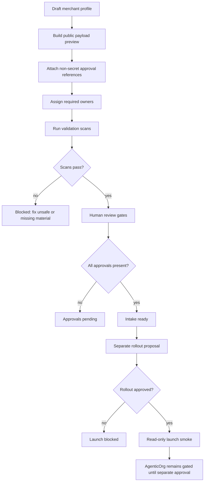

# Merchant Guide To Agentic Commerce

This guide explains how a merchant can prepare for and operate agentic commerce
with Grantex Commerce V1. It is written for merchant business owners, ecommerce
operators, product teams, compliance reviewers, security reviewers, support
teams, and launch owners.

This document is guidance only. It does not approve a merchant for production
discovery, does not approve any allowlist value, does not enable public
discovery, does not enable Commerce V1 in production, does not enable checkout
or payment creation, does not enable live payments, and does not enable live
Plural. A merchant can move toward launch only through separate human approval,
technical validation, legal/compliance review, security review, operations
readiness, rollback readiness, and production rollout approval.

## What Agentic Commerce Means

Agentic commerce lets AI agents help customers discover products, understand
merchant policies, assemble carts, and request permission for commerce actions.
The agent is not the payment processor and does not receive unrestricted access
to the merchant account. Grantex acts as the commerce control plane that keeps
identity, consent, merchant policy, audit evidence, amount caps, and provider
boundaries under reviewable controls.

The merchant experience has three layers:

| Layer | Merchant meaning | Grantex responsibility |
| --- | --- | --- |
| Discovery | Approved agents can read public-safe merchant and catalog metadata. | Publish only approved read-only metadata through gated discovery. |
| Consent | A customer must approve sensitive or payment-adjacent actions. | Record consent, issue scoped Commerce Passports, enforce limits, and audit outcomes. |
| Operations | Merchant teams review activity, incidents, support cases, and rollback. | Provide evidence, logs, policy checks, fail-closed controls, and operator workflows. |

Agentic commerce should feel like a controlled extension of the merchant's
existing ecommerce and support operations, not like handing an autonomous agent
direct access to payments or private systems.

## Current Safety Posture

Grantex Commerce V1 documentation separates local/demo/smoke work from real
merchant production rollout.

| Area | Merchant-facing status |
| --- | --- |
| Synthetic demo packets | Safe for demos and education only. They are not merchant approval. |
| Real merchant onboarding | Requires human artifacts and approval references outside public docs. |
| Read-only discovery | Must remain fail-closed until separately approved. |
| Checkout/payment creation | Requires a separate approved path and is not enabled by this guide. |
| Live payments and live Plural | Blocked until explicit provider, legal, compliance, security, and operations approval. |
| AgenticOrg public commerce discovery | Gated until Grantex readiness and separate AgenticOrg approval exist. |

If any instruction conflicts with these safety controls, stop and escalate to
the Grantex launch owner before proceeding.

## Who Should Use This Guide

Use this guide if you are one of the following:

| Role | Responsibilities |
| --- | --- |
| Merchant owner | Approves the merchant identity, public display name, category, and business intent. |
| Ecommerce operator | Provides catalog, policy, fulfillment, support, and return information. |
| Legal/compliance reviewer | Confirms public metadata is safe and claims are accurate. |
| Product wording reviewer | Reviews what agents and customers will see. |
| Security reviewer | Confirms no secrets, credentials, private data, or unsafe scopes are exposed. |
| Ops/on-call/support owner | Owns production monitoring, support escalation, and incident response. |
| Backup/RPO reviewer | Confirms recovery expectations and data retention boundaries. |
| Rollback owner | Owns disabling discovery and clearing approved rollout configuration if needed. |
| Read-only smoke owner | Owns controlled validation after approval, before broader exposure. |
| Evidence retention owner | Owns redacted evidence, audit summaries, and retention policy. |
| AgenticOrg dependency owner | Reviews downstream AgenticOrg gating after Grantex readiness. |

No single role should approve launch alone. Agentic commerce depends on shared
business, technical, compliance, and operational readiness.

## Merchant Journey Overview

The standard merchant journey has ten stages:

1. Create a private onboarding workspace.
2. Prepare a public-safe merchant profile draft.
3. Prepare a public payload preview.
4. Store private approval artifacts outside the repository.
5. Attach non-secret artifact references.
6. Assign required owners.
7. Run validation scans.
8. Complete human review gates.
9. Prepare a separate rollout proposal.
10. Launch only after explicit rollout approval and smoke validation.

The process is intentionally not automatic. A complete intake packet can make a
merchant intake-ready, but it does not by itself approve production rollout.

## Key Concepts

### Merchant Identity

Merchant identity is the public-safe metadata that tells agents and customers
which merchant they are interacting with.

Required public-safe identity fields usually include:

| Field | Purpose | Safety rule |
| --- | --- | --- |
| Approved public merchant ID | Stable identifier used in approved discovery surfaces. | Must be human-approved before production use. |
| Approved display name | Public merchant name shown to agents and users. | Must be reviewed for accuracy and rights to use. |
| Approved category | High-level category such as home goods, apparel, grocery, or services. | Must not imply unsupported regulated activity. |
| Discovery description | Short public description of what the merchant offers. | Must avoid certification, payment-readiness, or unsupported capability claims. |
| Country/currency posture | Public operating context, when approved. | Must not expose private tax, bank, or entity details. |
| Support posture | How support should be escalated. | Store private contacts outside the repo. |

Synthetic or demo merchant IDs must never be proposed as production allowlist
candidates.

### Public Payload Preview

The public payload preview is the exact read-only metadata that could later be
served to agent discovery clients after approval. It lets reviewers inspect what
would become public before any production configuration is changed.

A safe preview includes:

- merchant ID;
- display name;
- category;
- discovery description;
- issuer or JWKS reference;
- supported read-only capabilities;
- explicitly blocked capabilities;
- cache/header/rate-limit posture;
- no provider credentials;
- no private contracts;
- no private contacts;
- no customer data;
- no live-payment or certification claims.

The preview must be reviewed before launch. It should be treated as public
metadata, even before it is published.

### Schema.org JSON-LD Preview

The schema.org JSON-LD preview shows how the same public-safe Grantex merchant
and catalog evidence could be shaped as schema.org `Product`, `Offer`,
`MerchantReturnPolicy`, and `OfferShippingDetails` objects for later review.

The preview is not publication. It is not schema.org certification. It does not
enable public discovery, checkout, payment creation, live payments, live Plural,
provider access, production configuration, or allowlists.

The preview includes fields only when Grantex has safe evidence for them. For
example, a product name, description, image, brand, offer price, availability,
or return policy can appear only after the corresponding public-safe catalog
field exists. Missing shipping or return evidence appears as a blocker or
omitted type rather than guessed text.

Reviewers should reject the preview if it contains private merchant data,
internal IDs, provider metadata, raw payloads, secrets, production claims,
allowlist values, payment claims, launch claims, or certification claims.

### Read-Only Discovery

Read-only discovery allows approved agent clients to learn that a merchant
exists and inspect safe metadata. It does not allow an agent to create checkout,
initiate payment, access provider credentials, or claim the merchant is certified
for live commerce.

Read-only discovery may include:

- merchant profile read;
- catalog summary read;
- policy summary read;
- public support posture;
- safe issuer/JWKS references;
- safe cache and rate-limit posture.

Read-only discovery must not include:

- live provider credentials;
- payment processor secrets;
- private approval records;
- private contracts;
- private contacts;
- pricing terms not approved for public disclosure;
- customer data;
- raw payloads;
- private keys;
- bearer tokens;
- Commerce Passports;
- idempotency key values.

### Consent And Commerce Passports

Consent is the user approval step for sensitive or payment-adjacent actions. A
Commerce Passport is scoped runtime material that proves a specific consent or
authorization context. It must never be committed to docs, pasted in tickets, or
shared in screenshots.

Merchants should understand these rules:

- agents can suggest actions, but the system must enforce consent and policy;
- passports are scoped, temporary, and sensitive;
- amount caps and merchant policy must be checked before payment-adjacent work;
- missing, expired, revoked, or denied consent must fail closed;
- user-facing wording must clearly describe what is being authorized.

### Checkout And Payment Boundaries

This guide does not enable checkout or live payment creation. Checkout and
payments require separate approval, provider readiness, legal/compliance review,
security review, operations readiness, and rollback planning.

Blocked until separate approval:

- checkout creation;
- payment intent creation;
- live payment processing;
- live Plural access;
- provider credential access;
- direct Stripe, Plural, Pine, or provider credential paths from an agent;
- payment readiness or certification claims.

### AgenticOrg Dependency

AgenticOrg public commerce discovery remains gated until Grantex readiness is
complete and separately approved. A merchant should not assume that Grantex
intake approval automatically exposes commerce metadata through AgenticOrg.

The sequence is:

1. Grantex merchant intake is completed.
2. Grantex read-only rollout proposal is approved separately.
3. Grantex read-only smoke validation passes.
4. AgenticOrg dependency review is completed.
5. AgenticOrg public discovery is separately approved.

## Merchant Onboarding Prerequisites

Before starting, the merchant should gather public-safe information and private
approval artifacts in the right places.

Public-safe information may later be summarized in repository docs or approval
packets:

- approved public merchant ID or non-secret reference authorizing it;
- approved public display name;
- approved category;
- approved discovery description;
- public-safe payload preview;
- non-secret private approval references;
- owner role labels, if approved for repo storage;
- validation scan summaries.

Private artifacts must stay outside public repositories:

- signed contracts;
- private approval records;
- private contacts;
- pricing terms;
- customer data;
- tax identifiers;
- bank details;
- provider credentials;
- raw provider payloads;
- secrets, tokens, JWTs, passports, private keys, DB URLs, or Redis URLs.

## Step 1: Create A Private Onboarding Workspace

The merchant or Grantex operator creates a private workspace for artifact
collection. This may be an approved internal system, document repository, ticket
system, or compliance workspace. It should have access control, audit history,
and retention rules.

The private workspace stores:

- approval artifacts;
- reviewer decisions;
- private contacts;
- contract references;
- support escalation information;
- rollback owner details;
- operational runbooks that include private data.

The public repository stores only public-safe summaries or non-secret references.

## Step 2: Draft The Merchant Profile

The merchant drafts a profile that agents may eventually read.

Recommended profile fields:

| Field | Example guidance |
| --- | --- |
| Display name | Use the approved public merchant name. |
| Category | Choose a plain category that matches the actual catalog. |
| Discovery description | Describe what customers can discover, not what is production-certified. |
| Geography | Include only public-safe operating regions. |
| Currency posture | Include only public-safe supported currency metadata. |
| Support posture | Use role-based escalation labels rather than private contact details. |

Review the profile for:

- accuracy;
- trademark or naming concerns;
- overclaims;
- unsupported regulated activities;
- private information;
- confusing payment or checkout promises.

## Step 3: Prepare The Public Payload Preview

The payload preview should show what the agent discovery layer would expose.
Keep it small, explicit, and reviewable.

Suggested structure:

```json
{
  "merchant_id": "<APPROVED_PUBLIC_MERCHANT_ID>",
  "display_name": "<APPROVED_PUBLIC_DISPLAY_NAME>",
  "category": "<APPROVED_PUBLIC_CATEGORY>",
  "discovery_description": "<APPROVED_PUBLIC_DISCOVERY_DESCRIPTION>",
  "issuer_reference": "<APPROVED_PUBLIC_ISSUER_REFERENCE>",
  "jwks_uri_reference": "<APPROVED_PUBLIC_JWKS_REFERENCE>",
  "supported_read_only_capabilities": [
    "merchant_profile_read",
    "catalog_summary_read",
    "policy_summary_read"
  ],
  "blocked_capabilities": [
    "checkout_creation",
    "payment_intent_creation",
    "live_payment_processing",
    "live_plural_access",
    "provider_credential_access"
  ]
}
```

Use placeholders until approved values exist. Do not paste production secrets,
private URLs, provider credentials, raw payloads, passports, or customer data.

## Step 4: Attach Non-Secret Artifact References

Each approval artifact should have a non-secret reference. A reference might be
an internal ticket ID, approval system ID, or controlled document reference that
does not expose the private artifact body.

Required approval references:

| Approval | Required question |
| --- | --- |
| Merchant owner | Is this the correct merchant identity and business intent? |
| Legal/compliance | Is the public metadata safe, accurate, and legally acceptable? |
| Product wording | Is the wording clear and free of unsupported claims? |
| Security | Are secrets, private data, and credential paths excluded? |
| Ops/on-call/support | Is support coverage and escalation ready? |
| Backup/RPO | Are recovery and retention expectations clear? |
| AgenticOrg dependency | Is downstream exposure still gated and separately reviewed? |
| Rollback owner | Who can disable discovery and coordinate rollback? |
| Read-only smoke owner | Who owns validation after approval? |
| Evidence retention owner | Who owns redacted evidence retention? |

Placeholders are not approval. A pending or placeholder reference means the
packet is not ready.

## Step 5: Assign Owners

Owner assignments should use public-safe role labels in repository docs. Private
names, emails, phone numbers, and escalation details must remain in private
systems.

Minimum owner roles:

- merchant owner;
- legal/compliance reviewer;
- product wording reviewer;
- security reviewer;
- operations/support owner;
- backup/RPO reviewer;
- rollback owner;
- read-only smoke owner;
- evidence retention owner;
- AgenticOrg dependency owner.

If any required owner is missing, the intake state remains not ready.

## Step 6: Run Validation Scans

Validation scans protect the merchant, Grantex, downstream agents, and customers.

Required scan categories:

| Scan | What it catches |
| --- | --- |
| Secret/private-detail scan | Secrets, tokens, provider credentials, private contacts, private contracts, raw payloads, DB/Redis URLs, private keys, customer data. |
| Overclaim scan | Production-ready, live-payment-ready, certified, external-pilot-ready, or provider-ready language without approval. |
| Merchant ID/name safety scan | Production-looking IDs, realistic names without approval, or demo/synthetic names used outside demo context. |
| Synthetic-ID production-candidate scan | Any synthetic or demo ID proposed for production. |
| Config/allowlist value scan | Concrete production config values or allowlist assignments. |
| Payload preview validation | Unsafe fields, unsupported capabilities, missing blocked capabilities, or ambiguous public metadata. |
| Owner/review completeness validation | Missing approvals, missing owners, or unresolved blockers. |

Any failed scan blocks progression.

## Step 7: Complete Human Review Gates

Automated scans are necessary but not sufficient. Human reviewers must verify
business intent, legal accuracy, public wording, security posture, operations
readiness, and rollback readiness.

Reviewers should confirm:

- all public fields are approved;
- all private artifacts are stored outside the repo;
- all approval references are non-secret;
- no private material appears in the public payload;
- blocked capabilities are explicit;
- customer-facing wording is accurate;
- support and rollback owners are assigned;
- downstream AgenticOrg exposure remains gated;
- launch still requires a separate rollout proposal.

## Step 8: Interpret Intake States

The merchant intake state should be explicit.

| State | Meaning | What happens next |
| --- | --- | --- |
| Not ready | Required fields, approvals, scans, or owners are missing. | Complete missing work. Do not propose rollout. |
| Intake ready | The artifact packet is complete and repo-safe. | Prepare a separate rollout proposal. |
| Rollout proposal ready | Intake is complete and rollout materials are prepared. | Seek explicit rollout approval. |
| Rejected | Private data, secrets, unsupported claims, or unsafe requests are present. | Remove unsafe material and restart review. |

Intake ready is not the same as production approved.

## Step 9: Prepare A Rollout Proposal

A rollout proposal is separate from onboarding. It should summarize readiness and
request explicit approval for the narrow next step.

The proposal should include:

- merchant identity summary;
- public payload preview summary;
- approval reference summary;
- scan summary;
- read-only discovery scope;
- dry-run plan;
- smoke validation plan;
- rollback plan;
- owner assignments;
- AgenticOrg dependency status;
- stop conditions;
- statement that checkout, live payments, live Plural, and provider credentials
  remain blocked unless separately approved.

Do not include private artifacts, raw logs, secret values, tokens, passports,
provider credentials, customer data, or production config assignments.

## Step 10: Launch Only After Separate Approval

Production read-only discovery may be considered only after the rollout proposal
is approved. Even then, launch should be narrow, observable, and reversible.

Launch expectations:

- change only approved read-only discovery controls;
- expose only approved public metadata;
- keep broad Commerce V1 runtime disabled unless separately approved;
- keep checkout/payment creation disabled unless separately approved;
- keep live payments and live Plural disabled;
- keep provider credentials unavailable to agents;
- run read-only smoke validation;
- record redacted evidence;
- keep rollback owner available.

If launch validation fails, roll back immediately and record redacted evidence.

## Merchant-Facing Workflow



## What Merchants Can Control

Merchants can control:

- public display name submitted for review;
- category submitted for review;
- public discovery description submitted for review;
- catalog information submitted for read-only preview;
- policies and constraints submitted for review;
- support posture submitted for review;
- approval artifact collection;
- operational readiness;
- rollback ownership;
- evidence retention ownership.

Merchants cannot unilaterally control:

- production allowlist values;
- public discovery enablement;
- Commerce V1 production runtime enablement;
- checkout/payment creation;
- live payment or live Plural access;
- provider credential paths;
- AgenticOrg public commerce discovery.

Those require separate Grantex and, when applicable, AgenticOrg approval.

## Catalog Readiness

Agentic commerce depends on grounded catalog data. Agents must not invent
products, variants, prices, discounts, delivery promises, return policies, or
availability.

Catalog readiness should confirm:

- product names are approved for public display;
- product categories are accurate;
- product identifiers are stable;
- variants are clear;
- availability status is current enough for the proposed use;
- price visibility matches merchant policy;
- return and warranty summaries are accurate;
- restricted products are excluded or clearly blocked;
- unsupported products do not appear in the public payload;
- private supplier data and cost pricing are excluded.

For early read-only discovery, use catalog summaries and policy summaries rather
than full transactional catalog operations unless separately approved.

## Policy Readiness

Merchant policy tells agents what is allowed, blocked, or requires additional
review.

Policy areas may include:

- allowed read-only capabilities;
- blocked capabilities;
- customer support escalation;
- restricted product categories;
- geography constraints;
- currency posture;
- maximum visible claim scope;
- return policy summary;
- cancellation policy summary;
- escalation policy;
- incident response policy;
- rollback policy.

Policy text should be written for clear interpretation by both humans and agent
systems. Ambiguous policy should block launch.

## Customer Consent Experience

When a future approved flow requests consent, the customer should understand:

- which merchant is involved;
- which agent is acting;
- what action is being requested;
- what information may be read;
- whether any payment-adjacent step is involved;
- what amount or limit applies, if applicable;
- how long the authorization lasts;
- how to deny or revoke consent;
- where to get support.

Consent wording must not hide payment implications, imply unsupported readiness,
or overstate agent authority.

## Support And Incident Handling

Merchants should prepare support workflows before launch.

Support should know how to answer:

- What did the agent read?
- Which public payload version was active?
- Was a customer asked for consent?
- Was any payment path involved?
- Which capabilities were blocked?
- Was a request denied by policy?
- Was discovery disabled or rolled back?
- Which owner is responsible for follow-up?

Support evidence must be redacted. Do not copy secrets, tokens, passports, raw
payloads, private customer data, or provider credentials into support tickets.

## Rollback Expectations

Rollback should prefer fail-closed behavior.

Rollback actions may include:

- disable read-only discovery;
- clear the approved allowlist when applicable;
- keep checkout/payment/live flags disabled;
- verify discovery no longer exposes the merchant;
- verify AgenticOrg remains gated;
- record redacted rollback evidence;
- notify merchant support and operations owners;
- keep private incident details in approved private systems.

Rollback is not a failure of the merchant. It is an expected safety control.

## Evidence And Audit Requirements

Evidence should help reviewers understand what happened without exposing private
or sensitive material.

Record:

- command or workflow name;
- file or payload reference name;
- pass/fail status;
- blocker codes;
- approval reference labels;
- owner role labels;
- public payload preview hash or non-secret reference;
- redacted scan summaries;
- smoke result summaries;
- rollback readiness summary.

Never record:

- private contracts;
- private contacts;
- signed approval bodies;
- pricing terms not approved for public release;
- customer data;
- secrets;
- tokens;
- JWTs;
- Commerce Passports;
- provider credentials;
- raw payloads;
- DB URLs;
- Redis URLs;
- private keys;
- production config values.

## AgenticOrg Readiness

If AgenticOrg will expose commerce metadata, treat it as a separate downstream
review.

AgenticOrg should remain gated until:

- Grantex merchant intake is complete;
- Grantex rollout proposal is separately approved;
- Grantex read-only smoke passes;
- AgenticOrg dependency owner approves the downstream exposure;
- AgenticOrg public discovery is explicitly approved.

AgenticOrg must not call provider credentials directly for commerce discovery.
It must use approved Grantex-only commerce surfaces.

## Merchant Demo Mode

Demo mode is useful for education and rehearsal. Demo mode may show:

- synthetic merchant identity;
- synthetic public payload preview;
- placeholder approval references;
- placeholder owner assignments;
- scan summary examples;
- read-only discovery posture;
- blocked checkout, payment, live Plural, and provider credential paths.

Demo mode must not imply:

- real merchant approval;
- production allowlist approval;
- public discovery enablement;
- checkout/payment enablement;
- live payment readiness;
- live Plural readiness;
- provider certification;
- synthetic IDs as production candidates.

## Launch Readiness Checklist

Use this checklist before asking for rollout approval.

| Area | Ready when |
| --- | --- |
| Merchant identity | Public merchant ID, display name, category, and description are approved. |
| Payload preview | Exact read-only metadata has been reviewed and approved. |
| Legal/compliance | Public metadata and consent wording are approved. |
| Product wording | Customer and agent-facing claims are accurate and limited. |
| Security | No secrets, private data, or provider credential paths are present. |
| Operations/support | Support owner and escalation posture are ready. |
| Backup/RPO | Recovery and evidence retention expectations are documented. |
| Rollback | Rollback owner and fail-closed process are ready. |
| Read-only smoke | Smoke owner and validation plan are ready. |
| Evidence retention | Redacted evidence owner and retention plan are ready. |
| AgenticOrg | Dependency remains gated until separate approval. |
| Production safety | Checkout, live payments, live Plural, and provider credentials remain blocked unless separately approved. |

## Common Merchant Questions

### Can an AI agent sell my products automatically?

Not by default. Early agentic commerce should begin with controlled read-only
discovery. Checkout or payment creation requires separate approval, consent,
policy checks, and provider readiness.

### Can the demo merchant be used for production?

No. Demo and synthetic merchants are for education, local validation, and
walkthroughs only. Synthetic IDs must never be used in a production allowlist.

### Can I paste signed approvals into the repository?

No. Store signed approvals in an approved private system. The repo may contain
only public-safe summaries or non-secret approval references.

### Can the agent access my payment provider directly?

No. Agentic commerce must preserve provider boundaries. Agents should not access
Stripe, Plural, Pine, or other provider credentials directly.

### What happens if a customer denies consent?

The action must stop. Denied, expired, revoked, or missing consent must fail
closed before payment-adjacent work.

### What if an agent gives an incorrect product answer?

The merchant should investigate catalog grounding, policy summary accuracy, and
agent integration behavior. If the issue affects safety or customer trust,
rollback discovery until the issue is corrected.

### What does launch approval mean?

Launch approval is explicit permission for a narrow reviewed rollout step. It
does not automatically approve checkout, live payments, live Plural, provider
credentials, or downstream AgenticOrg public discovery unless those are
separately approved.

## Stop Conditions

Stop immediately if any of these occur:

- real private merchant artifacts appear in the repository;
- a secret, token, JWT, passport, provider credential, raw payload, DB URL,
  Redis URL, or private key appears in docs or logs;
- a production config value or allowlist value appears without separate approval;
- a synthetic or demo ID is proposed for production;
- a merchant is treated as approved without human approval references;
- a checkout/payment/live-provider path is requested without separate approval;
- live payments or live Plural are requested without separate approval;
- AgenticOrg public commerce discovery is requested before Grantex read-only
  smoke and separate AgenticOrg approval;
- validation scans fail;
- rollback ownership is missing;
- support ownership is missing.

## Merchant Launch Packet Template

Use placeholders until values are approved.

```text
Merchant identity
- Public merchant ID: <MERCHANT_ID_PENDING_APPROVAL>
- Display name: <MERCHANT_PUBLIC_NAME_PENDING_APPROVAL>
- Category: <MERCHANT_CATEGORY_PENDING_APPROVAL>
- Discovery description: <MERCHANT_DISCOVERY_DESCRIPTION_PENDING_APPROVAL>

Public payload preview
- Issuer reference: <ISSUER_REFERENCE_PENDING_APPROVAL>
- JWKS reference: <JWKS_REFERENCE_PENDING_APPROVAL>
- Supported read-only capabilities: merchant_profile_read, catalog_summary_read, policy_summary_read
- Blocked capabilities: checkout_creation, payment_intent_creation, live_payment_processing, live_plural_access, provider_credential_access

Approval references
- Merchant owner: <PRIVATE_APPROVAL_REFERENCE_PENDING>
- Legal/compliance: <PRIVATE_APPROVAL_REFERENCE_PENDING>
- Product wording: <PRIVATE_APPROVAL_REFERENCE_PENDING>
- Security: <PRIVATE_APPROVAL_REFERENCE_PENDING>
- Ops/support: <PRIVATE_APPROVAL_REFERENCE_PENDING>
- Backup/RPO: <PRIVATE_APPROVAL_REFERENCE_PENDING>
- AgenticOrg dependency: <PRIVATE_APPROVAL_REFERENCE_PENDING>

Owner roles
- Rollback owner: <ROLLBACK_OWNER_PENDING>
- Read-only smoke owner: <READ_ONLY_SMOKE_OWNER_PENDING>
- Evidence retention owner: <EVIDENCE_RETENTION_OWNER_PENDING>

Validation
- Secret/private-detail scan: <SCAN_RESULT_PENDING>
- Overclaim scan: <SCAN_RESULT_PENDING>
- Merchant ID/name safety scan: <SCAN_RESULT_PENDING>
- Synthetic-ID production-candidate scan: <SCAN_RESULT_PENDING>
- Config/allowlist value scan: <SCAN_RESULT_PENDING>

Decision state
- Current state: not_ready
- Rollout approval: not_approved
```

## Summary

Agentic commerce can help merchants make public-safe product and policy
information available to AI agents while preserving consent, policy, audit, and
provider boundaries. The safe path is deliberate: draft public metadata, keep
private artifacts outside repos, attach non-secret approval references, run
validation scans, complete human review, prepare a separate rollout proposal,
and launch only after explicit approval.

Reading or using this guide does not approve any merchant, allowlist value,
production discovery setting, checkout/payment flow, live payment path, live
Plural path, or AgenticOrg public discovery path.
