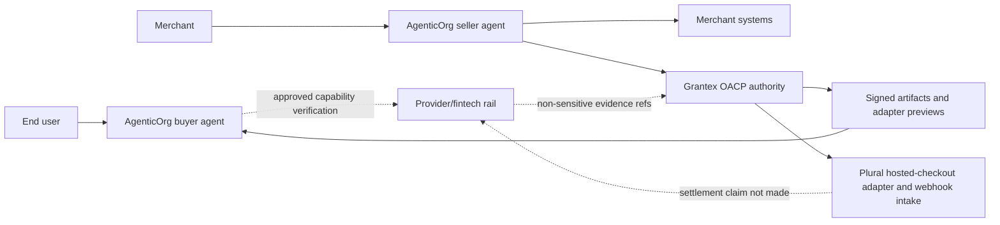
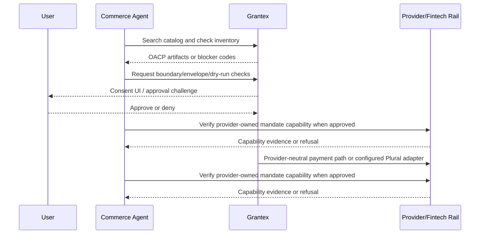
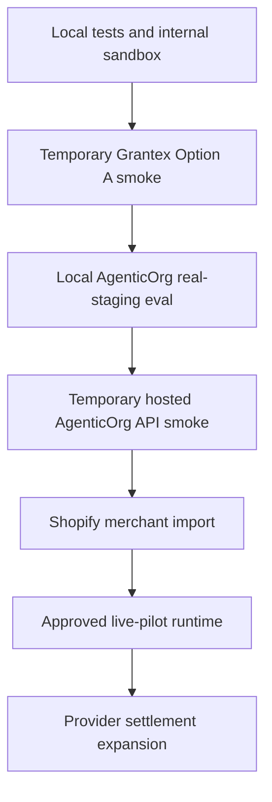

# Commerce V1 Overview

Grantex Commerce V1 is the trust, protocol, policy, and canonical-artifact
authority for agentic commerce. AgenticOrg runs buyer and seller agents.
Merchant systems remain operational sources of record. Provider and fintech
rails own mandate and payment execution. Grantex keeps OACP artifacts,
source/freshness rules, refusal semantics, consent posture, and audit evidence
safe without becoming a toll booth for every non-binding agent interaction.

This is the current live-pilot overview. Production Commerce V1 is deployed for
the approved Shopify merchant `mch_shopify_mgx0n6_22` from
`mgx0n6-22.myshopify.com`. The Grantex control plane is live; public docs do
not claim production Plural settlement because the available Plural credentials
authenticate against Plural UAT-compatible rails.

## Current Posture

| Capability | Status | Evidence or gate |
| --- | --- | --- |
| Local/internal sandbox | Implemented | Synthetic catalog, cart, consent, passport, payment, webhook, and audit flows. |
| Temporary Grantex Option A smoke | Verified | internal evidence record (operator-internal, available on request) records 14 passed, 0 failed, 6 failed-safe, 0 skipped. |
| AgenticOrg real-staging handoff | Verified externally | AgenticOrg evidence records authority-checked tools and redacted fixture handling. |
| Internal OACP foundation | Implemented through C6W9 | Artifact family, adapter preview, commitment boundary, prepared envelope, reconciliation, eligibility packet, and dry-run verifier foundations are internal and non-executing. |
| Hosted AgenticOrg API-only discovery | Verified externally | AgenticOrg C3 evidence records hosted MCP/A2A discovery against temporary Grantex smoke. |
| Plural sandbox hosted-checkout adapter | Implemented/gated | Token, hosted checkout order creation, order-status polling, and HMAC webhook verification are behind the provider abstraction and require explicit sandbox flags and credentials. |
| Shopify live pilot merchant | Deployed | `mgx0n6-22.myshopify.com` is imported as `mch_shopify_mgx0n6_22` with 5 products and 5 variants. |
| Grantex production Commerce V1 discovery | Live pilot | `/.well-known/grantex-commerce` returns the approved live merchant profile. |
| Machine-readable live-readiness gate | Complete for the approved pilot | Runtime snapshot requires explicit legal, provider, security, operations, OACP E2E, audit, rollback, and human approval evidence. Missing evidence still returns `live_readiness_blocked`. |
| Production checkout control plane | Enabled for the approved pilot | Consent, Commerce Passport, policy, amount-cap, cart, payment-intent, webhook, reconciliation, and audit controls are deployed. |
| Plural adapter | Configured | Webhook intake and adapter health are deployed; production Plural settlement is not claimed while credentials authenticate against UAT-compatible rails. |

## Start Here

| Audience | Path |
| --- | --- |
| Product, merchant success, and implementation owners | Read `docs/guides/commerce-v1-agentic-commerce-prd.md` as the canonical consolidated PRD, then use `docs/guides/commerce-v1-agentic-commerce-implementation-prd.md` for the implementation summary. |
| Sellers and buyer-experience reviewers | Read `docs/guides/commerce-v1-end-to-end-agentic-commerce-flow.mdx` for the one-time seller setup, one-time buyer setup, and regular transaction walkthrough. |
| Developers integrating with Grantex Commerce APIs/MCP | Read this overview, then `docs/guides/commerce-v1-developer-guide.mdx` and `docs/api/grantex-commerce-v1.openapi.yaml`. |
| Merchants and operators | Read `docs/guides/commerce-v1-merchant-operator-guide.mdx`, then `docs/guides/commerce-v1-operations.mdx`. |
| AgenticOrg integration owners | Read this page, the AgenticOrg commerce docs, and the Option A smoke workflow. |
| Reviewers assessing readiness | Read the smoke evidence and production discovery readiness report before any enablement proposal. |
| End users | Use the plain-language consent flow below: agents can prepare a purchase, but Grantex controls what may proceed and records what happened. |

## Architecture

The important boundary is that the agent does not execute payments or become the
merchant system of record. AgenticOrg may initiate approved connector sync jobs
and may verify provider-owned mandate capability where approved. Grantex owns
artifact authority, policy enforcement, refusal semantics, and evidence
requirements.

For the full consolidated product requirements, use
`docs/guides/commerce-v1-agentic-commerce-prd.md` as the source of truth.

## End-To-End Flow Summary

1. Seller starts in AgenticOrg Seller Commerce Agent, creates an onboarding
   packet, connects systems through approved connector custody, and requests
   Grantex authority review.
2. Buyer completes one-time setup in their preferred channel: account/session
   linking, safe preferences, and understanding that checkout requires Grantex
   consent.
3. Buyer asks an AgenticOrg-powered agent to discover, compare, or buy.
4. AgenticOrg uses cached OACP artifacts when TTL, revocation, and risk rules
   allow; otherwise it asks Grantex to refresh or verify.
5. Commitment-bound actions require boundary, envelope, reconciliation,
   eligibility, and dry-run checks before any future handoff.
6. AgenticOrg explains sourced facts, warns about stale or unknown data, and
   refuses unsupported claims.

## Consent And Commerce Passport Lifecycle

The Commerce Passport is scoped runtime material. It may be used during approved
smoke runs, but it must never appear in committed docs, PR bodies, logs, raw
payload dumps, or chat.

## Readiness Gate Ladder

Each gate is separate. The approved Shopify live pilot does not imply broad
merchant self-service, provider certification, or production Plural settlement.
The runtime live-readiness gate still requires machine-readable approval
evidence; feature flags alone are not sufficient to start live commerce.

## Allowed And Blocked

| Enabled now | Controlled or not claimed |
| --- | --- |
| Local mock demo and internal sandbox work. | Broad public self-serve merchant onboarding. |
| Approved temporary Option A smoke resources and historical evidence. | Provider certification or standards certification claims. |
| Shopify live pilot profile and catalog discovery for `mch_shopify_mgx0n6_22`. | Production Plural settlement claims while only UAT-compatible credentials are validated. |
| OACP artifact-backed AgenticOrg commerce tools and approved capability verification. | Direct payment execution, live provider credentials, or unapproved private merchant API execution from AgenticOrg commerce. |
| Public JWKS references as verification metadata. | Raw passports, bearer tokens, idempotency key values, secrets, DB/Redis URLs, or raw payloads in docs/evidence. |

## Related Documents

- `docs/guides/commerce-v1-agentic-commerce-implementation-prd.md`
- `docs/guides/commerce-v1-developer-guide.mdx`
- `docs/guides/commerce-v1-merchant-operator-guide.mdx`
- `docs/guides/commerce-v1-operations.mdx`
- `docs/guides/commerce-v1-repeatable-option-a-smoke-workflow.md`
- `docs/api/grantex-commerce-v1.openapi.yaml`

Internal Option A smoke evidence and production-discovery readiness
records are operator-internal artifacts kept in `docs/internal/commerce-v1/`
and are available to authorized reviewers on request via
`security@grantex.dev`.
