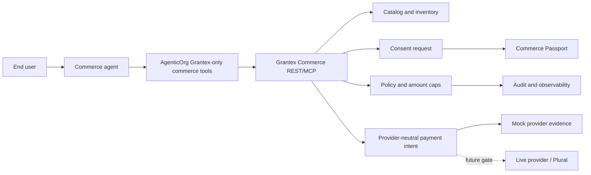
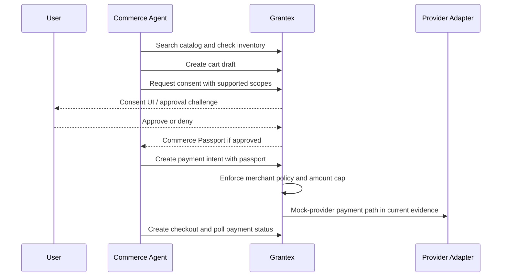
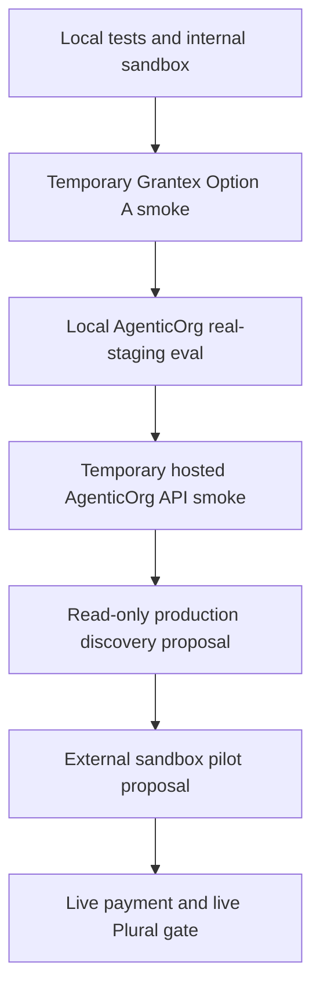

# Commerce V1 Overview

Grantex Commerce V1 is the control plane for agentic commerce. It keeps consent,
Commerce Passports, merchant policy, amount caps, audit, catalog grounding,
webhook replay safety, and payment-provider boundaries inside Grantex while
agents interact through approved REST and MCP surfaces.

This is a documentation and education page. It does not enable production
Commerce V1, live payments, live Plural, or production discovery.

## Current Posture

| Capability | Status | Evidence or gate |
| --- | --- | --- |
| Local/internal sandbox | Implemented | Synthetic catalog, cart, consent, passport, payment, webhook, and audit flows. |
| Temporary Grantex Option A smoke | Verified | internal evidence record (operator-internal, available on request) records 14 passed, 0 failed, 6 failed-safe, 0 skipped. |
| AgenticOrg real-staging handoff | Verified externally | AgenticOrg evidence records Grantex-only tools and redacted fixture handling. |
| Hosted AgenticOrg API-only discovery | Verified externally | AgenticOrg C3 evidence records hosted MCP/A2A discovery against temporary Grantex smoke. |
| Grantex production Commerce V1 discovery | Disabled/fail-closed | internal production-discovery readiness record (operator-internal, available on request). |
| Production checkout/live payments | Blocked | Requires legal, compliance, security, operations, provider, rollback, and human approval gates. |
| Live Plural | Blocked | Mock provider only in current smoke evidence. |

## Start Here

| Audience | Path |
| --- | --- |
| Product, merchant success, and implementation owners | Read `docs/guides/commerce-v1-agentic-commerce-prd.md` as the canonical consolidated PRD, then use `docs/guides/commerce-v1-agentic-commerce-implementation-prd.md` for the implementation summary. |
| Sellers and buyer-experience reviewers | Read `docs/guides/commerce-v1-end-to-end-agentic-commerce-flow.mdx` for the one-time seller setup, one-time buyer setup, and regular transaction walkthrough. |
| Developers integrating with Grantex Commerce APIs/MCP | Read this overview, then `docs/guides/commerce-v1-developer-guide.mdx` and `docs/api/grantex-commerce-v1.openapi.yaml`. |
| Merchants and operators | Read `docs/guides/commerce-v1-merchant-operator-guide.mdx`, then `docs/guides/commerce-v1-operations.mdx`. |
| AgenticOrg integration owners | Read this page, the AgenticOrg commerce docs, and the Option A smoke workflow. |
| Reviewers assessing readiness | Read the smoke evidence and production discovery readiness report before any enablement proposal. |
| End users | Use the plain-language consent flow below: agents can prepare a purchase, but Grantex controls what may proceed and records what happened. |

## Architecture

The important boundary is that the agent does not own payment-provider access.
AgenticOrg uses `grantex_commerce:*` tools. Grantex owns provider abstraction,
policy enforcement, audit, webhook replay safety, and any future live-provider
enablement.

For the full consolidated product requirements, use
`docs/guides/commerce-v1-agentic-commerce-prd.md` as the source of truth.

## End-To-End Flow Summary

1. Seller completes one-time setup in Grantex: workspace, verification,
   connected systems, catalog, inventory, policy, payment path, approvals,
   smoke evidence, and rollback ownership.
2. Buyer completes one-time setup in their preferred channel: account/session
   linking, safe preferences, and understanding that checkout requires Grantex
   consent.
3. Buyer asks an AgenticOrg-powered agent to discover, compare, or buy.
4. AgenticOrg calls only approved Grantex commerce tools.
5. Grantex grounds product, price, inventory, delivery, return, consent,
   checkout, payment, order, fulfillment, support, refund, settlement, audit,
   and rollback state.
6. AgenticOrg explains what Grantex knows, warns about stale or unknown data,
   and refuses unsupported claims.

## Consent And Commerce Passport Lifecycle

The Commerce Passport is scoped runtime material. It may be used during approved
smoke runs, but it must never appear in committed docs, PR bodies, logs, raw
payload dumps, or chat.

## Readiness Gate Ladder

Each gate is separate. Passing a temporary smoke run does not imply production
discovery, production checkout, live payments, live Plural, external pilot
readiness, or provider certification.

## Allowed And Blocked

| Allowed now | Blocked now |
| --- | --- |
| Local mock demo and internal sandbox work. | Production Commerce V1 discovery enablement. |
| Approved temporary Option A smoke resources. | Production checkout or payment execution. |
| Mock-provider evidence with scrubbed reports. | Live Plural or live provider credentials. |
| AgenticOrg Grantex-only commerce tools. | Direct Stripe, Plural, Pine, or provider credential paths from AgenticOrg commerce. |
| Public JWKS references as verification metadata. | Raw passports, bearer tokens, idempotency key values, secrets, DB/Redis URLs, or raw payloads in docs/evidence. |

## Related Documents

- `docs/guides/commerce-v1-agentic-commerce-implementation-prd.md`
- `docs/guides/commerce-v1-developer-guide.mdx`
- `docs/guides/commerce-v1-merchant-operator-guide.mdx`
- `docs/guides/commerce-v1-operations.mdx`
- `docs/guides/commerce-v1-repeatable-option-a-smoke-workflow.md`
- `docs/api/grantex-commerce-v1.openapi.yaml`

Internal Option A smoke evidence and production-discovery readiness
records are operator-internal artifacts kept in `docs/internal/commerce-v1/`
and are available to authorized reviewers on request via
`security@grantex.dev`.
