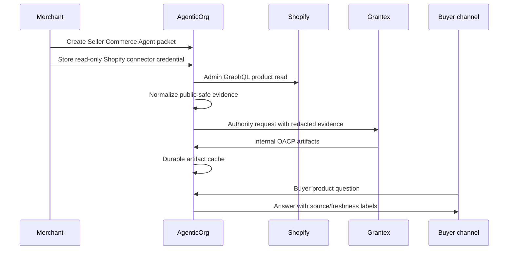

# OACP End-User Flow

Status: current runtime closure guide, updated 2026-06-18.

OACP in the current launch closure is an internal runtime artifact protocol, not
public standardization, certification, conformance, or production payment
approval.

## Ownership

- AgenticOrg is the buyer and seller AI-agent runtime. It owns Seller Commerce
  Agent onboarding, merchant connector initiation, artifact cache consumption,
  buyer sessions, bridge adapters, and approved provider-owned mandate
  capability verification.
- Grantex is the trust, protocol, policy, and canonical OACP artifact authority.
- Shopify and other merchant systems remain operational systems of record.
- Plural/Pine and other provider rails own payment and mandate execution.
- Grantex is not a toll booth for every non-binding buyer/seller interaction.

## Runtime Flow

## Artifact Families

Grantex C6Z authority issues these internal families for AgenticOrg cache intake:

- `merchant_profile`
- `seller_agent_card`
- `connector_evidence`
- `catalog_snapshot`
- `offer_price_snapshot`
- `inventory_snapshot`
- `policy_scope`
- `public_discovery_state`
- `mandate_capability`
- `protocol_adapter`
- `authority_request_status`

Every artifact keeps `allowed_to_execute=false`,
`no_payment_execution=true`, and `non_authoritative_for_transaction=true`.

## Adapter Closure Matrix

| Adapter | Official source/spec URL | Runtime helper | What it does | What it does not claim |
| --- | --- | --- | --- | --- |
| Schema.org Product/Offer JSON-LD | https://schema.org/Product and https://schema.org/Offer | `buildOacpC6W4ProtocolAdapterPreview('schema_org_jsonld')` | Maps sourced product/offer-like facts for preview. | No schema.org certification or publication approval. |
| UCP-style capability profile | https://ucp.dev/ | `buildOacpC6W4ProtocolAdapterPreview('ucp_capability_profile')` | Maps read-only capability metadata. | No UCP certification or public UCP publication. |
| ACP-style commerce shape | https://docs.stripe.com/agentic-commerce | `buildOacpC6W4ProtocolAdapterPreview('acp_commerce_capability')` | Maps non-binding commerce capability shape. | No checkout/payment authority or ACP certification. |
| AP2-style evidence shape | https://ap2-protocol.org/specification/ | `buildOacpC6W4ProtocolAdapterPreview('ap2_evidence_intent_summary')` | Maps evidence/intent summary without mandate execution. | No AP2 certification, mandate approval, or payment-network submission. |
| A2A agent card/task metadata | https://a2a-protocol.org/latest/specification/ | `buildOacpC6W4ProtocolAdapterPreview('a2a_agent_card_task_capability')` | Maps seller-agent task metadata. | No official A2A marketplace approval. |
| MCP tool/resource metadata | https://modelcontextprotocol.io/specification/ | `buildOacpC6W4ProtocolAdapterPreview('mcp_tool_resource_capability')` | Maps read-only tool/resource preview metadata. | No MCP registry approval or write tools. |
| OpenAPI buyer-safe bridge schema | https://spec.openapis.org/oas/latest.html | `buildOacpC6W4ProtocolAdapterPreview('openapi_buyer_safe_bridge_schema')` | Maps function/API bridge shape for buyer-safe questions. | No execution authority or public API approval. |

## Stop Conditions

Stop if a change enables checkout, payment, order, mandate, refund, return,
shipment, inventory hold, live provider calls, merchant-private mutation, public
discovery publication, external OACP publication, or certification,
conformance, standardization, merchant approval, payment approval, public-launch
readiness, or production-readiness claims.
