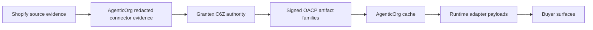

# OACP Runtime Authority And Adapter Mappings

Grantex is the OACP trust, protocol, policy, artifact signing, verification,
and adapter-governance authority. AgenticOrg is the buyer/seller agent runtime
that operates Shopify connector sync, artifact cache, buyer channels, and
provider-owned mandate capability verification.

Grantex must not become a toll booth for every buyer/seller agent interaction.
AgenticOrg may answer non-binding buyer questions from valid cached artifacts
while TTL, freshness, revocation, scope, and verifier state remain usable.

## C6Z Authority Route

`POST /v1/commerce/oacp/c6z/authority-requests` accepts AgenticOrg
route-scoped service-token requests for allowlisted tenants. It issues or
refuses signed/internal OACP artifacts for:

- `merchant_profile`
- `seller_agent_card`
- `connector_evidence`
- `catalog_snapshot`
- `offer_price_snapshot`
- `inventory_snapshot`
- `policy_scope`
- `public_discovery_state`
- `mandate_capability`
- `protocol_adapter`
- `authority_request_status`

The route is not a checkout, payment, order, mandate, provider, Shopify, or
merchant private API path.

## Protocol Adapter Governance

The `protocol_adapter` artifact carries a canonical mapping profile. It tells
AgenticOrg which artifact families must feed each compatibility payload:
Schema.org Product/Offer JSON-LD, UCP-style capability profile, ACP-style
commerce interaction profile, AP2-style mandate/payment evidence profile, A2A
task metadata, MCP tool/resource metadata, and OpenAPI buyer-safe bridge schema.

These are compatibility mappings only. They are not public protocol
certification, standards publication, public discovery approval, checkout
enablement, or payment execution.

## Refusal Rules

Grantex refuses stale, unsafe, private, raw, enabling, scope-mismatched, or
non-read-only authority requests. AgenticOrg must turn those refusals into
safe operator blockers rather than silently falling back to raw Shopify or
provider payloads.

