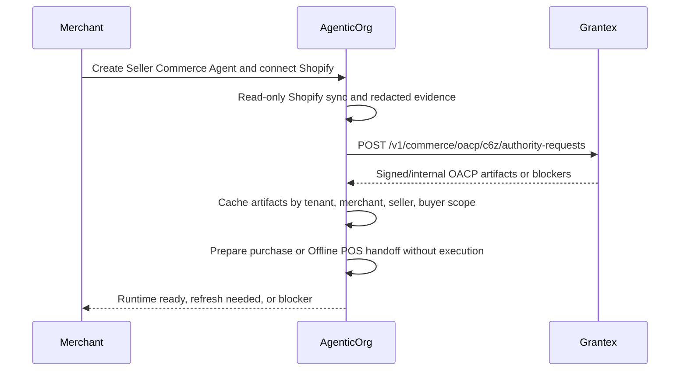

# OACP Integration Guide For AgenticOrg

Canonical end-to-end flow: [OACP authority overview](./overview).

AgenticOrg calls Grantex only when it needs authority artifacts or verification. It does not route every buyer message through Grantex.

## Runtime Flow

## Request Contract

AgenticOrg sends:

- tenant, merchant, seller agent, and source identifiers;
- requested OACP artifact families;
- source observed timestamp;
- public-safe connector evidence;
- no raw Shopify credential, raw provider payload, checkout URL, or payment URL.
- no raw POS payload, raw payment payload, order-created claim, or POS paid-state claim.

Grantex returns:

- `201 artifact_issuance_ready` with artifact families when ready;
- `202 received` when connector evidence is still required;
- `422` when the request is private, stale, executable, or otherwise unsafe.

## Public Catalog Publishing Boundary

AgenticOrg publishes public buyer-safe seller and product surfaces after it has valid Shopify/OACP evidence and the operator enables public catalog publishing. Grantex does not host these catalog pages and does not sit in the hot path for non-binding buyer questions.

Expected AgenticOrg public surfaces:

| Surface | AgenticOrg route |
| --- | --- |
| Seller profile page | `GET /api/v1/public/commerce/sellers/{merchant_id}?tenant_id=...&seller_agent_id=...` |
| Buyer-safe catalog JSON | `GET /api/v1/public/commerce/sellers/{merchant_id}/catalog.json?tenant_id=...&seller_agent_id=...` |
| Product detail page | `GET /api/v1/public/commerce/sellers/{merchant_id}/products/{product_slug}?tenant_id=...&seller_agent_id=...` |
| Product detail JSON | `GET /api/v1/public/commerce/sellers/{merchant_id}/products/{product_slug}.json?tenant_id=...&seller_agent_id=...` |
| Schema.org JSON-LD | `GET /api/v1/public/commerce/sellers/{merchant_id}/schema-org.jsonld?tenant_id=...&seller_agent_id=...` |
| Sitemap | `GET /api/v1/public/commerce/sellers/{merchant_id}/sitemap.xml?tenant_id=...&seller_agent_id=...` |
| llms.txt | `GET /api/v1/public/commerce/sellers/{merchant_id}/llms.txt?tenant_id=...&seller_agent_id=...` |

Those outputs must include source and freshness labels, must not expose Shopify credentials or raw provider payloads, and must not claim checkout, payment, mandate, order, certification, or external platform approval. If the AgenticOrg cache is stale, revoked, or source-mismatched, the public surface must block or label the missing requirement instead of inventing facts.

## Required Configuration

| Config | Owner | Purpose |
| --- | --- | --- |
| `COMMERCE_C6Z_AUTHORITY_SERVICE_TOKEN` | Grantex + AgenticOrg | Service-token auth for authority requests. |
| `COMMERCE_C6Z_AUTHORITY_SERVICE_TENANTS` | Grantex | Tenant allowlist. |
| Shopify credential custody | AgenticOrg + merchant | Read-only source evidence generation. |
| Provider capability config | AgenticOrg + provider | Capability evidence checks outside Grantex. |
| POS provider approval | AgenticOrg + merchant + POS/payment provider | Verified callback/evidence refs for Offline POS Bridge reconciliation. |

## Failure Handling

If Grantex is unavailable, AgenticOrg may answer non-binding buyer questions from valid cached artifacts. Commitment-bound or POS-bound requests must refresh, prepare no execution, use only valid cached policy when risk permits, or refuse.
