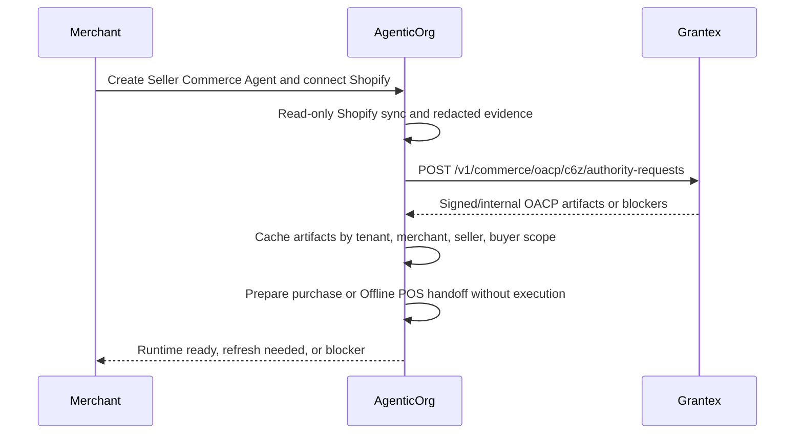

# OACP Integration Guide For AgenticOrg

Canonical end-to-end flow: [OACP authority overview](./overview).

AgenticOrg calls Grantex only when it needs authority artifacts or verification. It does not route every buyer message through Grantex.

## Runtime Flow

## Request Contract

AgenticOrg sends:

- tenant, merchant, seller agent, and source identifiers;
- requested OACP artifact families;
- source observed timestamp;
- public-safe connector evidence;
- no raw Shopify credential, raw provider payload, checkout URL, or payment URL.
- no raw POS payload, raw payment payload, order-created claim, or POS paid-state claim.

Grantex returns:

- `201 artifact_issuance_ready` with artifact families when ready;
- `202 received` when connector evidence is still required;
- `422` when the request is private, stale, executable, or otherwise unsafe.

## Required Configuration

| Config | Owner | Purpose |
| --- | --- | --- |
| `COMMERCE_C6Z_AUTHORITY_SERVICE_TOKEN` | Grantex + AgenticOrg | Service-token auth for authority requests. |
| `COMMERCE_C6Z_AUTHORITY_SERVICE_TENANTS` | Grantex | Tenant allowlist. |
| Shopify credential custody | AgenticOrg + merchant | Read-only source evidence generation. |
| Provider capability config | AgenticOrg + provider | Capability evidence checks outside Grantex. |
| POS provider approval | AgenticOrg + merchant + POS/payment provider | Verified callback/evidence refs for Offline POS Bridge reconciliation. |

## Failure Handling

If Grantex is unavailable, AgenticOrg may answer non-binding buyer questions from valid cached artifacts. Commitment-bound or POS-bound requests must refresh, prepare no execution, use only valid cached policy when risk permits, or refuse.
