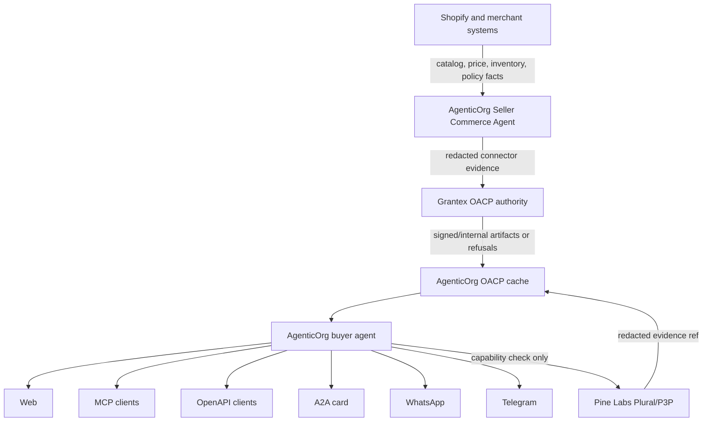
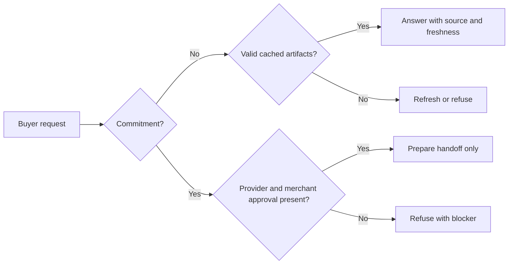

# OACP Architecture

Canonical end-to-end flow: [OACP authority overview](./overview).

OACP separates facts, authority, runtime behavior, and payment rails so no agent has to invent commerce state.

## Responsibilities

| Party | Owns | Does not own |
| --- | --- | --- |
| Merchant systems | Catalog, price, inventory, order, policy, support, and source timestamps. | OACP artifact policy. |
| AgenticOrg | Seller and buyer agents, Shopify connector runtime, cache, buyer channels, and capability verification. | Canonical OACP authority or payment rail execution. |
| Grantex | Policy, trust, artifacts, verification, and adapter authority. | Merchant connector runtime, buyer sessions, orders, or payments. |
| Provider rails | Mandate and payment execution, provider status, settlement, and provider webhooks. | OACP trust authority or buyer-agent answers. |

## Why Grantex Is Not In Every Loop

Grantex signs and verifies authority artifacts. AgenticOrg can answer non-binding questions from valid cached artifacts until TTL, revocation, or policy state requires refresh. This reduces latency and avoids making Grantex a relay for every buyer question while preserving a hard boundary for commitment requests.

## Failure Shape

