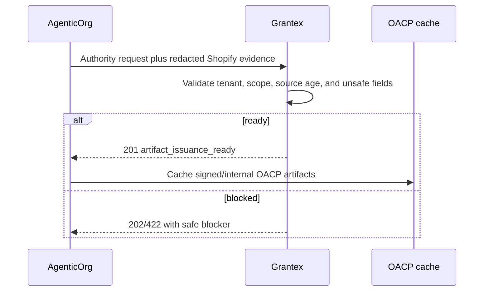

# OACP Artifact Authority

Canonical end-to-end flow: [OACP authority overview](./overview).

Grantex authority is exposed through `POST /v1/commerce/oacp/c6z/authority-requests`. The route accepts an AgenticOrg seller authority request and public-safe connector evidence, validates scope, and returns issued artifacts or a refusal.

## Artifact Families

| Family | Purpose |
| --- | --- |
| `merchant_profile` | Merchant identity and public profile evidence. |
| `seller_agent_card` | Seller Commerce Agent identity and runtime boundary. |
| `connector_evidence` | Public-safe source evidence from AgenticOrg connector custody. |
| `catalog_snapshot` | Product catalog facts from Shopify or merchant source. |
| `offer_price_snapshot` | Price and offer facts with freshness metadata. |
| `inventory_snapshot` | Inventory/availability facts with source time. |
| `policy_scope` | Merchant and Grantex policy boundaries. |
| `public_discovery_state` | Whether buyer-safe discovery may be shown. |
| `mandate_capability` | Provider-owned capability evidence requirement and state. |
| `protocol_adapter` | Compatibility mapping metadata. |
| `authority_request_status` | Request result and blocker state. |

## Verification Rules

Artifacts must carry issuer, issuer key, artifact type, issued/expires timestamps, payload hash, signature algorithm, source refs, freshness metadata, revocation posture, risk tier, and `no_checkout_payment_enablement` behavior. Payloads must not contain raw connector payloads, tokens, provider secrets, card or bank data, checkout URLs, payment URLs, executable targets, or private merchant data.

## Pending Runtime Gap

Detached signature verification and key governance are implemented internally, but external public key distribution, rotation policy publication, and partner acceptance remain approval work before external program launch.
