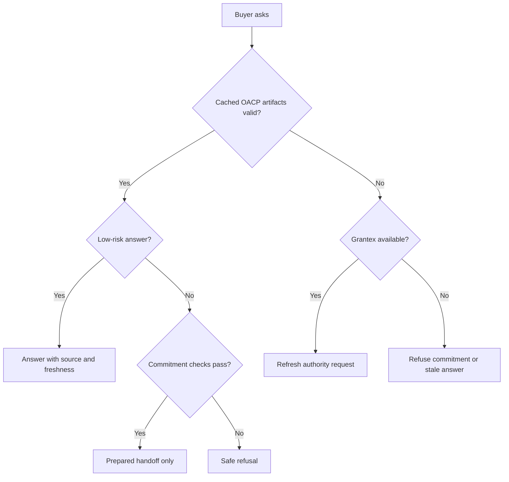

# OACP Buyer Safety And Freshness

Canonical end-to-end flow: [OACP authority overview](./overview).

Buyer agents can ask, compare, reason, prepare, and hand off. They cannot invent product facts, stock promises, discounts, payment outcomes, orders, or mandates.

## Valid Cache, Grantex Unavailable

If Grantex is temporarily unavailable and the cached artifacts are valid for the action class, AgenticOrg may continue non-binding Q&A with visible source and freshness labels.

## Grantex Unavailable And Commitment Requested

If the buyer asks for checkout, order, payment, mandate, refund, return, shipment, or inventory hold while Grantex is unavailable, AgenticOrg must refuse or prepare no further than a non-executing review handoff that clearly says execution did not occur.

## Safe User Wording

- "I can answer from the merchant source snapshot last refreshed at `<time>`."
- "I cannot confirm purchase or payment from this cache."
- "The source evidence is stale. I need a refresh before preparing this request."
- "The provider capability evidence is missing, so no mandate or payment was created."
