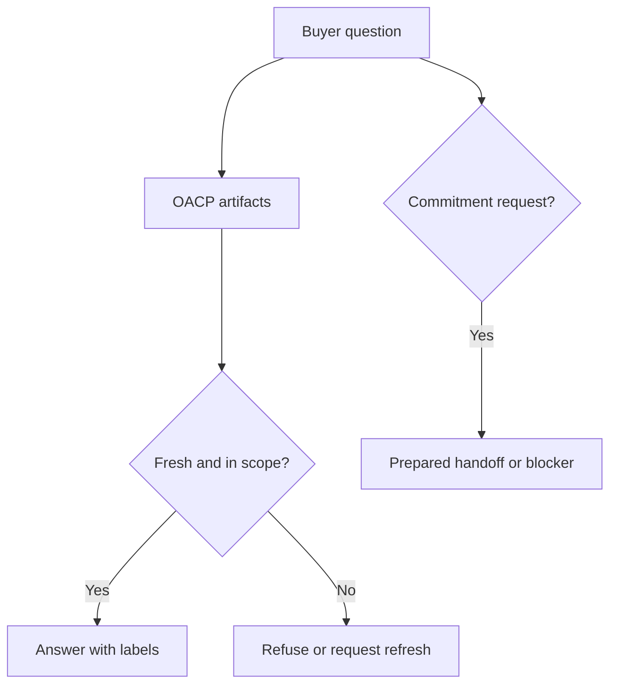

# How Buyer Agents Shop Safely With OACP

Canonical end-to-end flow: [OACP authority overview](../overview).

OACP lets a buyer agent answer from verified commerce facts instead of guessing.

## What The Agent Can Do

- Explain products, variants, availability, source, freshness, and merchant policy.
- Compare options from valid cached artifacts.
- Prepare a non-executing handoff when freshness and policy allow.
- Refuse stale, private, unsupported, or high-risk requests.

## What The Agent Cannot Do From OACP Artifacts

- Create an order.
- Capture payment.
- Create a checkout session.
- Set up a mandate.
- Reserve stock.
- Claim a provider rail succeeded.

## Safe Wording

"I can answer from a Shopify snapshot authorized by Grantex and refreshed at `<time>`. I cannot complete payment or order creation from this artifact cache."
