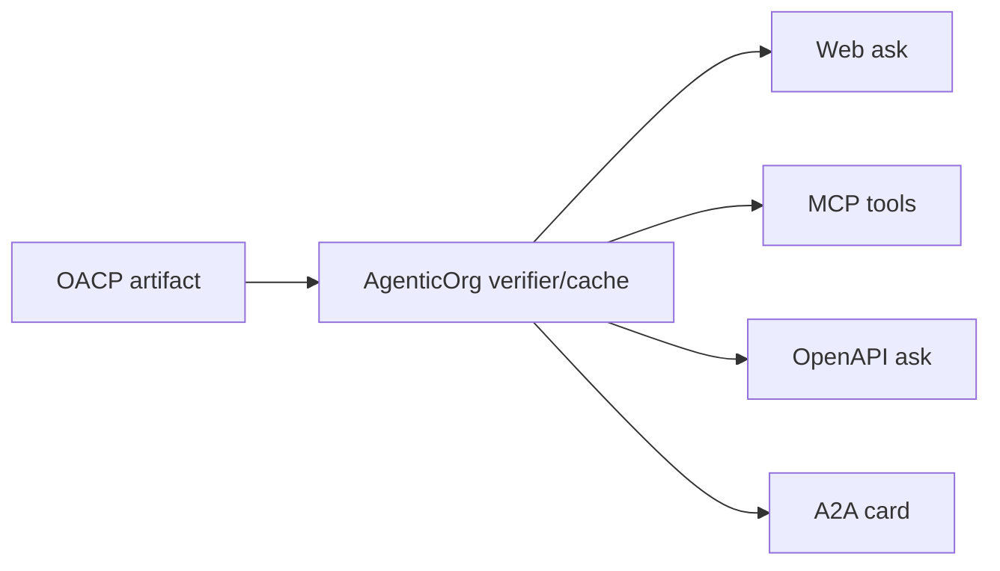

# Build Against OACP Artifacts And Bridges

Canonical end-to-end flow: [OACP authority overview](../overview).

Developers should treat OACP artifacts as signed/internal trust inputs, not as checkout execution tokens.

## Integration Points

| Surface | Owner | Purpose |
| --- | --- | --- |
| Grantex authority request | Grantex | Issues or refuses artifact families. |
| AgenticOrg artifact cache | AgenticOrg | Stores verified public-safe refs. |
| MCP | AgenticOrg | ChatGPT/Claude-style client tool surface. |
| OpenAPI | AgenticOrg | Gemini/Perplexity-style client surface. |
| A2A | AgenticOrg | Agent card and task metadata. |

## Developer Rules

- Never treat adapter payloads as payment approval.
- Preserve source and freshness labels in user-facing output.
- Block or refresh when artifact TTL, revocation, or scope fails.
- Keep provider credentials out of OACP artifacts.
