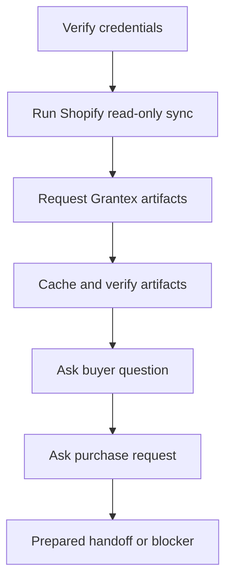

# Launch And Rollback Runbook

Canonical end-to-end flow: [OACP authority overview](../overview).

## Launch Smoke

## Monitor

- Authority request rate, refusal code mix, and tenant allowlist changes.
- Artifact TTL and stale-cache refusals.
- Adapter mapping errors.
- Provider capability verifier status.
- Channel webhook failures.

## Rollback

1. Remove tenant allowlist in Grantex.
2. Rotate the service token if needed.
3. Ask AgenticOrg to stop refresh and mark artifacts stale.
4. Disable public buyer channels.
5. Keep audit/export material for review.
