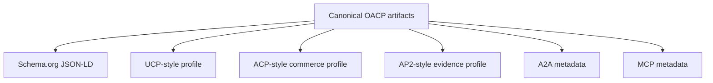

# How OACP Maps To Schema.org, UCP, ACP, AP2, A2A, And MCP

Canonical end-to-end flow: [OACP authority overview](../overview).

OACP is the canonical internal trust artifact. Protocol adapters are compatibility mappings derived from OACP, not official external approval.

## Compatibility Vs Official Approval

| Term | Meaning |
| --- | --- |
| Compatibility mapping | Deterministic field lineage from OACP artifacts to a known shape. |
| Official approval | External program review and acceptance. Not claimed here. |

## Partner Review Questions

- Which OACP artifact family is the canonical source?
- Which source refs and freshness labels must be visible?
- Which fields are unsupported because they imply execution?
- Which external program evidence is required before public claims change?
