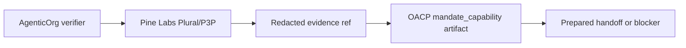

# Provider-Owned Mandate And Payment Evidence In OACP

Canonical end-to-end flow: [OACP authority overview](../overview).

OACP can carry evidence references that a provider-owned capability check occurred. It does not store raw payment secrets or execute the rail.

## Evidence Boundaries

| Item | Allowed in OACP | Not allowed in OACP |
| --- | --- | --- |
| Capability | Redacted provider evidence ref. | Raw credential or token. |
| Status | Freshness and capability label. | Provider secret response body. |
| Payment | Boundary state only. | Capture, checkout URL, order success, mandate creation. |

## Partner Action

Provide a capability-verification endpoint or partner process that returns non-sensitive evidence refs, expiry, and environment state. Execution remains with the provider rail.
