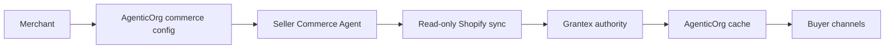

# Move Your Shopify Store To Agentic Commerce

Canonical end-to-end flow: [OACP authority overview](../overview).

This page is for merchants evaluating a Seller Commerce Agent in AgenticOrg.

## Steps

1. Save tenant/merchant/seller commerce config in AgenticOrg.
2. Create or update a Seller Commerce Agent in AgenticOrg.
3. Connect Shopify with read-only Admin API access or an approved OAuth flow.
4. Run a read-only sync for catalog, variants, price, inventory, and source timestamps.
5. Let AgenticOrg submit redacted evidence to Grantex.
6. Grantex issues OACP artifacts or exact blockers.
7. AgenticOrg caches artifacts and exposes buyer-safe channels.
8. Purchase requests are prepared for approved provider/POS/merchant handoff or refused.

## Requirements

| Requirement | Owner |
| --- | --- |
| Shopify read-only credential or OAuth install | Merchant + AgenticOrg |
| Merchant commerce config for sources, channels, providers, public publishing, and POS | Merchant + AgenticOrg |
| AgenticOrg tenant and seller agent id | AgenticOrg |
| Grantex tenant allowlist and service token | Grantex |
| Provider or bank capability configuration | AgenticOrg + Pine Labs Plural/P3P, bank, or provider |
| Channel approvals | AgenticOrg + channel owners |

## Expected Timeline

Local demo can be run after credentials and allowlisting. Public channel launch requires source evidence review, provider capability evidence, channel webhook approval, rollback owner, and operator signoff.

WooCommerce, ERP, PIM, OMS, WMS, custom API, bank-owned rail, fintech rail, and custom provider setup can be recorded as pending-adapter config in AgenticOrg. Grantex should not treat those refs as live execution or source evidence until an approved adapter path exists.

## What Agents Can Say

Buyer agents can answer product questions with source and freshness labels. They cannot promise payment, order, shipping, refund, mandate, or stock-hold success unless the merchant/provider system actually executed it.
