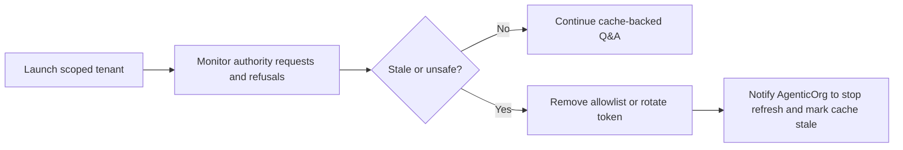

# OACP Launch Readiness

Canonical end-to-end flow: [OACP authority overview](./overview).

OACP authority is launch-ready only for the scoped path where Grantex issues internal artifacts to an allowlisted AgenticOrg tenant and AgenticOrg uses them for non-binding buyer answers or prepared handoff decisions.

## Readiness Matrix

| Gate | Required evidence |
| --- | --- |
| Runtime route | Authority endpoint merged and protected by operator/service auth. |
| Tenant allowlist | AgenticOrg tenant explicitly allowlisted. |
| Source evidence | Shopify read-only sync evidence is redacted and timestamped. |
| Artifact issue/refuse | All 11 families issue for valid evidence; unsafe requests refuse. |
| Adapter mapping | Schema.org, UCP-style, ACP-style, AP2-style, A2A, MCP, and OpenAPI mappings derive from OACP artifacts. |
| Cache behavior | Valid cache can answer non-binding questions; stale cache blocks commitment. |
| Provider boundary | Plural/Pine capability evidence is provider-owned and redacted. |
| Rollback | Tenant removal and service-token rotation tested. |

## Launch And Rollback Diagram

## Do Not Claim

Do not claim official protocol approval, broad payment support, all-buyer purchase support, or payment/order success. Current OACP authority supports trust artifacts, compatibility mapping, cache-backed discovery, and prepared handoff boundaries.
