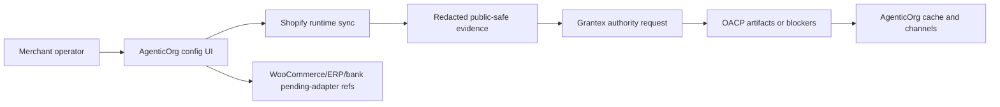

# OACP Merchant Self-Service Config Boundary

Canonical end-to-end flow: [OACP authority overview](./overview).

AgenticOrg owns merchant self-service configuration. Grantex does not store merchant connector secrets, payment-provider credentials, bank secrets, raw POS payloads, or merchant onboarding UI state. Grantex receives public-safe authority requests and issues or refuses OACP artifacts from redacted evidence.

## Configuration Scope

AgenticOrg scopes merchant commerce configuration by tenant, merchant, and seller agent. A merchant can create the config during Seller Commerce Agent onboarding and update it later.

The config may include:

| Config group | AgenticOrg-owned meaning | Grantex-owned authority view |
| --- | --- | --- |
| Merchant profile | Display name, categories, public-safe profile refs. | May be represented in merchant profile artifacts. |
| Source connector | Shopify runtime config today; WooCommerce, ERP, PIM, OMS, WMS, and custom API setup intent for future adapters. | Receives only redacted connector evidence refs, hashes, timestamps, source ids, and freshness. |
| Buyer channels | Web, MCP, OpenAPI, A2A, search/public catalog, WhatsApp, Telegram readiness and approval refs. | May sign protocol adapter or public discovery-state artifacts; does not run channel bridges. |
| Payment providers | Plural/Pine capability verifier today; bank, fintech, and custom provider refs as provider-owned non-executing setup. | May sign non-sensitive mandate capability evidence refs; does not execute rails. |
| Offline POS | Store/POS refs and webhook-secret refs held by AgenticOrg. | May verify redacted POS evidence refs when authority refresh is needed. |
| Public publishing | Merchant-level enablement for public-safe seller/product surfaces. | May sign public discovery-state artifacts; does not host AgenticOrg catalog pages. |

## Runtime-Supported Vs Pending Adapter

| Source or provider | Current status |
| --- | --- |
| Shopify | Runtime-supported through AgenticOrg read-only Admin GraphQL sync and webhook-triggered refresh/reconciliation. |
| WooCommerce | Configurable as pending adapter; not live until approved connector code, tests, credentials, and webhooks exist. |
| ERP/PIM/OMS/WMS/custom API | Configurable as pending adapter; not live until source precedence and adapter contracts exist. |
| Pine Labs Plural/P3P | Runtime-supported as provider-owned mandate capability verification where credentials are configured. |
| Bank-owned rail | Configurable as provider-owned pending adapter; not executable until a bank adapter, contract, callback verification, and rollout approval exist. |
| Fintech/custom provider | Configurable as provider-owned pending adapter; not executable until approved. |

## Authority Request Boundary

Grantex rejects authority requests that include raw secrets, raw provider payloads, private merchant payloads, executable checkout/payment/order/refund targets, unsupported live claims, or certification/standardization claims.

## Public Wording

Safe wording:

- "Merchant configuration is owned by AgenticOrg and scoped per tenant, merchant, and seller agent."
- "Shopify is the current runtime source connector."
- "WooCommerce, ERP, bank-owned rails, and custom providers are pending adapter until approved."
- "Grantex signs or refuses OACP artifacts; it does not execute payments or host merchant connector runtime."

Unsafe wording:

- "Grantex runs every buyer/seller message."
- Any wording that presents UCP, ACP, AP2, IETF, NIST, provider, or external-program certification as already granted.
- "Configuring a bank provider means live payment execution is enabled."
- "WooCommerce or ERP sync is live before the adapter and tests exist."
