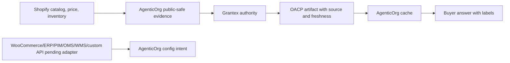

# OACP Merchant-System Source Of Record

Canonical end-to-end flow: [OACP authority overview](./overview).

OACP does not move commerce truth into Grantex. Shopify, future WooCommerce/ERP/PIM/OMS/WMS sources, merchant inventory systems, policy stores, support systems, POS systems, banks, and payment providers remain operational systems of record.

## Source Rules

- Product names, descriptions, variants, images, prices, and inventory come from Shopify or the merchant-approved source.
- Shopify is the current runtime-supported source connector.
- WooCommerce, ERP, PIM, OMS, WMS, and custom API source configs are merchant-owned setup intent until approved adapters exist.
- Grantex validates evidence shape and policy, not the raw private connector payload.
- AgenticOrg stores public-safe artifact refs and freshness labels, not raw Shopify secrets.
- If source evidence is stale or conflicting, buyer answers must refresh or refuse.

## Pending Runtime Gap

Multi-system conflict resolution across Shopify, WooCommerce, ERP, OMS, WMS, support, bank/provider, and POS records needs explicit source precedence policy before broad launch.
