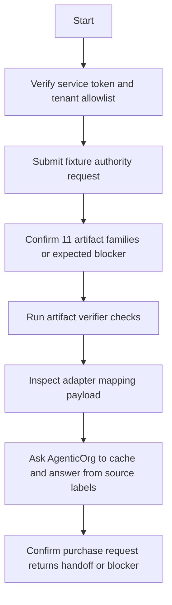

# OACP Operator Runbook

Canonical end-to-end flow: [OACP authority overview](./overview).

## Smoke Tests

## Checklist

| Check | Command or evidence |
| --- | --- |
| Authority route exists | `apps/auth-service/src/routes/commerce-oacp-runtime.ts` |
| Artifact tests pass | `npm --prefix apps/auth-service test -- commerce-c6z-runtime-artifact-authority.test.ts` |
| Adapter tests pass | `npm --prefix apps/auth-service test -- commerce-c6w4-oacp-adapter-previews.test.ts` |
| Conformance gate | `node scripts/commerce-c6oe-preview-conformance-gate.mjs --mode pr` |
| Guardrail scan | Search changed docs for stale or overclaim wording. |

## Rollback

1. Remove the AgenticOrg tenant from `COMMERCE_C6Z_AUTHORITY_SERVICE_TENANTS`.
2. Rotate the service token if compromise is suspected.
3. Ask AgenticOrg to stop refreshing artifacts and mark affected cache records stale.
4. Leave existing historical artifacts reviewable for audit/export.
5. Publish an operator note with affected tenants, merchant ids, artifact families, and timestamps.

## Refusal Copy

Use exact blockers: missing source evidence, stale artifact, unsafe executable request, provider capability missing, tenant not allowlisted, or authority temporarily unavailable.
