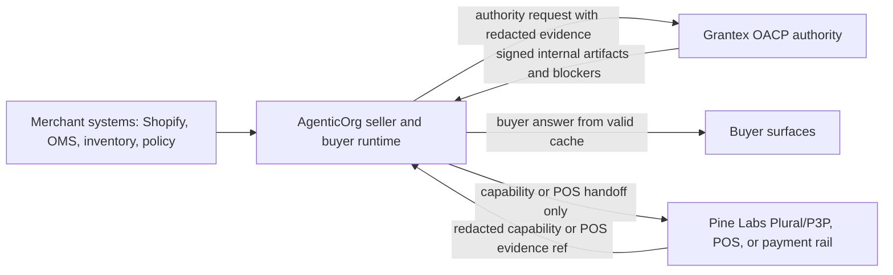

# OACP Authority Overview

This is the canonical Grantex OACP page. The canonical end-to-end flow starts here and links to the AgenticOrg runtime guide from the integration page.

OACP is the trust and interoperability layer for agentic commerce. Grantex owns the protocol, trust, policy, artifact, verification, and protocol-adapter authority. AgenticOrg owns the buyer and seller AI-agent runtime, Shopify connector runtime, buyer sessions, channel bridges, OACP cache, and provider-owned mandate capability verification.

Merchant systems such as Shopify and POS systems remain the source of record. Pine Labs Plural/P3P, POS systems, and other provider rails own mandate, payment, and in-store execution. Grantex must not become a toll booth for every buyer and seller interaction.

## Four-Party Architecture

## What Grantex Owns

| Area | Grantex role |
| --- | --- |
| Trust authority | Issues or refuses canonical internal OACP artifacts. |
| Policy governance | Defines artifact TTL, freshness, source, revocation, risk, and blocked-capability rules. |
| Artifact verification | Verifies issuer, scope, payload hash, signature, TTL, and public-safe payload constraints. |
| Protocol adapters | Governs compatibility mappings from canonical OACP artifacts to Schema.org, UCP-style, ACP-style, AP2-style, A2A, MCP, and OpenAPI payloads. |
| Integration boundary | Accepts allowlisted AgenticOrg authority requests with public-safe connector evidence. |

## What Grantex Does Not Own

Grantex does not own Shopify runtime credentials, merchant onboarding UX, buyer sessions, WhatsApp or Telegram webhooks, MCP/OpenAPI client sessions, AgenticOrg artifact cache storage, Offline POS Bridge orchestration, final checkout execution, POS transaction execution, order creation, stock holds, mandate setup, payment capture, refund execution, or provider settlement.

## Runtime Reality

| Status | Reality |
| --- | --- |
| Implemented runtime | `POST /v1/commerce/oacp/c6z/authority-requests`, internal artifact issuance, verifier helpers, adapter preview helpers, and OACP guard tests. |
| Implemented docs only | Historical Commerce V1 planning and C6 audit/review reports remain useful as internal history but are superseded for the public OACP split. |
| Requires external credentials or approval | AgenticOrg service token and tenant allowlist, merchant Shopify access, channel approvals, and provider rail approval. |
| Missing | Public standards program approval, universal channel launch, live POS provider approval, and broad payment/order execution. |
| Stale/confusing documentation | Older Commerce V1 pages that frame Grantex as the merchant control plane are historical; use this OACP group for the current authority narrative. |

## Artifact Families

Grantex currently issues or refuses these internal OACP families for the C6Z AgenticOrg runtime path: `merchant_profile`, `seller_agent_card`, `connector_evidence`, `catalog_snapshot`, `offer_price_snapshot`, `inventory_snapshot`, `policy_scope`, `public_discovery_state`, `mandate_capability`, `protocol_adapter`, and `authority_request_status`.

## Buyer-Safe Rule

AgenticOrg may continue non-binding product questions and comparison from valid cached artifacts. A request that would commit the buyer, create a checkout, create a mandate, capture payment, execute a POS transaction, reserve inventory, create an order, refund, return, or ship must use the approved provider, merchant, POS, and channel path. OACP artifacts do not invent success.

## Related Pages

- [Architecture](./architecture)
- [Artifact authority](./artifact-authority)
- [Offline POS Bridge boundary](./pos-bridge-boundary)
- [AgenticOrg integration guide](./agenticorg-integration)
- [Launch readiness](./launch-readiness)
