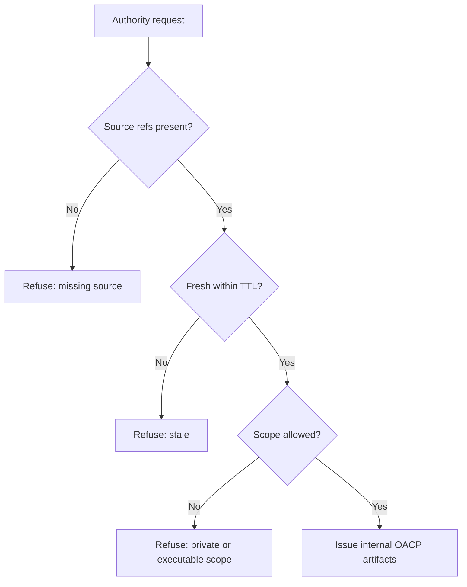

# OACP Policy And Governance

Canonical end-to-end flow: [OACP authority overview](./overview).

Grantex governs the policy envelope around OACP artifacts: source lineage, TTL, freshness, revocation snapshot age, risk tier, blocked capabilities, and adapter lineage.

## Governance Controls

| Control | Grantex requirement |
| --- | --- |
| Source lineage | Every artifact needs source refs and observed timestamps. |
| Freshness | TTL is capped by artifact family and risk tier. |
| Revocation | Cache consumers need current enough revocation posture for the action class. |
| Risk tier | Low-risk discovery can use valid cache; commitment-bound actions require stronger evidence. |
| Adapter lineage | Adapter payloads must cite canonical OACP artifact families. |
| Non-enablement | Artifacts must not imply checkout, payment, order, mandate, refund, return, shipment, or stock-hold execution. |

## Policy Diagram

## Publication And Approval

External public claims require documented evidence, product approval, security review, partner review, and release notes. Until then, docs must use "compatibility mapping" and "internal OACP artifact authority."
