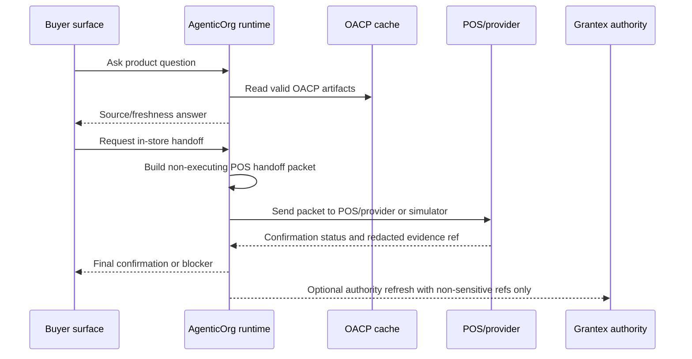

# OACP Offline POS Bridge Boundary

Canonical end-to-end flow: [OACP authority overview](./overview).

AgenticOrg owns Offline POS Bridge orchestration. POS systems and payment providers own final price, inventory, staff review, payment, receipt, and order evidence. Grantex only recognizes non-sensitive evidence references when they are needed for OACP policy or authority refresh.

## Ownership

| Area | Owner | Grantex role |
| --- | --- | --- |
| POS handoff packet | AgenticOrg | Verify that referenced OACP artifacts and policy boundaries are valid when asked. |
| Final POS price/inventory | POS or merchant system | Treat as source-of-record evidence, not as Grantex state. |
| Payment confirmation | POS/payment provider | Accept only redacted evidence refs; never store raw payment payloads. |
| Receipt evidence | POS/payment provider | Reference only when callback evidence is verified. |
| Policy refresh | Grantex | Issue or refuse refreshed OACP artifacts from public-safe evidence. |

## Allowed Evidence

OACP artifacts may carry references such as:

- `offline_pos_handoff_packet_ref`
- `provider_pos_evidence_ref`
- `receipt_evidence_ref`
- catalog, price, inventory, policy, and mandate capability artifact refs

The references must be non-sensitive, scoped to tenant/merchant/seller agent, and tied to freshness metadata. They are not proof that a payment succeeded unless the POS or provider callback says so.

## Blocked Claims

Grantex does not:

- execute a POS transaction;
- capture a POS payment;
- create a POS order;
- reserve in-store inventory;
- verify raw card, wallet, mandate, or provider payloads;
- turn a simulator confirmation into a live paid state.

## Safe Wording

Use:

> POS accepted the handoff. Staff must confirm final price and payment at the store.

Do not use:

> OACP completed the POS purchase.

## Runtime Status

AgenticOrg has an internal Offline POS Bridge foundation with non-sensitive handoff packets, confirmation intake, local simulator confirmation, and reconciliation status. Live POS integrations require merchant/POS provider approval, verified callbacks, monitoring, rollback, and operator readiness.
