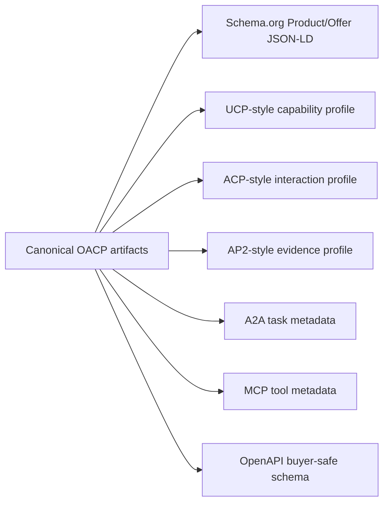

# OACP Protocol Adapter Authority

Canonical end-to-end flow: [OACP authority overview](./overview).

The canonical artifact is OACP. Adapter payloads are derived compatibility views for clients and partner systems. They are not official approval by Schema.org, UCP, ACP, AP2, A2A, MCP, or OpenAPI programs.

## Adapter Boundaries

| Adapter | Current use | Boundary |
| --- | --- | --- |
| Schema.org | Product and offer discovery shape. | Source/freshness stays from OACP and Shopify. |
| UCP-style | Capability summary for agentic commerce. | Compatibility mapping only. |
| ACP-style | Checkout-like shape preview for clients. | Does not create checkout or payment. |
| AP2-style | Mandate/evidence profile shape. | Does not create a mandate. |
| A2A | Agent card/task metadata. | Does not authorize execution. |
| MCP | Tool metadata for ChatGPT/Claude-style clients. | Tool calls still hit AgenticOrg runtime checks. |
| OpenAPI | Gemini/Perplexity-style hosted/action clients. | Buyer-safe schema only. |

## Internal Mapping Vs External Approval

Internal mapping means Grantex defines deterministic field lineage from OACP artifacts to adapter payloads. External approval means a third-party program has reviewed and accepted claims. The current implementation is internal mapping only unless a future page links evidence for external approval.

## Operator Rule

If a new adapter field cannot be derived from a canonical OACP artifact and public-safe source refs, leave it out or return an unsupported field blocker.
