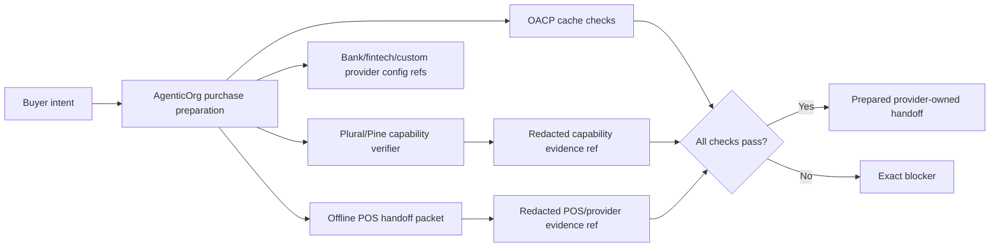

# OACP Provider And Payment Boundary

Canonical end-to-end flow: [OACP authority overview](./overview).

Pine Labs Plural/P3P, bank-owned rails, POS systems, and other provider rails own mandate setup, payment execution, provider status, settlement, receipt evidence, and provider webhooks. Grantex does not execute provider, bank, or POS rails in the AgenticOrg OACP runtime split.

## Boundary Rules

| Area | Rule |
| --- | --- |
| Mandate setup | Provider-owned. OACP may carry non-sensitive capability evidence refs. |
| Bank-owned rails | Provider-owned config refs only until an approved bank adapter exists. |
| Payment capture | Provider-owned and outside artifact issuance. |
| POS handoff | AgenticOrg-owned orchestration; POS/provider-owned confirmation. |
| Checkout/order success | Must come from merchant/provider systems, never from an agent guess. |
| Raw secrets | Not stored in OACP artifacts. |
| Evidence | Redacted refs and freshness only. |

## Pending Runtime Gap

Provider-owned, bank-owned, or POS-owned execution can only be added after merchant, provider/POS/bank, legal, security, operations, channel, rollback, and observability approval. Until then, docs must say prepared handoff, POS accepted pending staff/payment confirmation, pending adapter, or blocker.
