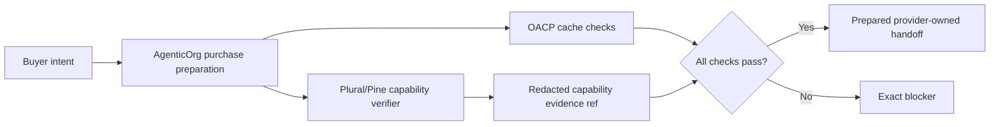

# OACP Provider And Payment Boundary

Canonical end-to-end flow: [OACP authority overview](./overview).

Pine Labs Plural/P3P and other provider rails own mandate setup, payment execution, provider status, settlement, and provider webhooks. Grantex does not execute provider rails in the AgenticOrg OACP runtime split.

## Boundary Rules

| Area | Rule |
| --- | --- |
| Mandate setup | Provider-owned. OACP may carry non-sensitive capability evidence refs. |
| Payment capture | Provider-owned and outside artifact issuance. |
| Checkout/order success | Must come from merchant/provider systems, never from an agent guess. |
| Raw secrets | Not stored in OACP artifacts. |
| Evidence | Redacted refs and freshness only. |

## Pending Runtime Gap

Provider-owned execution can only be added after merchant, provider, legal, security, operations, channel, rollback, and observability approval. Until then, docs must say prepared handoff or blocker.
