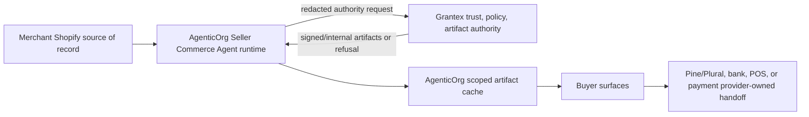

# OACP Runtime Launch Closure PRD

Status date: 2026-06-30

This is the canonical Grantex closure PRD for the OACP Shopify merchant runtime. Older Commerce V1 C6/C6W/C6X/C6Y documents are historical/internal compatibility records and are superseded for launch decisions by this OACP guide set.

## Corrected Architecture



Grantex owns trust, protocol, policy, canonical OACP artifacts, verification, adapter governance, and the AgenticOrg service-token/tenant allowlist. AgenticOrg owns runtime, connectors, buyer surfaces, artifact cache, public catalog pages, buyer conversations, and provider-owned handoff orchestration. Merchant systems remain source of record. Pine Labs Plural/P3P, POS, bank, and payment providers own execution.

Grantex must not become a toll booth for every buyer/seller interaction. AgenticOrg may answer non-binding buyer questions from valid cached artifacts and must refresh or refuse commitment-bound flows when artifacts, provider evidence, or merchant source state are stale.

## Canonical Authority Route

`POST /v1/commerce/oacp/c6z/authority-requests`

Accepts:

- allowlisted AgenticOrg service token or operator caller;
- tenant, merchant, seller agent scope;
- Shopify read-only connector evidence refs and counts;
- source observed timestamp and bounded freshness policy;
- requested 11 OACP artifact families;
- non-enablement flags.

Rejects or blocks:

- missing tenant/service-token allowlist;
- invalid token;
- stale evidence;
- raw Shopify/provider/POS payloads;
- secrets, credentials, checkout links, payment links, or raw provider callbacks;
- execution targets or certification/standardization claims.

Returns:

- `201 artifact_issuance_ready` with 11 signed/internal artifact families;
- `202 received` when connector evidence is not yet attached;
- `403 service_tenant_not_allowed` for non-allowlisted service tenant;
- `422` for unsafe, stale, malformed, or executable requests.

## Artifact Metadata Closure

Every issued artifact must carry:

- source lineage;
- TTL seconds;
- freshness status and stale behavior;
- revocation posture;
- blocked and unsupported capabilities;
- non-sensitive evidence refs only;
- signature metadata;
- no raw Shopify payloads;
- no raw provider payloads;
- no payment credentials;
- no connector secrets;
- no live checkout/payment/order/POS success claim.

The C6Z authority implementation lives in:

- `apps/auth-service/src/lib/commerce/oacp-runtime-vertical.ts`
- `apps/auth-service/src/routes/commerce-oacp-runtime.ts`
- `apps/auth-service/tests/commerce-c6z-runtime-artifact-authority.test.ts`

## Operator Provisioning

1. Create or rotate `COMMERCE_C6Z_AUTHORITY_SERVICE_TOKEN` through the production secret path.
2. Add the AgenticOrg tenant id to `COMMERCE_C6Z_AUTHORITY_SERVICE_TENANTS`.
3. Restart or redeploy the Grantex auth service with the updated secret and allowlist.
4. Run a fixture authority request for that tenant.
5. Confirm `artifact_count = 11` or record the exact blocker.
6. Remove the tenant from the allowlist to roll back.

Example local smoke:

```bash
npm --prefix apps/auth-service test -- commerce-c6z-runtime-artifact-authority.test.ts
node scripts/commerce-oacp-runtime-launch-check.mjs
```

## Closure Checklist

| Requirement | Grantex closure path | Status |
| --- | --- | --- |
| Canonical route documented | This PRD, OpenAPI, operator runbook, integration docs. | Implemented |
| Tenant allowlist docs | This PRD and operator runbook. | Implemented |
| Missing tenant/token tests | `commerce-c6z-runtime-artifact-authority.test.ts`. | Implemented |
| Unsafe evidence tests | Raw payload, secret, and execution-target rejection. | Implemented |
| Stale evidence tests | `source_evidence_stale` and connector stale checks. | Implemented |
| Valid issuance tests | 11 artifact-family issuance with verifier status. | Implemented |
| Artifact metadata | Source lineage, TTL, freshness, revocation, evidence refs, signature metadata. | Implemented |
| Verifier output | Internal verifier status on every artifact. | Implemented |
| No raw private payloads | Payload guard and tests. | Implemented |
| No transaction toll booth | Docs and architecture. | Implemented |

## Validation Commands

```bash
npm --prefix apps/auth-service test -- commerce-c6z-runtime-artifact-authority.test.ts commerce-c6w4-oacp-adapter-previews.test.ts commerce-no-plural-leak.test.ts commerce-openapi.test.ts
npm --prefix apps/auth-service run typecheck
node scripts/commerce-c6oe-preview-conformance-gate.mjs --mode pr
git diff --check origin/main...HEAD
```

## Launch Readiness Rule

Grantex is launch-ready for this vertical only when AgenticOrg has a real Shopify merchant/dev-store evidence run and Grantex returns either valid 11-family artifacts or an exact refusal through the canonical authority route, with no raw secrets or raw private payloads stored or logged. Public standards approval, ChatGPT/Gemini listing approval, WhatsApp/Telegram approval, Pine/Plural provider approval, and POS provider approval remain external blockers unless separately proven.
