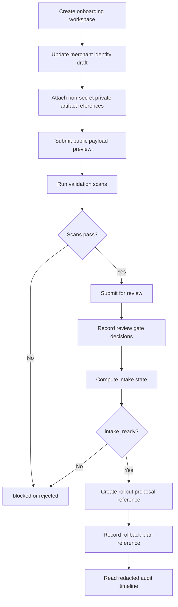
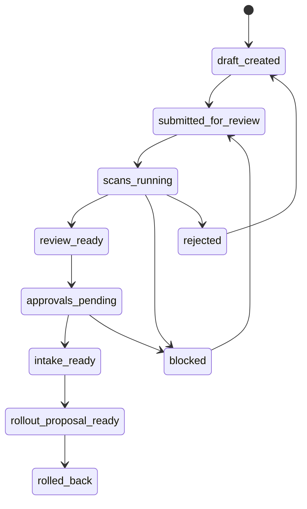

# Commerce V1 C5Q Self-Onboarding API And Data Model Proposal

Status: planning only
Date: 2026-05-26
Scope: conceptual API and data model proposal for future merchant
self-onboarding for read-only Commerce discovery
Production changes made by this proposal: none
Runtime code changed by this proposal: no
Migrations added by this proposal: no
Production config changed by this proposal: no
Production Commerce V1 changed by this proposal: no
Read-only discovery changed by this proposal: no
Merchant allowlist value approved by this proposal: no
Checkout or payment creation changed by this proposal: no
Live payment path changed by this proposal: no
Live Plural path changed by this proposal: no
Named merchant approved by this proposal: no
Secrets inspected or changed: no

This proposal describes future API boundaries and conceptual persistence records
for merchant self-onboarding. It does not implement runtime handlers, add
migrations, approve a merchant, approve an allowlist value, enable discovery,
enable Commerce V1, enable checkout or payment creation, enable live payments,
enable live Plural, or introduce provider credentials.

## Current State

- No real merchant is approved.
- No allowlist value is approved.
- Grantex production read-only discovery remains fail-closed.
- AgenticOrg public commerce discovery remains gated.
- C5I, C5J, C5O, and C5P synthetic/demo planning artifacts are not production
  approval.
- This C5Q proposal is not a runtime implementation plan.

## API Boundary Principles

- APIs are future conceptual boundaries only.
- Every write API records an audit event and returns redacted summaries only.
- Private artifacts remain outside repositories and outside public responses.
- API responses must never include private contacts, contracts, signed approval
  records, pricing terms, customer data, secrets, tokens, passports/JWTs,
  idempotency keys, webhook secrets, provider credentials, raw payloads,
  DB/Redis URLs, or private keys.
- Intake state does not enable discovery, Commerce V1, checkout/payment
  creation, live payments, live Plural, or provider paths.
- Rollout references are links to later review records only. They do not change
  production state.

## Conceptual APIs

These API shapes are examples for later design. They are not implemented here.

### Create Onboarding Workspace

Boundary: create a private onboarding workspace shell for a merchant submitter.

Request shape:

```json
{
  "submitter_role": "<MERCHANT_SUBMITTER_ROLE>",
  "workspace_purpose": "read_only_discovery_intake",
  "private_artifact_system_reference": "<NON_SECRET_PRIVATE_SYSTEM_REFERENCE>"
}
```

Response shape:

```json
{
  "workspace_id": "<WORKSPACE_ID>",
  "state": "draft_created",
  "production_effect": "none",
  "audit_event_id": "<AUDIT_EVENT_ID>"
}
```

### Update Merchant Identity Draft

Boundary: save proposed public metadata for review.

Request shape:

```json
{
  "workspace_id": "<WORKSPACE_ID>",
  "proposed_public_merchant_id": "<MERCHANT_ID_PENDING_APPROVAL>",
  "proposed_display_name": "<MERCHANT_PUBLIC_NAME_PENDING_APPROVAL>",
  "proposed_category": "<MERCHANT_CATEGORY_PENDING_APPROVAL>",
  "proposed_discovery_description": "<DISCOVERY_DESCRIPTION_PENDING_APPROVAL>"
}
```

Response shape:

```json
{
  "merchant_identity_draft_id": "<MERCHANT_IDENTITY_DRAFT_ID>",
  "state": "draft_created",
  "requires_review": true,
  "audit_event_id": "<AUDIT_EVENT_ID>"
}
```

### Submit Public Payload Preview

Boundary: generate or update a read-only public payload preview.

Request shape:

```json
{
  "workspace_id": "<WORKSPACE_ID>",
  "merchant_identity_draft_id": "<MERCHANT_IDENTITY_DRAFT_ID>",
  "issuer_reference": "<ISSUER_REFERENCE_PENDING_REVIEW>",
  "jwks_reference": "<JWKS_REFERENCE_PENDING_REVIEW>",
  "read_only_capabilities": ["discovery_metadata_read"],
  "cache_header_posture": "<CACHE_POSTURE_PENDING_REVIEW>",
  "rate_limit_posture": "<RATE_LIMIT_POSTURE_PENDING_REVIEW>"
}
```

Response shape:

```json
{
  "payload_preview_id": "<PAYLOAD_PREVIEW_ID>",
  "read_only_only": true,
  "excludes_checkout_payment_live_provider_claims": true,
  "audit_event_id": "<AUDIT_EVENT_ID>"
}
```

### Attach Non-Secret Private Artifact References

Boundary: attach references to private artifacts stored outside repositories.

Request shape:

```json
{
  "workspace_id": "<WORKSPACE_ID>",
  "artifact_type": "<APPROVAL_OR_REVIEW_REFERENCE_TYPE>",
  "non_secret_reference_label": "<PRIVATE_APPROVAL_REFERENCE_PENDING>",
  "redaction_required": true
}
```

Response shape:

```json
{
  "artifact_reference_id": "<ARTIFACT_REFERENCE_ID>",
  "private_content_stored_in_repo": false,
  "audit_event_id": "<AUDIT_EVENT_ID>"
}
```

### Run Validation Scans

Boundary: start automated validation on public-safe summaries and references.

Request shape:

```json
{
  "workspace_id": "<WORKSPACE_ID>",
  "scan_types": [
    "secret_private_detail",
    "overclaim",
    "merchant_id_name_safety",
    "synthetic_id_production_candidate",
    "config_allowlist_value",
    "public_payload_preview"
  ]
}
```

Response shape:

```json
{
  "scan_batch_id": "<SCAN_BATCH_ID>",
  "state": "scans_running",
  "results_pending": true,
  "audit_event_id": "<AUDIT_EVENT_ID>"
}
```

### Submit For Review

Boundary: move a scan-clean workspace into human review.

Request shape:

```json
{
  "workspace_id": "<WORKSPACE_ID>",
  "submission_note": "<PUBLIC_SAFE_REVIEW_NOTE>",
  "requested_review_gates": [
    "merchant_owner",
    "legal_compliance",
    "product_wording",
    "security",
    "ops_support",
    "backup_rpo",
    "rollback_owner",
    "read_only_smoke_owner",
    "evidence_retention_owner",
    "agenticorg_dependency"
  ]
}
```

Response shape:

```json
{
  "state": "approvals_pending",
  "review_request_id": "<REVIEW_REQUEST_ID>",
  "audit_event_id": "<AUDIT_EVENT_ID>"
}
```

### Record Review Gate Decision

Boundary: record one human review gate decision using a non-secret reference.

Request shape:

```json
{
  "workspace_id": "<WORKSPACE_ID>",
  "gate_type": "<REVIEW_GATE_TYPE>",
  "decision": "approved_or_blocked_or_rejected",
  "non_secret_approval_reference": "<APPROVAL_REFERENCE_PENDING>",
  "reviewer_role": "<REVIEWER_ROLE>"
}
```

Response shape:

```json
{
  "review_gate_decision_id": "<REVIEW_GATE_DECISION_ID>",
  "state_after_decision": "<DECISION_STATE>",
  "audit_event_id": "<AUDIT_EVENT_ID>"
}
```

### Compute Intake State

Boundary: derive the current state from scans, required fields, owners, and
review gates.

Request shape:

```json
{
  "workspace_id": "<WORKSPACE_ID>",
  "include_blocker_summary": true
}
```

Response shape:

```json
{
  "state": "not_ready_or_blocked_or_review_ready_or_intake_ready_or_rejected",
  "blocker_summary": "<REDACTED_BLOCKER_SUMMARY>",
  "production_effect": "none",
  "audit_event_id": "<AUDIT_EVENT_ID>"
}
```

### Create Rollout Proposal Reference

Boundary: create a link to a separate rollout proposal after intake readiness.

Request shape:

```json
{
  "workspace_id": "<WORKSPACE_ID>",
  "rollout_proposal_reference": "<ROLLOUT_PROPOSAL_REFERENCE_PENDING>",
  "scope": "read_only_discovery_only"
}
```

Response shape:

```json
{
  "rollout_proposal_reference_id": "<ROLLOUT_PROPOSAL_REFERENCE_ID>",
  "state": "rollout_proposal_ready",
  "production_effect": "none",
  "audit_event_id": "<AUDIT_EVENT_ID>"
}
```

### Record Rollback Plan Reference

Boundary: attach a rollback owner and reference for a future separate rollout.

Request shape:

```json
{
  "workspace_id": "<WORKSPACE_ID>",
  "rollback_owner_role": "<ROLLBACK_OWNER_ROLE>",
  "rollback_plan_reference": "<ROLLBACK_PLAN_REFERENCE_PENDING>"
}
```

Response shape:

```json
{
  "rollback_plan_reference_id": "<ROLLBACK_PLAN_REFERENCE_ID>",
  "rollback_scope": "disable_read_only_discovery_and_clear_later_approved_allowlist",
  "audit_event_id": "<AUDIT_EVENT_ID>"
}
```

### Read Audit Timeline

Boundary: return an immutable, redacted event timeline.

Request shape:

```json
{
  "workspace_id": "<WORKSPACE_ID>",
  "redacted_only": true
}
```

Response shape:

```json
{
  "workspace_id": "<WORKSPACE_ID>",
  "events": [
    {
      "audit_event_id": "<AUDIT_EVENT_ID>",
      "event_type": "<EVENT_TYPE>",
      "actor_role": "<ACTOR_ROLE>",
      "event_summary": "<REDACTED_EVENT_SUMMARY>",
      "created_at": "<TIMESTAMP_REFERENCE>"
    }
  ]
}
```

## Persistence Model

This persistence model is conceptual. It does not add tables, migrations, or
runtime schemas.

| Record | Conceptual fields |
| --- | --- |
| Onboarding workspace | `workspace_id`, `state`, `created_by_role`, `created_at`, `updated_at`, `private_artifact_system_reference`, `retention_policy_reference` |
| Merchant identity draft | `merchant_identity_draft_id`, `workspace_id`, `proposed_public_merchant_id`, `proposed_display_name`, `proposed_category`, `proposed_discovery_description`, `draft_version`, `review_status` |
| Public payload preview | `payload_preview_id`, `workspace_id`, `issuer_reference`, `jwks_reference`, `read_only_capabilities`, `cache_header_posture`, `rate_limit_posture`, `no_payment_claims` |
| Private artifact reference | `artifact_reference_id`, `workspace_id`, `artifact_type`, `non_secret_reference_label`, `redaction_required`, `private_content_in_repo` |
| Validation scan result | `scan_result_id`, `workspace_id`, `scan_type`, `status`, `redacted_summary`, `review_required`, `created_at` |
| Review gate decision | `review_gate_decision_id`, `workspace_id`, `gate_type`, `decision`, `reviewer_role`, `non_secret_approval_reference`, `decided_at` |
| Owner assignment | `owner_assignment_id`, `workspace_id`, `owner_role`, `public_safe_role_label`, `status` |
| Decision state | `decision_state_id`, `workspace_id`, `state`, `reason_summary`, `computed_at`, `computed_by_role` |
| Audit event | `audit_event_id`, `workspace_id`, `event_type`, `actor_role`, `redacted_event_summary`, `created_at` |
| Rollout proposal reference | `rollout_proposal_reference_id`, `workspace_id`, `proposal_reference`, `scope`, `created_after_intake_ready` |
| Rollback plan reference | `rollback_plan_reference_id`, `workspace_id`, `rollback_owner_role`, `rollback_plan_reference`, `last_reviewed_at` |

## State Machine

| State | Meaning | Allowed transition |
| --- | --- | --- |
| `draft_created` | Workspace exists, but required draft inputs may be missing. | `submitted_for_review`, `blocked`, `rejected` |
| `submitted_for_review` | Public-safe inputs and private artifact references were submitted. | `scans_running`, `blocked`, `rejected` |
| `scans_running` | Automated checks are in progress. | `review_ready`, `blocked`, `rejected` |
| `blocked` | Required information, scans, owners, or review references are missing. | `submitted_for_review`, `scans_running`, `rejected` |
| `review_ready` | Scans passed and public payload preview is complete. | `approvals_pending`, `blocked`, `rejected` |
| `approvals_pending` | Human review gates are open. | `intake_ready`, `blocked`, `rejected` |
| `intake_ready` | Intake packet is complete enough for separate rollout proposal planning. | `rollout_proposal_ready`, `blocked`, `rejected` |
| `rollout_proposal_ready` | A separate read-only rollout proposal reference may exist. | `blocked`, `rejected`, `rolled_back` |
| `rejected` | Unsafe material, missing approval, or forbidden runtime path is present. | `draft_created` after remediation outside repos |
| `rolled_back` | A later approved rollout was reverted. | `draft_created`, `blocked` |

## Validation Model

- Secret/private-detail scan rejects private contracts, private contacts,
  signed approval records, pricing, customer data, secrets, tokens,
  passports/JWTs, idempotency keys, webhook secrets, provider credentials, raw
  payloads, DB/Redis URLs, and private keys.
- Overclaim scan rejects wording that implies checkout, payment creation, live
  provider behavior, rollout authorization, certification, or readiness beyond
  the reviewed read-only discovery scope.
- Merchant-ID/name safety review confirms proposed metadata is either pending
  review or tied to non-secret human approval references.
- Synthetic-ID production-candidate scan rejects any synthetic ID proposed for
  production use or an allowlist.
- Config/allowlist value scan rejects broad runtime flags, production config
  values, and concrete allowlist values unless a later approved rollout permits
  repo-safe summary storage.
- Public payload preview validation confirms read-only metadata, issuer/JWKS
  references, capability wording, cache/header/rate-limit posture, and explicit
  no checkout/payment/live-provider posture.

## Review-Gate Model

Required gates:

- Merchant owner.
- Legal/compliance.
- Product wording.
- Security.
- Ops/on-call/support.
- Backup/RPO.
- Rollback owner.
- Read-only smoke owner.
- Evidence retention owner.
- AgenticOrg dependency.

Every gate stores only the reviewer role, decision, redacted reason summary, and
non-secret approval reference. Private contacts, signed approval records, and
private business details remain outside repositories.

## Audit Model

- Audit timeline is immutable and append-only.
- Every state transition, scan result, review gate decision, owner assignment,
  rollout proposal reference, and rollback plan reference records an audit
  event.
- Audit events store redacted summaries only.
- Evidence retention owner is required before `intake_ready`.
- Raw logs, private evidence, provider material, and private business details
  are never stored in repository docs.

Never store:

- Private contracts.
- Private contacts.
- Signed approval records.
- Pricing.
- Customer data.
- Secrets.
- Tokens, passports/JWTs, idempotency keys, or webhook secrets.
- Provider credentials.
- Raw payloads.
- DB/Redis URLs.
- Private keys.

## Mermaid API Flow



## Mermaid Data And State Diagram



## Future Implementation Slice Map

| Slice | Scope | Gate posture |
| --- | --- | --- |
| C5R schema/API prototype proposal | Propose schema details and endpoint contracts for local review. | Separate docs/prototype review; no migrations unless approved later. |
| C5S UI wireframe/spec | Define merchant and operator screens for public-safe drafts, scans, reviews, and state. | Separate review; no production discovery. |
| C5T local-only validator prototype | Prototype validation against placeholder/demo inputs only. | Local-only; no secrets, production config, or provider paths. |
| C5U review workflow implementation | Implement gate recording and state computation after approval. | Gated; no automatic rollout. |
| C5V rollout automation proposal | Propose narrow read-only rollout and rollback automation. | Separate approval required before any production change. |

## Stop Conditions

Stop and keep the workspace `blocked` or `rejected` if:

- Named merchant approval is missing.
- Required legal, product, security, ops, backup/RPO, rollback, smoke, evidence,
  or AgenticOrg dependency gate is missing.
- Private material appears in repository docs.
- Any secret or credential material appears.
- Production config or concrete allowlist values appear without separate
  approval for repo-safe summary storage.
- Synthetic IDs are proposed for production use or allowlist use.
- Broad Commerce V1, checkout/payment creation, live payment, live Plural, or
  provider credential path is requested.
- Public discovery is requested before separate approved rollout.
- Any required scan fails.

## Production Safety Controls

- No runtime enablement.
- No broad Commerce V1 enablement.
- No checkout/payment creation.
- No live payments.
- No live Plural.
- No provider credentials.
- No public discovery until a separate approved rollout.
- No synthetic production candidates.
- No automatic state-changing production request from any onboarding state.
- Grantex production read-only discovery remains fail-closed.
