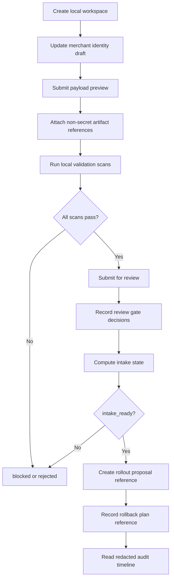
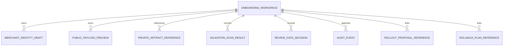

# Commerce V1 C5R Self-Onboarding Schema/API Prototype Proposal

Status: historical planning artifact; superseded by the current OACP authority mapping guide in docs/guides/oacp-runtime-authority-and-adapter-mappings.md.
Date: 2026-05-26
Scope: local-only schema and API prototype proposal for future merchant
self-onboarding for read-only Commerce discovery
Production changes made by this proposal: none
Runtime code changed by this proposal: no
Migrations added by this proposal: no
Production config changed by this proposal: no
Production Commerce V1 changed by this proposal: no
Read-only discovery changed by this proposal: no
Merchant allowlist value approved by this proposal: no
Checkout or payment creation changed by this proposal: no
Live payment path changed by this proposal: no
Live Plural path changed by this proposal: no
Named merchant approved by this proposal: no
Secrets inspected or changed: no

This proposal narrows C5Q into local-only schema and endpoint prototype sketches.
It is not a runtime implementation. It does not add migrations, approve a
merchant, approve an allowlist value, enable discovery, enable Commerce V1,
enable checkout or payment creation, enable live payments, enable live Plural,
or introduce provider credentials.

## Local-Only Prototype Scope

- Prototype inputs use placeholders and synthetic/demo summaries only.
- Prototype outputs are redacted summaries only.
- Prototype storage, if later approved, must be local-only and disposable until
  a separate implementation task defines persistence.
- Prototype endpoints are contract sketches, not deployed handlers.
- Prototype validation must fail closed when any required field, owner, scan, or
  review gate is missing.
- The prototype cannot produce a production config value, allowlist value,
  checkout/payment instruction, live payment path, live Plural path, or provider
  credential reference.

## Proposed Schema Sketches

The following sketches are conceptual and are not migrations or runtime schemas.

### Onboarding Workspace

```json
{
  "workspace_id": "<WORKSPACE_ID>",
  "state": "draft_created",
  "created_by_role": "<MERCHANT_SUBMITTER_ROLE>",
  "private_artifact_system_reference": "<NON_SECRET_PRIVATE_SYSTEM_REFERENCE>",
  "retention_policy_reference": "<RETENTION_POLICY_REFERENCE>",
  "production_effect": "none"
}
```

Required validation:

- `workspace_id` is a placeholder or local-only generated reference.
- `private_artifact_system_reference` is non-secret and contains no private
  artifact content.
- `production_effect` must remain `none`.

### Merchant Identity Draft

```json
{
  "merchant_identity_draft_id": "<MERCHANT_IDENTITY_DRAFT_ID>",
  "workspace_id": "<WORKSPACE_ID>",
  "proposed_public_merchant_id": "<MERCHANT_ID_PENDING_APPROVAL>",
  "proposed_display_name": "<MERCHANT_PUBLIC_NAME_PENDING_APPROVAL>",
  "proposed_category": "<MERCHANT_CATEGORY_PENDING_APPROVAL>",
  "proposed_discovery_description": "<DISCOVERY_DESCRIPTION_PENDING_APPROVAL>",
  "review_status": "pending_review"
}
```

Required validation:

- Proposed merchant metadata is public-safe or pending approval.
- No realistic private merchant details are stored.
- No synthetic ID is treated as a production candidate.

### Public Payload Preview

```json
{
  "payload_preview_id": "<PAYLOAD_PREVIEW_ID>",
  "workspace_id": "<WORKSPACE_ID>",
  "issuer_reference": "<ISSUER_REFERENCE_PENDING_REVIEW>",
  "jwks_reference": "<JWKS_REFERENCE_PENDING_REVIEW>",
  "read_only_capabilities": ["discovery_metadata_read"],
  "cache_header_posture": "<CACHE_HEADER_POSTURE_PENDING_REVIEW>",
  "rate_limit_posture": "<RATE_LIMIT_POSTURE_PENDING_REVIEW>",
  "checkout_payment_live_provider_claims": "none"
}
```

Required validation:

- Capabilities are read-only.
- Payload has no checkout, payment creation, live payment, live Plural,
  provider credential, direct provider call, or readiness claim.

### Private Artifact Reference

```json
{
  "artifact_reference_id": "<ARTIFACT_REFERENCE_ID>",
  "workspace_id": "<WORKSPACE_ID>",
  "artifact_type": "<APPROVAL_OR_REVIEW_REFERENCE_TYPE>",
  "non_secret_reference_label": "<PRIVATE_APPROVAL_REFERENCE_PENDING>",
  "private_content_in_repo": false,
  "redaction_required": true
}
```

Required validation:

- Only reference labels are accepted.
- Private contracts, contacts, signed approval records, pricing terms, customer
  data, raw payloads, secrets, provider material, DB/Redis URLs, and private
  keys are rejected.

### Validation Scan Result

```json
{
  "scan_result_id": "<SCAN_RESULT_ID>",
  "workspace_id": "<WORKSPACE_ID>",
  "scan_type": "<SCAN_TYPE>",
  "status": "passed_or_blocked_or_rejected",
  "redacted_summary": "<REDACTED_SCAN_SUMMARY>",
  "review_required": true
}
```

Required validation:

- Raw scan output is not stored in repository docs.
- Blocking scan status prevents intake advancement.

### Review Gate Decision

```json
{
  "review_gate_decision_id": "<REVIEW_GATE_DECISION_ID>",
  "workspace_id": "<WORKSPACE_ID>",
  "gate_type": "<REVIEW_GATE_TYPE>",
  "decision": "approved_or_blocked_or_rejected",
  "reviewer_role": "<REVIEWER_ROLE>",
  "non_secret_approval_reference": "<APPROVAL_REFERENCE_PENDING>"
}
```

Required validation:

- Reviewer identity is a role label, not a private contact.
- Approval reference is non-secret and does not contain signed approval content.

### Audit Event

```json
{
  "audit_event_id": "<AUDIT_EVENT_ID>",
  "workspace_id": "<WORKSPACE_ID>",
  "event_type": "<EVENT_TYPE>",
  "actor_role": "<ACTOR_ROLE>",
  "redacted_event_summary": "<REDACTED_EVENT_SUMMARY>",
  "created_at_reference": "<TIMESTAMP_REFERENCE>"
}
```

Required validation:

- Audit events are append-only in later implementations.
- Repository examples contain redacted summaries only.

## Endpoint Contract Sketches

All endpoint paths are placeholders for local-only prototype discussion. They
are not implemented here.

| Endpoint sketch | Purpose | State effect | Production effect |
| --- | --- | --- | --- |
| `POST /local/commerce/self-onboarding/workspaces` | Create workspace shell. | `draft_created` | none |
| `PUT /local/commerce/self-onboarding/workspaces/{workspace_id}/merchant-draft` | Update public merchant draft. | remains draft or blocked | none |
| `PUT /local/commerce/self-onboarding/workspaces/{workspace_id}/payload-preview` | Submit read-only payload preview. | remains draft or blocked | none |
| `POST /local/commerce/self-onboarding/workspaces/{workspace_id}/artifact-references` | Attach non-secret private artifact reference. | remains draft or blocked | none |
| `POST /local/commerce/self-onboarding/workspaces/{workspace_id}/scans` | Run local validation scans. | `scans_running` then blocked/review-ready | none |
| `POST /local/commerce/self-onboarding/workspaces/{workspace_id}/review-submit` | Submit scan-clean packet for review. | `approvals_pending` | none |
| `POST /local/commerce/self-onboarding/workspaces/{workspace_id}/review-decisions` | Record review gate decision. | recomputed state | none |
| `POST /local/commerce/self-onboarding/workspaces/{workspace_id}/state:compute` | Compute intake state. | state summary only | none |
| `POST /local/commerce/self-onboarding/workspaces/{workspace_id}/rollout-reference` | Link separate rollout proposal reference. | `rollout_proposal_ready` only after intake | none |
| `POST /local/commerce/self-onboarding/workspaces/{workspace_id}/rollback-reference` | Link rollback plan reference. | reference only | none |
| `GET /local/commerce/self-onboarding/workspaces/{workspace_id}/audit` | Read redacted audit timeline. | none | none |

## Placeholder Request/Response Examples

### Workspace Creation

Request:

```json
{
  "submitter_role": "<MERCHANT_SUBMITTER_ROLE>",
  "workspace_purpose": "read_only_discovery_intake",
  "private_artifact_system_reference": "<NON_SECRET_PRIVATE_SYSTEM_REFERENCE>"
}
```

Response:

```json
{
  "workspace_id": "<WORKSPACE_ID>",
  "state": "draft_created",
  "production_effect": "none",
  "audit_event_id": "<AUDIT_EVENT_ID>"
}
```

### Scan Execution

Request:

```json
{
  "workspace_id": "<WORKSPACE_ID>",
  "scan_types": [
    "secret_private_detail",
    "overclaim",
    "merchant_id_name_safety",
    "synthetic_id_production_candidate",
    "config_allowlist_value",
    "public_payload_preview"
  ]
}
```

Response:

```json
{
  "scan_batch_id": "<SCAN_BATCH_ID>",
  "state": "scans_running",
  "production_effect": "none",
  "results": [
    {
      "scan_type": "secret_private_detail",
      "status": "passed",
      "redacted_summary": "<REDACTED_SCAN_SUMMARY>"
    }
  ]
}
```

### Intake State Computation

Request:

```json
{
  "workspace_id": "<WORKSPACE_ID>",
  "include_redacted_blockers": true
}
```

Response:

```json
{
  "state": "blocked_or_review_ready_or_intake_ready_or_rejected",
  "redacted_blocker_summary": "<REDACTED_BLOCKER_SUMMARY>",
  "can_enable_production_discovery": false,
  "production_effect": "none"
}
```

## Validation Behavior

- Schema validation checks required fields, enum values, placeholder-only local
  examples, and redacted-only references.
- Secret/private-detail scan rejects private contracts, private contacts,
  signed approval records, pricing terms, customer data, secrets, tokens,
  passports/JWTs, idempotency keys, webhook secrets, provider credentials, raw
  payloads, DB/Redis URLs, and private keys.
- Overclaim scan rejects checkout, payment creation, live payment, live Plural,
  provider, readiness, certification, and rollout authorization claims.
- Merchant-ID/name safety review rejects production-looking IDs and realistic
  merchant identities unless a later approved intake task supplies a repo-safe
  approval reference.
- Synthetic-ID production-candidate scan rejects synthetic IDs being proposed
  for production or allowlist use.
- Config/allowlist scan rejects production config values and concrete allowlist
  values.
- Public payload preview validation requires read-only capabilities and no
  checkout/payment/live-provider posture.

## Audit Examples

Workspace created:

```json
{
  "event_type": "workspace_created",
  "actor_role": "<MERCHANT_SUBMITTER_ROLE>",
  "redacted_event_summary": "Local-only workspace shell created for read-only discovery intake.",
  "production_effect": "none"
}
```

Scan completed:

```json
{
  "event_type": "scan_completed",
  "actor_role": "<LOCAL_VALIDATOR_ROLE>",
  "redacted_event_summary": "Required local scans completed with redacted summaries.",
  "production_effect": "none"
}
```

Review decision recorded:

```json
{
  "event_type": "review_gate_decision_recorded",
  "actor_role": "<REVIEWER_ROLE>",
  "redacted_event_summary": "Review gate decision recorded using a non-secret reference.",
  "production_effect": "none"
}
```

## Safety And Rollback Controls

- Prototype state changes never modify production.
- Rollout references do not enable discovery.
- Rollback references describe how a later approved rollout would disable the
  read-only discovery gate and clear any later approved allowlist value.
- If a scan or review gate fails, the prototype state remains `blocked` or
  `rejected`.
- If a rollback signal is recorded after a later rollout, the prototype state
  can represent `rolled_back`, but this proposal does not perform rollback.

## AgenticOrg Dependency Examples

AgenticOrg dependency validation input:

```json
{
  "workspace_id": "<WORKSPACE_ID>",
  "grantex_state": "intake_ready_or_blocked",
  "read_only_smoke_summary_reference": "<READ_ONLY_SMOKE_REFERENCE_PENDING>",
  "agenticorg_dependency_reference": "<AGENTICORG_DEPENDENCY_REFERENCE>"
}
```

AgenticOrg dependency validation output:

```json
{
  "agenticorg_dependency_state": "gated_or_review_ready_or_blocked",
  "public_discovery_enabled": false,
  "production_effect": "none",
  "redacted_blocker_summary": "<REDACTED_BLOCKER_SUMMARY>"
}
```

AgenticOrg remains gated unless Grantex has a separate approved read-only
rollout, Grantex read-only smoke passes, and separate AgenticOrg approval
exists.

## Mermaid Endpoint Flow



## Mermaid Schema Relationship Diagram



## Future Implementation Notes

- C5S UI wireframe/spec should define merchant and operator screens for local
  draft entry, public payload preview, scan summaries, review gates, and
  blocked/rejected states.
- C5T local-only validator prototype should validate placeholder docs/examples
  only, store redacted summaries, and fail closed on any private material,
  overclaim, production-looking ID, synthetic production candidate, or config
  value.
- Neither C5S nor C5T should enable public discovery, Commerce V1, checkout,
  payments, live Plural, or provider credentials.

## Stop Conditions

Stop the prototype path if:

- A real merchant approval is missing.
- Private material appears in repository docs.
- A secret, token, passport/JWT, idempotency key, webhook secret, provider
  credential, raw payload, DB/Redis URL, or private key appears.
- A production config value or concrete allowlist value appears.
- A synthetic ID is proposed for production or allowlist use.
- A broad Commerce V1, checkout/payment creation, live payment, live Plural, or
  provider credential path is requested.
- Public discovery is requested before a separate approved rollout.

## Production Safety Controls

- Local-only prototype scope.
- No runtime code.
- No migrations.
- No production config.
- No broad Commerce V1.
- No checkout/payment creation.
- No live payments.
- No live Plural.
- No provider credentials.
- No public discovery until a separate approved rollout.
- No synthetic production candidates.
- Grantex production read-only discovery remains fail-closed.
