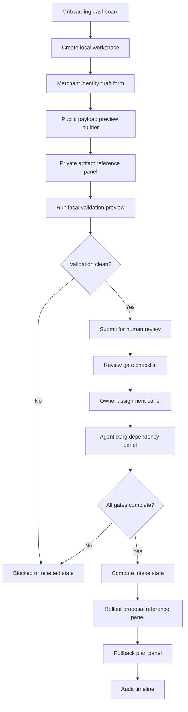

# Commerce V1 C5S Self-Onboarding UI Wireframe Spec

Status: planning only
Date: 2026-05-26
Scope: local-only UI wireframe/spec for future merchant self-onboarding for
read-only Commerce discovery
Production changes made by this spec: none
Runtime UI code changed by this spec: no
Migrations added by this spec: no
Production config changed by this spec: no
Production Commerce V1 changed by this spec: no
Read-only discovery changed by this spec: no
Merchant allowlist value approved by this spec: no
Checkout or payment creation changed by this spec: no
Live payment path changed by this spec: no
Live Plural path changed by this spec: no
Named merchant approved by this spec: no
Secrets inspected or changed: no

This C5S record translates the C5P, C5Q, and C5R planning artifacts into a
local-only UI wireframe/spec. It is not an implementation. It does not add UI
code, runtime handlers, migrations, config values, allowlist values, public
discovery, Commerce V1 enablement, checkout/payment creation, live payments,
live Plural, provider credentials, real merchant approval, or rollout approval.

## Local-Only UI Scope

- Planning/spec only; this file is not a runtime UI implementation.
- Screens and fields describe a future local-only operator and merchant
  experience.
- UI examples use placeholders and redacted summaries only.
- No merchant is approved by completing or reading this spec.
- No public discovery is enabled or proposed for immediate use.
- No checkout, payment creation, live payment, live Plural, direct provider, or
  provider credential path is enabled.
- The UI must fail closed when a required field, scan, owner, review gate, or
  dependency signal is missing.
- The UI must never write production config or concrete allowlist values.

## Merchant Submitter UX Flow

1. Merchant submitter creates a local onboarding workspace.
2. Submitter fills the merchant identity draft with pending public-safe
   metadata fields.
3. Submitter drafts the public payload preview with read-only capability text.
4. Submitter attaches non-secret private artifact references; private artifacts
   remain outside the repository.
5. Submitter runs a local validation preview.
6. Submitter reviews validation feedback and fixes blocked fields.
7. Submitter submits the workspace for human review only after required local
   validation checks pass.
8. Submitter can view blocked and not-ready states but cannot override them.

Submitter guardrails:

- The submit button is disabled while required fields are missing.
- The UI shows private-only warnings near artifact references.
- Any pasted private content, secret-like value, config value, concrete
  allowlist value, live-provider claim, or synthetic production candidate moves
  the workspace to `blocked` or `rejected`.
- The submitter view never displays signed approvals, contracts, private
  contacts, pricing terms, customer data, raw payloads, provider credentials,
  DB/Redis URLs, private keys, tokens, passports/JWTs, idempotency keys, or
  webhook secrets.

## Grantex Operator UX Flow

1. Operator opens the submitted workspace from the onboarding dashboard.
2. Operator inspects redacted scan summaries.
3. Operator reviews the public payload preview and confirms read-only wording.
4. Operator verifies non-secret private artifact references without displaying
   private artifacts.
5. Operator records review gate decisions by role.
6. Operator assigns missing owners for rollback, read-only smoke, evidence
   retention, ops/support, backup/RPO, and AgenticOrg dependency.
7. Operator computes the intake state from scans, owner assignments, review
   gates, and dependency signals.
8. Operator can prepare a rollout proposal reference only after all gates pass;
   the reference still has no production effect.
9. Operator records a rollback plan reference as a non-secret summary.

Operator guardrails:

- Owner and review gate controls require role labels, not private contacts.
- Decision notes are redacted summaries only.
- The UI cannot write production config, a concrete allowlist value, or a public
  discovery flag.
- If a later approved rollout is prepared, this UI only links to a separate
  proposal reference; it does not apply it.

## Screen Inventory

| Screen | Primary users | Purpose | Production effect |
| --- | --- | --- | --- |
| Onboarding dashboard | Submitter, operator | List local workspaces, states, blockers, and owners. | none |
| Merchant identity draft form | Submitter | Capture pending public-safe merchant metadata. | none |
| Public payload preview builder | Submitter, operator | Preview read-only discovery fields and capability wording. | none |
| Private artifact reference panel | Submitter, operator | Record non-secret references to private systems. | none |
| Validation scan results panel | Submitter, operator | Show redacted scan summaries and blocking reasons. | none |
| Review gate checklist | Operator, reviewers | Record gate decisions by role. | none |
| Owner assignment panel | Operator | Assign public-safe role labels. | none |
| Audit timeline | Operator, reviewers | Read append-only redacted audit events. | none |
| AgenticOrg dependency panel | Operator | Show gated dependency state and missing signals. | none |
| Rollout proposal reference panel | Operator | Link a separate future rollout proposal after intake. | none |
| Rollback plan panel | Operator | Link non-secret rollback plan reference. | none |

## Field-Level Wireframe Spec

### Onboarding Dashboard

Fields:

- `workspace_id`: placeholder/local-only reference.
- `workspace_state`: `draft_created`, `blocked`, `review_ready`,
  `approvals_pending`, `intake_ready`, `rollout_proposal_ready`, `rejected`, or
  `rolled_back`.
- `merchant_display_name_status`: pending, blocked, or reviewed.
- `required_owner_status`: complete or missing.
- `required_gate_status`: complete, blocked, rejected, or missing.
- `agenticorg_dependency_state`: gated, blocked, or review-ready.
- `last_redacted_audit_event`: public-safe summary.

Wireframe notes:

- Dashboard defaults to a dense table with filters for blocked, missing owner,
  missing gate, and dependency-gated states.
- Row actions are limited to view, edit local draft, run local validation, and
  open review.
- No production action appears in the dashboard.

### Merchant Identity Draft

Fields:

- `proposed_public_merchant_id`: `<MERCHANT_ID_PENDING_APPROVAL>`.
- `proposed_display_name`: `<MERCHANT_PUBLIC_NAME_PENDING_APPROVAL>`.
- `proposed_category`: `<MERCHANT_CATEGORY_PENDING_APPROVAL>`.
- `proposed_discovery_description`:
  `<MERCHANT_DISCOVERY_DESCRIPTION_PENDING_APPROVAL>`.
- `legal_entity_reference`: `<LEGAL_ENTITY_REFERENCE_PENDING_APPROVAL>`.
- `support_posture_summary`: `<PUBLIC_SAFE_SUPPORT_POSTURE_PENDING>`.

Validation:

- Reject realistic private merchant details.
- Reject production-looking IDs without a future repo-safe approval reference.
- Reject synthetic IDs proposed for production or allowlist use.
- Reject private contacts and customer details.

### Public Payload Preview Builder

Fields:

- `merchant_id`: pending public-safe value or placeholder.
- `display_name`: pending public-safe value or placeholder.
- `category`: pending public-safe value or placeholder.
- `discovery_description`: pending public-safe value or placeholder.
- `issuer_reference`: `<ISSUER_REFERENCE_PENDING_REVIEW>`.
- `jwks_reference`: `<JWKS_REFERENCE_PENDING_REVIEW>`.
- `supported_read_only_capabilities`: `discovery_metadata_read` only.
- `cache_header_posture`: `<CACHE_HEADER_POSTURE_PENDING_REVIEW>`.
- `rate_limit_posture`: `<RATE_LIMIT_POSTURE_PENDING_REVIEW>`.
- `checkout_payment_live_provider_posture`: `none`.

Validation:

- Capabilities must remain read-only.
- Builder rejects checkout, payment creation, live payment, live Plural,
  provider credential, provider certification, rollout authorization, or
  broad runtime claims.
- Preview cannot produce a config value or allowlist value.

### Private Artifact Reference Panel

Fields:

- `artifact_reference_id`: `<ARTIFACT_REFERENCE_ID>`.
- `artifact_type`: merchant owner, legal/compliance, product wording, security,
  ops/support, backup/RPO, AgenticOrg dependency, rollback, read-only smoke, or
  evidence retention.
- `non_secret_reference_label`: `<PRIVATE_APPROVAL_REFERENCE_PENDING>`.
- `reference_owner_role`: `<APPROVER_ROLE_PENDING>`.
- `private_content_in_repo`: false.
- `redaction_required`: true.

Validation:

- Accept only non-secret reference labels.
- Reject pasted private artifacts, signed approvals, contracts, private
  contacts, pricing terms, customer data, secrets, tokens, passports/JWTs,
  idempotency keys, webhook secrets, provider credentials, raw payloads,
  DB/Redis URLs, and private keys.

### Validation Scan Results Panel

Fields:

- `scan_batch_id`: `<SCAN_BATCH_ID>`.
- `scan_type`: secret/private-detail, overclaim, merchant-ID/name safety,
  synthetic-ID production-candidate, config/allowlist value, or public payload
  preview.
- `scan_status`: passed, blocked, or rejected.
- `redacted_summary`: `<REDACTED_SCAN_SUMMARY>`.
- `required_action`: `<REDACTED_REQUIRED_ACTION>`.
- `review_required`: true or false.

Validation:

- Raw scan output is never displayed in repository-safe summaries.
- Any blocked or rejected scan prevents intake advancement.

### Review Gate Checklist

Fields:

- `gate_type`: merchant owner, legal/compliance, product wording, security,
  ops/support, backup/RPO, AgenticOrg dependency, rollback owner, read-only
  smoke owner, or evidence retention owner.
- `decision`: pending, approved, blocked, or rejected.
- `reviewer_role`: `<REVIEWER_ROLE>`.
- `non_secret_approval_reference`: `<APPROVAL_REFERENCE_PENDING>`.
- `redacted_decision_summary`: `<REDACTED_DECISION_SUMMARY>`.

Validation:

- Missing required gate keeps state at `approvals_pending` or `blocked`.
- Private reviewer contacts are rejected.
- Approval references are links or labels to private systems, not signed records.

### Owner Assignment Panel

Fields:

- `owner_role`: rollback owner, read-only smoke owner, evidence retention owner,
  ops/support owner, backup/RPO owner, or AgenticOrg dependency owner.
- `owner_assignment_status`: pending, assigned, blocked, or rejected.
- `public_safe_role_label`: `<OWNER_ROLE_LABEL_PENDING>`.
- `assignment_reference`: `<OWNER_ASSIGNMENT_REFERENCE_PENDING>`.

Validation:

- Owner assignments use role labels only.
- Private names, emails, phone numbers, and private contacts are rejected unless
  later approved for repo-safe storage in a separate intake task.

### Audit Timeline

Fields:

- `audit_event_id`: `<AUDIT_EVENT_ID>`.
- `event_type`: workspace_created, draft_updated, scan_completed,
  review_gate_decision_recorded, owner_assigned, state_computed,
  dependency_checked, rollout_reference_added, rollback_reference_added, or
  workspace_rejected.
- `actor_role`: `<ACTOR_ROLE>`.
- `redacted_event_summary`: `<REDACTED_EVENT_SUMMARY>`.
- `production_effect`: none.

Validation:

- Timeline is append-only in future implementations.
- Redacted summaries only.
- Private evidence and raw payloads never appear.

### Rollout Proposal Reference Panel

Fields:

- `rollout_reference_id`: `<ROLLOUT_REFERENCE_ID_PENDING>`.
- `intake_state_at_reference`: intake_ready or rollout_proposal_ready.
- `redacted_rollout_summary`: `<REDACTED_ROLLOUT_SUMMARY>`.
- `separate_approval_required`: true.
- `production_effect`: none.

Validation:

- Panel is disabled until scans, gates, owners, payload review, rollback plan,
  read-only smoke owner, evidence owner, and AgenticOrg dependency checks are
  complete.
- Creating a reference does not enable discovery or config.

### Rollback Plan Reference

Fields:

- `rollback_reference_id`: `<ROLLBACK_REFERENCE_ID_PENDING>`.
- `rollback_owner_role`: `<ROLLBACK_OWNER_PENDING>`.
- `rollback_summary`: "Keep discovery gate disabled or clear later approved
  config after a separately approved rollout."
- `production_effect`: none.

Validation:

- Rollback plan is a non-secret summary.
- No private operational contacts or secrets are accepted.

## Validation And Error-State Behavior

| Detected condition | UI response | State effect |
| --- | --- | --- |
| Secret/private detail detected | Hide value, show redacted blocking error, require removal. | blocked or rejected |
| Overclaim detected | Highlight claim and require wording removal. | blocked |
| Production-looking ID without approval | Block field and require non-secret approval reference in a future intake task. | blocked |
| Synthetic ID proposed as production candidate | Block and explain synthetic IDs cannot be production candidates. | rejected |
| Config/allowlist value pasted | Remove from preview, show hard stop, require separate rollout process. | rejected |
| Missing owner | Show owner assignment task. | approvals_pending |
| Missing approval gate | Show gate checklist blocker. | approvals_pending |
| AgenticOrg dependency incomplete | Show gated dependency panel with missing signal list. | blocked |
| Broad Commerce V1/live/payment request detected | Show hard stop and require scope reduction to read-only discovery. | rejected |

Error messages must name the category of failure without echoing secret or
private content.

## Public-Safe Vs Private-Only Boundaries

May be shown or stored in repo-safe summaries:

- Placeholder merchant identity fields.
- Approved public merchant metadata only after a separate intake approval.
- Non-secret private system references.
- Reviewer role labels.
- Owner role labels.
- Redacted scan summaries.
- Redacted audit events.
- Public payload preview summaries with read-only capability wording.

Must remain outside repositories and private systems only:

- Signed approvals.
- Private contracts.
- Private contacts.
- Pricing terms.
- Customer data.
- Secrets.
- Tokens/passports/JWTs.
- Idempotency keys.
- Webhook secrets.
- Provider credentials.
- Raw payloads.
- DB/Redis URLs.
- Private keys.
- Private support contacts.
- Sensitive business details.

## AgenticOrg Dependency Visibility

- Show Grantex intake state only as a public-safe summary.
- Show AgenticOrg dependency state as gated, blocked, or review-ready.
- Keep AgenticOrg public commerce discovery gated in all C5S screens.
- Show dependency blocked until Grantex read-only smoke passes after separate
  approval.
- Require separate AgenticOrg approval before any future public commerce
  metadata exposure proposal.
- Hide private AgenticOrg review details and store only role labels and
  redacted summaries.

## Accessibility And Auditability Notes

- All controls must be keyboard reachable.
- Error messages must be visible next to the affected field and summarized at
  the top of the screen.
- Tables need stable sorting, filtering, and row focus states.
- Review decision controls must record role, decision, non-secret reference, and
  redacted summary.
- Audit events must be append-only in future implementations.
- Evidence views must show redacted summaries only.
- Blocked and rejected states must be visually distinct without relying only on
  color.

## Production Safety Controls

- No public discovery.
- No broad Commerce V1.
- No checkout/payment creation.
- No live payments.
- No live Plural.
- No provider credentials.
- No synthetic production candidates.
- No production config values.
- No concrete allowlist values.
- Rollback posture is to keep the gate disabled or clear later approved config
  after a separately approved rollout.
- Grantex production read-only discovery remains fail-closed.

## Mermaid UI Flow Diagram

## Future Implementation Notes

- C5T local-only validator prototype should wire these screens to local
  placeholder validation only and store redacted summaries.
- C5U review workflow implementation should implement role-based gate decision
  recording without private evidence in repositories.
- C5V rollout automation proposal must remain separate and require explicit
  approval before any production change is considered.
- None of C5T, C5U, or C5V may bypass the read-only discovery scope, AgenticOrg
  gating, or fail-closed production posture.

## Stop Conditions

Stop UI planning or later prototype work if:

- A real merchant approval is missing.
- Private material appears in repository docs.
- A secret, token, passport/JWT, idempotency key, webhook secret, provider
  credential, raw payload, DB/Redis URL, or private key appears.
- A production config value or concrete allowlist value appears.
- A synthetic ID is proposed for production or allowlist use.
- A broad Commerce V1, checkout/payment creation, live payment, live Plural, or
  provider credential path is requested.
- AgenticOrg public commerce discovery is requested before Grantex read-only
  smoke passes and separate AgenticOrg approval exists.
