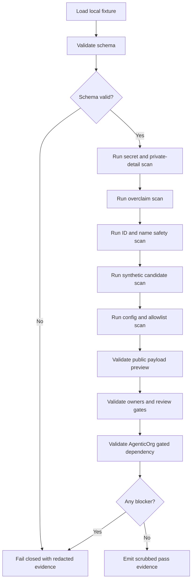

# Commerce V1 C5T Self-Onboarding Local Validator Prototype Plan

Status: planning only
Date: 2026-05-26
Scope: local-only validator prototype plan for future merchant self-onboarding
for read-only Commerce discovery
Production changes made by this plan: none
Runtime code changed by this plan: no
Validator code changed by this plan: no
Migrations added by this plan: no
Production config changed by this plan: no
Production Commerce V1 changed by this plan: no
Read-only discovery changed by this plan: no
Merchant allowlist value approved by this plan: no
Checkout or payment creation changed by this plan: no
Live payment path changed by this plan: no
Live Plural path changed by this plan: no
Named merchant approved by this plan: no
Secrets inspected or changed: no

This C5T record describes a future local-only validator prototype for merchant
self-onboarding packets. It is not an implementation. It does not add runtime
code, validator code, migrations, config values, allowlist values, public
discovery, Commerce V1 enablement, checkout/payment creation, live payments,
live Plural, provider credentials, real merchant approval, or rollout approval.

## Local-Only Validator Scope

- Planning/prototype only.
- Local files only.
- No production URLs.
- No cloud commands.
- No deploy commands.
- No runtime feature enablement.
- No rollout approval.
- No production config writes.
- No concrete allowlist values.
- No checkout, payment creation, live payment, live Plural, direct provider, or
  provider credential path.
- Validator outputs are redacted summaries only.
- Validator behavior must fail closed on any blocker.

The future prototype should run against repository-safe fixture files and
redacted summaries. Private artifacts remain outside repositories and are
represented only by non-secret reference labels.

## Conceptual Input Schemas

The following schemas are conceptual contracts, not migrations or runtime
schemas.

### Merchant Identity Draft

```json
{
  "workspace_id": "ws_synth_validator_readonly_0001",
  "merchant_identity_draft_id": "mid_synth_validator_readonly_0001",
  "proposed_public_merchant_id": "mch_synth_validator_readonly_0001",
  "proposed_display_name": "Synthetic Validator Readonly Merchant",
  "proposed_category": "synthetic-readonly-demo",
  "proposed_discovery_description": "Synthetic local validator fixture for read-only discovery review.",
  "approval_reference_status": "pending"
}
```

Required checks:

- IDs use clearly fake local fixture values.
- Display name is obviously synthetic.
- Category and description are read-only and demo-scoped.
- No private merchant details are present.

### Public Payload Preview

```json
{
  "payload_preview_id": "ppv_synth_validator_readonly_0001",
  "workspace_id": "ws_synth_validator_readonly_0001",
  "issuer_reference": "<ISSUER_REFERENCE_PENDING_REVIEW>",
  "jwks_reference": "<JWKS_REFERENCE_PENDING_REVIEW>",
  "supported_capabilities": ["discovery_metadata_read"],
  "checkout_payment_live_provider_posture": "none",
  "cache_header_posture": "<CACHE_HEADER_POSTURE_PENDING_REVIEW>",
  "rate_limit_posture": "<RATE_LIMIT_POSTURE_PENDING_REVIEW>"
}
```

Required checks:

- Capabilities remain read-only.
- No checkout/payment/live-provider posture appears.
- Issuer/JWKS references are placeholders or reviewed non-secret labels.

### Private Artifact References

```json
{
  "artifact_references": [
    {
      "artifact_reference_id": "arf_synth_validator_readonly_0001",
      "artifact_type": "legal_compliance",
      "non_secret_reference_label": "<PRIVATE_APPROVAL_REFERENCE_PENDING>",
      "private_content_in_repo": false,
      "redaction_required": true
    }
  ]
}
```

Required checks:

- Reference labels are non-secret.
- Private artifact bodies are absent.
- Private contacts, contracts, signed records, pricing, customer data, secrets,
  raw payloads, and provider material are rejected.

### Review Gate Decisions

```json
{
  "review_gate_decisions": [
    {
      "gate_type": "security",
      "decision": "pending",
      "reviewer_role": "<SECURITY_REVIEWER_ROLE>",
      "non_secret_approval_reference": "<APPROVAL_REFERENCE_PENDING>"
    }
  ]
}
```

Required checks:

- All required gate types are present before intake can pass.
- Reviewer values are role labels only.
- Missing or blocked gates fail closed.

### Owner Assignments

```json
{
  "owner_assignments": [
    {
      "owner_role": "rollback_owner",
      "assignment_status": "pending",
      "public_safe_role_label": "<ROLLBACK_OWNER_PENDING>"
    }
  ]
}
```

Required checks:

- Rollback owner, read-only smoke owner, evidence retention owner, ops/support
  owner, backup/RPO owner, and AgenticOrg dependency owner are present.
- Owner labels are public-safe role labels, not private contacts.

### AgenticOrg Dependency Summary

```json
{
  "dependency_reference": "dep_synth_validator_readonly_0001",
  "grantex_intake_state": "not_ready",
  "grantex_read_only_smoke_status": "pending",
  "agenticorg_approval_status": "pending",
  "mcp_a2a_discovery_gate_state": "gated",
  "metadata_exposure": "none"
}
```

Required checks:

- AgenticOrg remains gated unless separate future approvals and smoke evidence
  exist.
- Metadata exposure remains `none`.
- Missing Grantex smoke or AgenticOrg approval fails closed.

### Scan Configuration

```json
{
  "scan_configuration_id": "scan_cfg_synth_validator_readonly_0001",
  "required_scans": [
    "secret_private_detail",
    "overclaim",
    "merchant_id_name_safety",
    "synthetic_id_production_candidate",
    "production_config_allowlist_value",
    "public_payload_preview",
    "owner_review_gate_completeness",
    "agenticorg_dependency_gated_state"
  ],
  "fail_closed": true,
  "emit_redacted_evidence": true
}
```

Required checks:

- All required scan categories are enabled.
- Raw payload capture is disabled.
- Evidence output is scrubbed.

### Expected Decision State

```json
{
  "expected_decision_state": "not_ready",
  "allowed_states": [
    "not_ready",
    "blocked",
    "review_ready",
    "intake_ready",
    "rollout_proposal_ready",
    "rejected"
  ],
  "can_enable_discovery": false,
  "production_effect": "none"
}
```

Required checks:

- `can_enable_discovery` remains false.
- `production_effect` remains `none`.
- Decision state cannot advance when any blocker exists.

## Placeholder Fixtures

Fixture rules:

- Use clearly fake IDs only.
- Use synthetic, local, readonly, demo, or placeholder naming.
- Do not use realistic merchant names.
- Do not include production config values.
- Do not include allowlist values.
- Do not include secrets, tokens, passports/JWTs, idempotency keys, webhook
  secrets, provider credentials, raw payloads, DB/Redis URLs, or private keys.
- Synthetic values remain limited to local fixture and demo validation.

Recommended fixture set:

- `fixtures/pass/local_readonly_complete.synthetic.json`: complete local packet
  with no blockers.
- `fixtures/fail/secret_private_detail.synthetic.json`: contains redacted test
  marker for blocker behavior only.
- `fixtures/fail/overclaim.synthetic.json`: contains forbidden claim marker.
- `fixtures/fail/config_allowlist.synthetic.json`: contains config-value marker.
- `fixtures/fail/missing_gate.synthetic.json`: omits required gate.
- `fixtures/fail/agenticorg_gated.synthetic.json`: omits required dependency
  signal.

Fixture files are future examples only. This plan does not create them.

## Scan Categories

### Secret/Private-Detail Scan

Rejects:

- Private contracts.
- Private contacts.
- Signed approval records.
- Pricing terms.
- Customer data.
- Secrets.
- Tokens/passports/JWTs.
- Idempotency keys.
- Webhook secrets.
- Provider credentials.
- Raw payloads.
- DB/Redis URLs.
- Private keys.

### Overclaim Scan

Rejects claims for:

- Checkout/payment creation.
- Live payments.
- Live Plural.
- Provider capability or provider readiness.
- Certification or rollout authorization.
- Public discovery enablement.
- Broad Commerce V1 enablement.

### Merchant-ID/Name Safety Scan

Rejects:

- Production-looking merchant IDs without a later approved non-secret reference.
- Realistic private merchant names.
- Private entity details.
- Private contact or customer hints in display fields.

### Synthetic-ID Production-Candidate Scan

Rejects:

- Any synthetic ID proposed for real rollout use.
- Any synthetic ID proposed for allowlist use.
- Any fixture ID marked as a deployment candidate.

### Production Config/Allowlist Value Scan

Rejects:

- Production flag assignments.
- Concrete allowlist values.
- Runtime config values.
- Production URL values.
- Live mode flags.

### Public Payload Preview Validation

Requires:

- Read-only capabilities only.
- Non-secret issuer/JWKS references.
- No checkout/payment/live-provider posture.
- No readiness, certification, or rollout claims.
- Cache, header, and rate-limit posture present as reviewed placeholders.

### Owner/Review-Gate Completeness Validation

Requires:

- Merchant owner gate.
- Legal/compliance gate.
- Product wording gate.
- Security gate.
- Ops/support gate.
- Backup/RPO gate.
- AgenticOrg dependency gate.
- Rollback owner.
- Read-only smoke owner.
- Evidence retention owner.

### AgenticOrg Dependency/Gated-State Validation

Requires:

- Grantex intake state summary.
- Grantex read-only smoke status.
- AgenticOrg separate approval status.
- MCP/A2A discovery gate state.
- Metadata exposure set to none until separately approved.

## Expected Pass/Fail Behavior

Pass only when:

- Packet is complete.
- Packet is repository-safe.
- Packet contains no secrets or private material.
- Packet contains no overclaims.
- Packet contains no production config values.
- Packet contains no concrete allowlist values.
- Packet contains only read-only public payload posture.
- All required owners and review gates are present.
- AgenticOrg dependency remains gated until separate criteria are complete.
- Production effect is `none`.

Fail when:

- Any secret/private material appears.
- Any production config or allowlist value appears.
- Any synthetic fixture ID is proposed for real rollout or allowlist use.
- Any required approval or owner gate is missing.
- Any checkout, payment, live payment, live Plural, provider, or broad runtime
  path appears.
- AgenticOrg public discovery is requested before Grantex read-only smoke and
  separate AgenticOrg approval.
- Any production URL, cloud command, or deploy command appears.

Failure output must include a blocker code and a redacted summary. It must not
echo the blocked private value.

## Redacted Evidence Output Format

Conceptual output:

```json
{
  "command_name": "commerce-self-onboarding-local-validator validate-fixture",
  "file_name": "local_readonly_complete.synthetic.json",
  "status": "passed_or_failed",
  "blocker_code": "none_or_blocker_code",
  "redacted_hash": "<OPTIONAL_REDACTED_HASH>",
  "redacted_summary": "<REDACTED_SUMMARY>",
  "raw_payload_stored": false,
  "secrets_stored": false,
  "private_artifact_bodies_stored": false,
  "production_effect": "none"
}
```

Evidence rules:

- Include command name.
- Include file name.
- Include pass/fail status.
- Include blocker code.
- Include redacted hash only if needed.
- Exclude raw payloads.
- Exclude secrets.
- Exclude private artifact bodies.
- Exclude private contacts and private records.

## CLI Command Sketches

The following command shapes are future local-only sketches. They are not
implemented by this plan.

```powershell
node scripts\commerce-self-onboarding-local-validator.mjs validate-fixture docs\examples\local_readonly_complete.synthetic.json
node scripts\commerce-self-onboarding-local-validator.mjs run-scans docs\examples\local_readonly_complete.synthetic.json
node scripts\commerce-self-onboarding-local-validator.mjs emit-evidence docs\examples\local_readonly_complete.synthetic.json --redacted
node scripts\commerce-self-onboarding-local-validator.mjs validate-fixture docs\examples\missing_gate.synthetic.json --fail-closed
```

Command requirements:

- Read local files only.
- Never call production URLs.
- Never run cloud commands.
- Never write production config.
- Never create checkout/payment artifacts.
- Exit non-zero on blockers.
- Emit scrubbed evidence only.

## AgenticOrg Dependency Checks

The validator must check:

- Grantex intake state is present as a redacted summary.
- Grantex read-only smoke status is present before dependency can advance.
- AgenticOrg separate approval status is present before public metadata can be
  considered in a separate future proposal.
- MCP/A2A discovery remains gated until separately approved.
- Metadata exposure remains `none` while dependency is incomplete.
- Missing dependency signals fail closed.

## Rollback And Safety Checks

The validator must assert:

- No config changes are made.
- Gates remain disabled.
- Production remains fail-closed.
- No cloud commands are present.
- No deploy commands are present.
- No production URL is used.
- Rollback references are non-secret summaries only.
- Later approved config, if it ever exists, must be cleared by a separate
  rollback process outside this plan.

## Stop Conditions

Stop local validation if any of the following appears:

- Production URL.
- Cloud command.
- Secret/private data.
- Live flag.
- Checkout/payment path.
- Provider credential path.
- Production allowlist/config value.
- Synthetic value proposed for real rollout.
- Missing review gate.
- Missing owner.
- Missing Grantex read-only smoke status.
- Missing AgenticOrg separate approval status.

## Mermaid Validator Flow Diagram



## Future Notes

- C5U review workflow implementation should turn these conceptual checks into
  review-gate tasks without storing private evidence in repositories.
- C5V rollout automation proposal must remain separate and require explicit
  approval before any production change is considered.
- C5T must not bypass Grantex fail-closed discovery posture or AgenticOrg gated
  discovery posture.

## Production Safety Controls

- No production URLs.
- No cloud commands.
- No deploy commands.
- No runtime feature enablement.
- No production config.
- No concrete allowlist values.
- No broad Commerce V1.
- No checkout/payment creation.
- No live payments.
- No live Plural.
- No provider credentials.
- No public discovery.
- No synthetic values for real rollout.
- Grantex production read-only discovery remains fail-closed.
