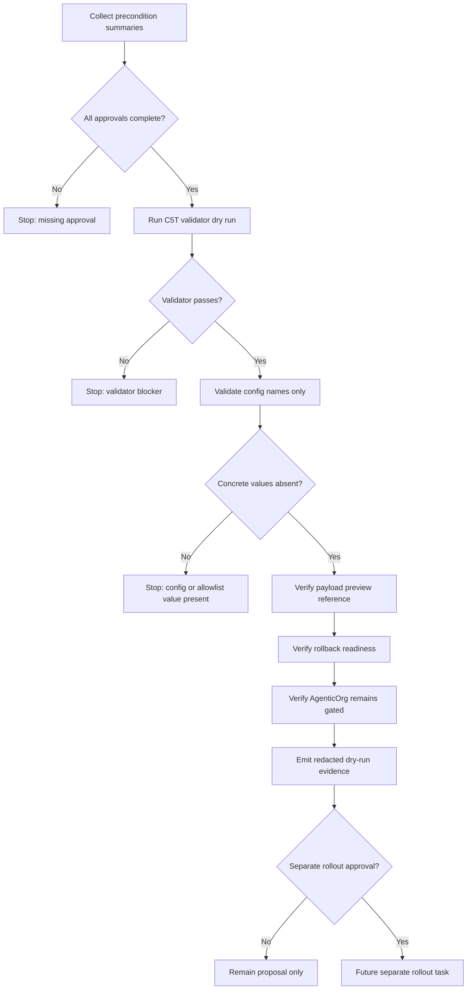

# Commerce V1 C5V Self-Onboarding Rollout Automation Proposal

Status: historical planning artifact; superseded by the current OACP authority mapping guide in docs/guides/oacp-runtime-authority-and-adapter-mappings.md.
Date: 2026-05-26
Scope: future rollout automation proposal for merchant self-onboarding
read-only Commerce discovery
Production changes made by this proposal: none
Runtime code changed by this proposal: no
Automation code changed by this proposal: no
Migrations added by this proposal: no
Cloud resources created by this proposal: no
Production config changed by this proposal: no
Production Commerce V1 changed by this proposal: no
Read-only discovery changed by this proposal: no
Merchant allowlist value approved by this proposal: no
Checkout or payment creation changed by this proposal: no
Live payment path changed by this proposal: no
Live Plural path changed by this proposal: no
Named merchant approved by this proposal: no
Secrets inspected or changed: no

This C5V record describes a future rollout automation proposal. It is not an
implementation. It does not add runtime code, automation code, migrations,
config values, cloud resources, public discovery, Commerce V1 enablement,
checkout/payment creation, live payments, live Plural, provider credentials,
real merchant approval, or rollout approval.

## Planning-Only Rollout Automation Scope

- Proposal only.
- No runtime automation implementation.
- No cloud resource creation.
- No production config mutation.
- No public discovery enablement.
- No checkout, payment, live payment, live Plural, provider, or broad runtime
  path.
- No real merchant is approved by this proposal.
- No rollout is approved by this proposal.
- Any future automation must be dry-run-first and human-approved before a
  separate rollout task can be considered.

## Required Preconditions

Future rollout automation may be considered only after all required artifacts
and approvals are complete:

- Real named merchant approval complete.
- Legal/compliance approval complete.
- Product wording approval complete.
- Security approval complete.
- Ops/on-call/support approval complete.
- Backup/RPO approval complete.
- Rollback owner assigned.
- Read-only smoke owner assigned.
- Evidence retention owner assigned.
- C5T validator passes.
- Public payload preview approved.
- Separate rollout approval granted.
- AgenticOrg dependency owner has a gated-state review summary.
- Rollback readiness summary exists.

Missing any precondition blocks the rollout automation path.

## Approval Gates

Required gates:

- Merchant owner.
- Legal/compliance.
- Product wording.
- Security.
- Operations/support.
- Backup/RPO.
- AgenticOrg dependency.
- Rollback owner.
- Read-only smoke owner.
- Evidence retention owner.
- Final human rollout approval.

Approval recording rules:

- Private approvals remain outside repositories.
- Repository records contain only non-secret approval references and redacted
  summaries.
- Placeholders are not approvals.
- Gate completion does not imply production rollout.
- Final human rollout approval must be separate from intake readiness and
  separate from this proposal.

## Config Proposal Boundaries

Future automation may discuss config names only as placeholders. This proposal
does not approve or set values.

| Config item | C5V boundary |
| --- | --- |
| `COMMERCE_PUBLIC_DISCOVERY_ENABLED` | Remains disabled until a future approved rollout. |
| `COMMERCE_PUBLIC_DISCOVERY_MERCHANT_ALLOWLIST` | Remains unset until a future approved rollout. |
| `COMMERCE_V1_ENABLED` | Remains disabled; broad runtime enablement is out of scope. |
| `COMMERCE_LIVE_MODE_ENABLED` | Remains disabled. |
| `PLURAL_LIVE_ENABLED` | Remains disabled. |
| AgenticOrg public discovery flag | Remains disabled until separate AgenticOrg approval. |

Boundary rules:

- Placeholder names only.
- No concrete values.
- No synthetic ID can be proposed as a production candidate.
- No config write is performed.
- No production URL is called.
- No cloud command is run.

## Dry-Run-Only Validation Concept

Future dry-run automation should:

1. Load a repo-safe rollout proposal packet.
2. Validate proposed config names without applying values.
3. Verify the allowlist candidate is approved by non-secret reference.
4. Verify the public payload preview hash or reference.
5. Verify no live, runtime, checkout, payment, Plural, or provider flags are
   included.
6. Verify AgenticOrg remains gated.
7. Verify rollback owner and read-only smoke owner are assigned.
8. Emit redacted dry-run evidence only.

Dry-run output must not include raw payloads, secrets, private artifact bodies,
provider credentials, DB/Redis URLs, private keys, production config values, or
concrete allowlist values.

## Rollback Automation Concept

Future rollback automation should be scoped to fail-closed behavior:

- Disable or unset the read-only discovery gate.
- Clear the allowlist.
- Keep Commerce V1/runtime/live flags disabled.
- Keep live payment and live Plural flags disabled.
- Verify the well-known discovery endpoint fails closed.
- Verify AgenticOrg remains gated.
- Record redacted rollback evidence.
- Avoid production deploy or cloud-resource creation unless a separate approved
  rollback task explicitly authorizes it.

Rollback evidence must show only command summaries, blocker codes, redacted
hashes, and public-safe state summaries.

## Evidence And Audit Requirements

Required evidence summaries:

- Precondition summary.
- Approval references as non-secret labels.
- Dry-run command summary.
- Read-only smoke result summary.
- Rollback readiness summary.
- AgenticOrg gated-state summary.
- Evidence retention owner summary.

Never record:

- Raw payloads.
- Secrets.
- Private artifact bodies.
- Private contracts.
- Private contacts.
- Signed approval records.
- Pricing terms.
- Customer data.
- Provider credentials.
- DB/Redis URLs.
- Private keys.
- Production config values.
- Concrete allowlist values.

Audit behavior:

- Append-only event timeline in any future implementation.
- Redacted event summary only.
- Actor role labels only.
- Production effect is none for this proposal.

## AgenticOrg Sequencing

- AgenticOrg stays gated before Grantex rollout.
- AgenticOrg stays gated during Grantex rollout.
- AgenticOrg may be considered only after Grantex read-only smoke passes.
- AgenticOrg requires separate approval and a separate rollout prompt.
- AgenticOrg rollback path is independent.
- Grantex rollout automation cannot enable AgenticOrg public discovery.
- AgenticOrg public commerce discovery remains disabled in this proposal.

## Stop Conditions

Stop rollout automation planning if:

- Required approval is missing.
- C5T validator fails.
- Private material appears in repository docs.
- Production config value is included.
- Allowlist value is included without separate approval.
- Broad Commerce V1 is requested.
- Checkout, payment, live payment, live Plural, or provider path is requested.
- AgenticOrg public discovery is requested too early.
- Synthetic ID is proposed for production.
- Cloud command, deploy command, or production URL is included.

## Mermaid Rollout Proposal Flow

## Future Notes

- Post-C5V local-only dry-run prototype should validate placeholders and emit
  redacted evidence without applying config.
- Separate human-approved production rollout is required before any production
  config change can be considered.
- Separate AgenticOrg discovery rollout may be considered only after Grantex
  read-only smoke passes and separate AgenticOrg approval exists.
- This proposal does not approve a merchant, allowlist value, config value,
  public discovery, checkout, payment, live payment, live Plural, provider path,
  deploy, cloud command, or production URL use.

## Production Safety Controls

- Grantex remains fail-closed.
- AgenticOrg remains gated.
- No public discovery.
- No broad Commerce V1.
- No checkout/payment creation.
- No live payments.
- No live Plural.
- No provider credentials.
- No synthetic production candidates.
- No production config values.
- No concrete allowlist values.
- No cloud resources.
- No deploy commands.
- No rollout approval from this proposal.
