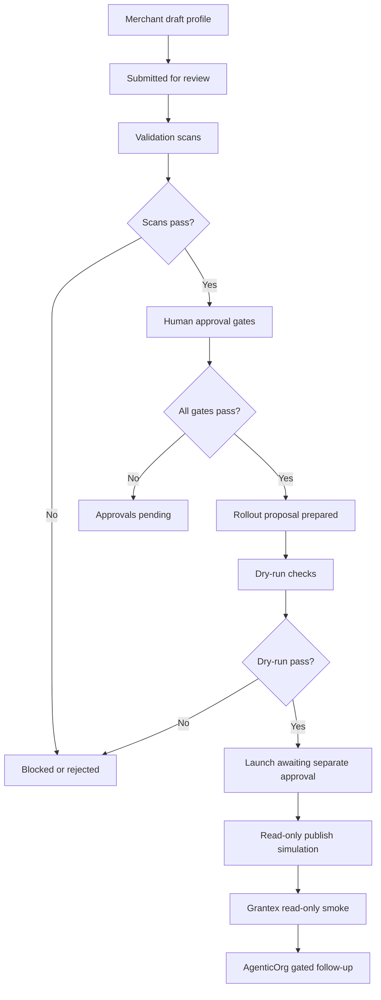

# Commerce V1 C5X Demo Launch Rehearsal

Status: docs-only launch rehearsal
Date: 2026-05-27
Scope: merchant education walkthrough for a simulated read-only discovery
publish flow
Production changes made by this record: none
Production rollout approved by this record: no
Production allowlist value approved by this record: no
Public discovery enabled by this record: no
Checkout or payment creation enabled by this record: no
Live payment or live Plural enabled by this record: no
Secrets inspected or changed: no

This rehearsal uses the synthetic `Demo Home Goods Store` packet from
`docs/examples/commerce-c5w-demo-home-goods-store-packet.json` to show how a
merchant launch would work after real approvals. The packet is demo-only, is
not a real merchant approval, and is never a production allowlist candidate.

## Demo Launch Flow

1. Merchant completes the profile.
   - Merchant fills public-safe identity fields and discovery wording.
   - Private artifacts stay outside the repo.

2. Public payload preview is reviewed.
   - Reviewers inspect the read-only discovery metadata.
   - The preview must exclude checkout, payment, live Plural, provider
     credential, and certification claims.

3. Private approval artifacts are referenced outside repo.
   - The repo stores only non-secret reference labels and public-safe
     summaries.
   - Signed approvals, contacts, contracts, pricing, and customer data remain
     in private systems.

4. Validation scans run.
   - Secret/private-detail scan.
   - Overclaim scan.
   - Merchant ID/name safety scan.
   - Synthetic-ID production-candidate scan.
   - Production config and allowlist scan.

5. Human approval gates pass.
   - Merchant owner, legal/compliance, product wording, security, ops/support,
     rollback, smoke, evidence retention, and AgenticOrg dependency reviewers
     must all be represented.

6. Rollout proposal is prepared.
   - The proposal is still a separate review artifact.
   - Preparing a proposal does not enable public discovery.

7. Dry-run checks pass.
   - Dry-run validates only names, references, and blocked paths.
   - Dry-run does not mutate production config or allowlists.

8. Publish request is submitted.
   - The publish request waits for separate production rollout approval.
   - This rehearsal does not approve that request.

9. Read-only discovery launch would be enabled only after separate approval.
   - Production remains fail-closed until that later approval exists.
   - Checkout, payments, live Plural, and provider credentials remain blocked.

10. AgenticOrg remains gated until Grantex read-only smoke passes.
    - AgenticOrg review starts only after Grantex approval and smoke evidence.
    - AgenticOrg public commerce discovery requires a separate approval path.

## Merchant-Facing Publish Checklist

| Item | Demo status |
| --- | --- |
| Approved public merchant ID | Placeholder only |
| Approved display name | `Demo Home Goods Store`, demo-only |
| Category | `Home and Kitchen`, demo-only |
| Discovery description | Synthetic read-only preview wording |
| Public payload preview | Demo packet historical preview state |
| Legal/compliance approval | Demo reference only |
| Product wording approval | Demo reference only |
| Security approval | Demo reference only |
| Ops/support owner | Demo role label only |
| Rollback owner | Demo role label only |
| Read-only smoke owner | Demo role label only |
| Evidence retention owner | Demo role label only |
| AgenticOrg dependency approval | Demo reference only |

## Demo UI And Status Labels

- Draft profile.
- Submitted for review.
- Scans running.
- Review ready.
- Approvals pending.
- Intake ready.
- Rollout proposal ready.
- Dry-run passed.
- Launch awaiting approval.
- Published read-only discovery: simulated only.
- Blocked: checkout, payments, live Plural, provider credentials.

## Speaker Notes

- Merchants control their public profile draft, discovery wording, public-safe
  category, and private artifact submission outside the repo.
- Human review is required for legal/compliance, wording, security, operations,
  support, rollback, smoke, evidence retention, and AgenticOrg dependency.
- Public-safe data includes reviewed merchant metadata, non-secret reference
  labels, payload preview summaries, and scan summaries.
- Private-only material includes contracts, contacts, signed approvals, pricing,
  customer data, secrets, provider credentials, raw payloads, DB or Redis URLs,
  private keys, and production config values.
- Launch is not automatic because public discovery affects production
  exposure, rollback, support posture, and downstream AgenticOrg dependency
  state.
- Rollback requires an assigned owner, evidence retention, a smoke result, and
  fail-closed behavior.

## Safety Disclaimers

- This is not production approval.
- No real merchant is approved.
- No allowlist value is approved.
- No public discovery is enabled.
- No production Commerce V1 runtime is enabled.
- No checkout or payment creation is enabled.
- No live payments are enabled.
- No live Plural access is enabled.
- No provider credentials are introduced.
- Synthetic IDs are never production candidates.

## Stop Conditions

Stop the rehearsal if any condition appears:

- Real private artifact content appears in the repo.
- Production config appears.
- Allowlist value appears.
- Demo merchant is treated as approved.
- Checkout, payment, live payment, live Plural, or provider path is requested.
- AgenticOrg public discovery is requested before Grantex read-only smoke.

## Launch Rehearsal Diagram

## Explicit Non-Approval

This walkthrough does not approve `Demo Home Goods Store`, does not approve a
production allowlist value, does not enable public discovery, does not enable
Commerce V1, does not enable checkout or payment creation, does not enable live
payments, does not enable live Plural, and does not approve AgenticOrg public
commerce discovery.
