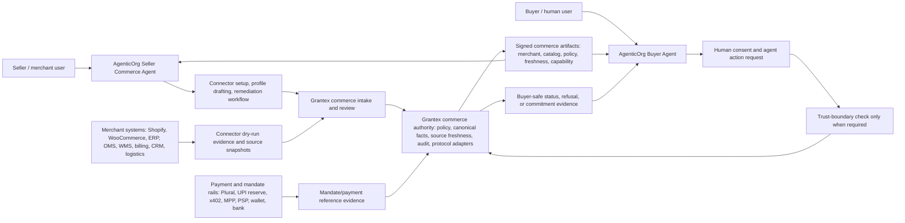

# C6V Agentic Commerce Clean Architecture PRD

Status: draft for human review only

Date: 2026-06-11

Repos reviewed:

- Grantex: commerce PRD, Commerce V1 build spec, merchant operator guide, connector metadata schema, sandbox/readiness/order/provider docs and tests.
- AgenticOrg: Grantex commerce connector, buyer discovery/session guardrails, commerce sales agent prompt, parity/refusal reports, Plural/billing/AP processor surfaces, public discovery readiness reports.

This PRD is documentation and architecture only. It does not approve launch, production checkout, live payments, live Plural, public discovery, provider calls, merchant private API calls, production allowlists, protocol publication, certification, compliance, conformance, standardization, or merchant approval.

## 1. Executive Summary

The current implementation has made strong progress on sandbox readiness, public-safe preview, refusal semantics, connector planning, order foundations, provider sandbox contracts, and internal compatibility preview tooling. The biggest product gap is not a missing helper function. The biggest product gap is ownership clarity.

The clean architecture should be:

- AgenticOrg is the AI agent runtime and user-facing agent workspace.
- Grantex is the agentic commerce trust, policy, protocol, consent, evidence, and canonical commerce authority.
- Merchant systems such as Shopify, WooCommerce, Magento, ERP, OMS, WMS, logistics, billing, CRM, and support remain the merchant operational systems of record.
- Payment and mandate rails such as Plural, UPI reserve, one-time mandates, x402, MPP, wallets, banks, PSPs, and fintech providers own actual mandate setup, authorization, payment execution, money movement, chargebacks, settlement, and regulated payment obligations.

AgenticOrg should make it easy for real buyers and sellers to create and operate agents. Grantex should make commerce facts safe, auditable, policy-bound, protocol-compatible, and buyer-safe. A buyer agent should never rely on raw seller-agent claims, raw connector output, or direct payment/provider calls. It should rely on Grantex-approved canonical commerce facts, signed authority artifacts, and narrowly scoped evidence references.

Grantex must not become a toll booth for every buyer/seller agent interaction. Normal discovery, comparison, negotiation, explanation, and low-risk buyer/seller conversation should run inside AgenticOrg using unexpired Grantex-signed artifacts. Grantex should be required at trust boundaries: merchant publish, fact refresh, policy revocation, public discovery change, final commitment, order/payment evidence, dispute, rollback, and emergency disablement.

Human decision update: if Grantex is unavailable, AgenticOrg may continue non-binding interactions with valid artifacts and may continue final commitments only through a constrained Offline Commitment Mode. Offline Commitment Mode requires explicit artifact permission, direct merchant/provider confirmation where required, a fresh local revocation snapshot, local evidence capture, and queued Grantex reconciliation.

First implementation decision: Offline Commitment Mode allows only bounded price locks, small inventory holds, provisional reservations, order-pending-reconciliation, Plural P3P-verified payment intents, confirmed cancellations, refund request intake, provisional return authorization, and support ticket escalation. It does not allow payment capture, refund execution, settlement, payout, public discovery changes, merchant approval/suspension, policy override, emergency disablement, or high-value orders beyond configured caps.

## 2. Problem Statement

The current docs and implementation can confuse product owners, merchants, buyers, and engineers because several documents still describe Grantex as the merchant control plane, while the desired product direction is that AgenticOrg carries AI agents, skills, knowledge bases, connectors, workflows, and buyer/seller-facing UX.

That distinction matters. If Grantex is described as the place where merchants create the seller AI agent, upload everything, run all adapters, and collect payment, then end users will not understand why AgenticOrg exists. If AgenticOrg directly connects buyer agents to merchant private APIs or payment providers, then trust, consent, auditability, protocol mapping, and safety can fragment.

The product must separate four responsibilities and one runtime rule:

1. Agent experience and autonomy.
2. Commerce authority and protocol trust.
3. Merchant operational source systems.
4. Regulated mandate and payment rails.
5. AgenticOrg runs agent workflows; Grantex issues, verifies, refreshes, and revokes commerce authority artifacts.

## 3. Corrected Product Positioning

### 3.1 AgenticOrg

AgenticOrg is the agent runtime and experience layer.

It should own:

- Buyer agent creation.
- Seller Commerce Agent creation.
- Agent skills, workflows, knowledge base, memory, conversation UX, and channel orchestration.
- Buyer channels such as web chat, ChatGPT-style interfaces, Claude-style interfaces, Gemini-style interfaces, WhatsApp, Telegram, voice, mobile apps, and other agent surfaces.
- Seller onboarding assistant UX.
- Connector setup guidance for merchant systems.
- Remediation workflows for merchant catalog, policy, inventory, support, and evidence gaps.
- Agent-specific refusal language, buyer-safe summaries, and handoff UI.

It should not be the source of truth for commerce authorization, production public discovery, payment approval, live provider readiness, merchant approval, or regulated payment evidence.

### 3.2 Grantex

Grantex is the agentic commerce authority layer.

It should own:

- Canonical merchant commerce profile.
- Canonical catalog, offer, inventory, policy, source, and freshness facts.
- Commerce policy evaluation.
- Consent, session, passport, revocation, and narrowly scoped mandate capability evidence when needed.
- Buyer-safe commercial fact projection.
- Audit and evidence retention.
- Protocol adapter generation from a single canonical model.
- Public discovery gates.
- Commerce refusal semantics.
- Provider-neutral payment, commitment, and mandate capability evidence contracts.
- Operator approval, rollback, emergency disablement, and release evidence.

Grantex should not try to become the merchant ERP, ecommerce platform, buyer chat product, seller agent workspace, or payment provider.

### 3.3 Merchant Systems

Merchant systems remain systems of record for operations.

Examples:

- Shopify, WooCommerce, Magento, BigCommerce, custom storefronts.
- ERP, OMS, WMS, PIM, inventory, pricing, tax, billing, CRM, support, warranty, returns, logistics, and carrier systems.

AgenticOrg seller agents may help merchants connect these systems and remediate issues, but Grantex must approve and publish the canonical buyer-safe commerce facts used by buyer agents.

### 3.4 Payment and Mandate Rails

Payment and mandate rails own regulated money movement.

Examples:

- Plural.
- UPI reserve.
- UPI one-time mandate.
- UPI AutoPay or e-mandate where legally approved.
- x402 or MPP where legally and technically supported.
- Banks, PSPs, wallets, card networks, account-to-account payment providers, or other fintech products.

Human buyers should set mandates or payment authorization with the regulated provider or fintech rail. Grantex should not create, own, refresh, debit, or execute those mandates. Grantex should verify or record only non-sensitive mandate capability evidence when cross-agent trust, policy enforcement, audit, or protocol mapping requires it. AgenticOrg buyer agents should use those capability signals only through approved commerce policy, not raw credentials or direct provider authority.

## 4. Clean Reference Architecture

## 4.1 Non-Toll-Booth Runtime Model

Grantex should not sit synchronously between buyer and seller agents for every message, search, comparison, or recommendation. That design would make Grantex a latency bottleneck, a single operational dependency for every agent conversation, and a confusing product boundary.

The preferred model is signed and cached authority artifacts:

- Grantex signs merchant capability, public discovery, catalog, offer, inventory freshness, policy, and protocol adapter artifacts.
- AgenticOrg seller agents use those artifacts to advertise what the merchant can safely support.
- AgenticOrg buyer agents use those artifacts to discover, compare, explain, and prepare actions.
- Grantex is called again only when the artifact is missing, stale, revoked, out of scope, or when the buyer agent crosses a final commitment boundary.
- If Grantex is unavailable at a final commitment boundary, AgenticOrg may continue only when Offline Commitment Mode is allowed by the relevant signed artifacts and external confirmations.
- Revocation lists, expiry windows, artifact versions, and emergency disablement signals must be enforceable without turning every low-risk interaction into a Grantex round trip.

Required online Grantex boundaries:

- Merchant onboarding submission and approval.
- Connector source approval and canonical fact publication.
- Public discovery state changes.
- Artifact refresh after source or policy changes.
- Consent/session/passport issuance, refresh, and revocation.
- Mandate capability verification when a commitment depends on it.
- Final order, reservation, payment, refund, or cancellation commitment when online authority is available.
- Dispute, rollback, emergency disablement, and audit evidence review.

Allowed offline or cached-agent behavior:

- Buyer discovery using unexpired signed facts.
- Seller-agent explanation of approved capabilities.
- Product comparison using unexpired facts.
- Non-binding recommendations.
- Draft cart or quote preparation when clearly marked non-final.
- Offline final commitment when the artifact explicitly allows it, provider or merchant confirmation succeeds, and reconciliation is queued.
- Refusal when artifacts are missing, stale, revoked, or ambiguous.

## 5. Design Principles

1. AgenticOrg creates and operates agents. Grantex authorizes commerce authority artifacts and final commitment boundaries.
2. Seller agents can assist, but they cannot approve themselves.
3. Buyer agents can discover and reason using unexpired Grantex-signed facts; final commitments require online authority or explicit Offline Commitment Mode.
4. Merchant systems are sources of operational data, not direct buyer-agent execution targets.
5. Payment providers own mandates and money movement. Grantex only verifies or records non-sensitive mandate capability evidence when needed for policy, audit, or protocol mapping.
6. Protocol adapters must be generated from one canonical Grantex commerce model.
7. Public discovery remains off until Grantex approval, protocol adapters, evidence, rollback, and monitoring are ready.
8. No runtime path may treat sandbox, synthetic, preview, or dry-run data as production approval.
9. Every buyer-visible commerce fact needs source, freshness, scope, and refusal behavior.
10. Every final cross-system commitment needs audit evidence, revocation handling, and rollback.

## 6. End-to-End Seller Flow

### 6.1 One-Time Seller Setup

1. Merchant signs in to AgenticOrg.
2. Merchant creates a Seller Commerce Agent.
3. Seller agent collects public merchant profile draft:
   - Display name.
   - Legal entity reference.
   - Category.
   - Country.
   - Currency.
   - Public description.
   - Support channel.
   - Return, warranty, fulfillment, and support policy summaries.
4. Seller agent helps merchant connect or describe source systems:
   - Shopify or WooCommerce.
   - ERP, OMS, WMS, PIM, billing, logistics, CRM, or support system.
   - CSV/manual fallback for early sandbox.
5. Seller agent prepares connector dry-run evidence:
   - Source type.
   - Data shape.
   - Field mapping.
   - Redacted samples.
   - Freshness fields.
   - Conflict report.
   - Missing policy fields.
6. AgenticOrg sends a structured onboarding packet to Grantex.
7. Grantex validates:
   - Tenant and merchant boundaries.
   - Public-safe fields.
   - Source freshness.
   - Required policies.
   - No secrets in public fields.
   - No production allowlist/config values.
   - No live provider path.
   - No checkout/payment enablement.
8. Grantex returns readiness, blockers, and remediation tasks.
9. AgenticOrg Seller Commerce Agent guides the merchant through remediation.
10. Human operator review is required before any public discovery or production commerce state.

### 6.2 Seller Regular Operations

1. Merchant updates products, inventory, prices, policies, support, or fulfillment status in existing systems.
2. Connector sync or dry-run captures changed source facts.
3. Grantex validates, signs, and version-stamps canonical commerce artifacts when publication or refresh is required.
4. AgenticOrg seller agent monitors readiness, artifact freshness, and blockers.
5. Buyer agents only see buyer-safe Grantex projections or unexpired signed artifacts.
6. If source data is stale, contradictory, missing, private, or outside approved scope, buyer agents must refuse or qualify the answer.

## 7. End-to-End Buyer Flow

### 7.1 One-Time Buyer Setup

1. Buyer creates or connects a buyer agent in AgenticOrg or an approved channel.
2. Buyer reviews agent permissions.
3. Buyer selects commerce capabilities and limits:
   - Categories.
   - Merchants.
   - Amount caps.
   - Frequency.
   - Expiry.
   - Jurisdiction.
   - Required confirmation conditions.
4. Buyer sets a mandate or payment authorization with the relevant fintech/payment rail where legally available.
5. Payment rail returns a provider-owned mandate/payment capability reference.
6. Grantex verifies or records non-sensitive mandate capability evidence only when the buyer wants that capability to be usable by agents across a trusted commerce flow:
   - Provider key.
   - Mandate reference or hash.
   - Scope.
   - Limits.
   - Expiry.
   - Revocation state.
   - Buyer-agent binding.
   - Audit references.
7. AgenticOrg stores no provider credentials and does not treat the mandate as unrestricted payment authority.

### 7.2 Buyer Regular Agentic Commerce

1. Buyer asks an agent to find, compare, reserve, or purchase something.
2. AgenticOrg buyer agent interprets intent and first uses unexpired Grantex-signed commerce artifacts when available.
3. If artifacts are missing, stale, revoked, ambiguous, or out of scope, AgenticOrg asks Grantex for refreshed buyer-safe merchant, catalog, offer, inventory, policy, source, and freshness facts.
4. AgenticOrg buyer agent presents grounded options and refuses unsupported claims.
5. Buyer gives consent for a specific action.
6. AgenticOrg asks Grantex to validate only when the action crosses a trust boundary:
   - Merchant state.
   - Product and offer source.
   - Inventory freshness.
   - Consent scope.
   - Passport/session state.
   - Mandate capability evidence when required.
   - Revocation/expiry.
   - Jurisdiction and amount limits.
7. If online checks pass, Grantex creates or verifies commitment evidence, not a blanket approval for future spend.
8. If Grantex is unavailable, AgenticOrg may use Offline Commitment Mode only when signed artifacts explicitly permit it and merchant/provider confirmation succeeds.
9. Payment rail executes or challenges the mandate/payment.
10. Provider webhook/evidence returns to Grantex directly or through queued AgenticOrg reconciliation.
11. Grantex projects buyer-safe status back to AgenticOrg when online or after reconciliation.
12. AgenticOrg explains the result to the buyer and seller agent.

## 8. Protocol Adapter Strategy

The product should not ask every merchant or buyer agent to implement every protocol separately. Instead, Grantex should define one canonical commerce contract and generate adapter shapes.

### 8.1 Canonical Grantex Commerce Contract

Required canonical domains:

- Merchant profile.
- Agentic capability profile.
- Catalog item.
- Variant.
- Offer.
- Inventory and freshness.
- Policy summary.
- Cart draft.
- Consent/session.
- Commerce Passport.
- Mandate/payment reference.
- Order.
- Fulfillment.
- Refund/return.
- Support.
- Settlement/payout evidence reference.
- Connector source.
- Audit/evidence reference.
- Refusal and blocker taxonomy.

### 8.2 Adapter Targets

Adapters should be non-certifying until externally reviewed and approved.

- schema.org JSON-LD: public merchant, product, offer, availability, policy, and organization markup.
- UCP-style capability profile: merchant and agent commerce capability shape.
- ACP-style action or checkout shape: agent-safe action request, consent, and refusal structure.
- AP2-style evidence shape: mandate, consent, payment, and audit evidence references.
- MCP tools: Grantex-owned commerce tools consumed by AgenticOrg.
- A2A: AgenticOrg agent cards and task routing that reference Grantex authority IDs.

### 8.3 Ownership Rule

AgenticOrg can expose agent cards, channels, and agent workflows. Grantex must own the canonical facts and policy references behind any commerce claim.

## 9. Merchant System Connector Strategy

### 9.1 What AgenticOrg Should Do

AgenticOrg should provide the seller-facing agent experience:

- "Connect my Shopify store."
- "Map these WooCommerce fields."
- "Show why my catalog is blocked."
- "Prepare missing return policy summary."
- "Upload this CSV and run a dry-run."
- "Explain what Grantex will publish to buyer agents."

### 9.2 What Grantex Should Do

Grantex should provide authority and publication controls:

- Connector registry.
- Connector source and freshness model.
- Dry-run validation.
- Conflict detection.
- Redacted evidence export.
- Canonical fact approval.
- Public discovery gating.
- Audit and rollback.

### 9.3 What Neither Should Do Prematurely

Neither system should treat a live Shopify/WooCommerce/ERP connection as automatic public launch. Source access is not approval. A connected merchant system is only input evidence until Grantex validates, reviews, and publishes buyer-safe facts.

## 10. Payment and Mandate Strategy

### 10.1 Correct Ownership

Payment/mandate providers own:

- Mandate creation.
- Customer authentication.
- Payment authorization.
- Money movement.
- Chargebacks.
- Settlement.
- Provider risk checks.
- Regulated payment receipts and disputes.

Grantex should not own the mandate or payment rail. Grantex may own only the commerce-side capability evidence that lets agents decide whether a specific action is allowed.

Grantex may own:

- Non-sensitive mandate capability references when needed.
- Scope and policy checks at commitment boundaries.
- Consent/passport binding.
- Revocation/expiry propagation.
- Provider-neutral status projection.
- Audit references.
- Buyer-safe refusal.

AgenticOrg owns:

- Buyer consent UX.
- Buyer-agent explanation.
- Channel-specific refusal and confirmation language.
- No direct storage of provider secrets for commerce execution.
- Buyer confirmation UX when a mandate capability is absent, stale, revoked, expired, or insufficient.

### 10.2 Optional Mandate Capability Evidence Contract

A production-ready contract may need the following fields only when agentic commerce requires portable proof that a buyer-authorized payment capability exists. If the provider, channel, or jurisdiction can do the same verification directly at final confirmation, Grantex should not duplicate that state.

- mandate_reference_id.
- provider_key.
- jurisdiction.
- rail_type.
- buyer_agent_id.
- buyer_subject_reference.
- merchant_scope.
- category_scope.
- max_amount.
- currency.
- frequency or recurrence.
- expiry.
- revocation_state.
- challenge_required_conditions.
- last_verified_at.
- audit_event_id.
- evidence_reference.
- verification_mode:
  - provider_callback.
  - provider_token_introspection.
  - signed_provider_receipt.
  - human_reconfirm_required.
- grantex_cache_expiry.

No raw payment credentials, private provider payloads, raw JWTs, secrets, bank account numbers, or private customer identifiers should be exposed to AgenticOrg or public protocol adapters.

### 10.3 When Grantex Is Not Needed

Grantex should not be called for:

- General buyer/seller conversation.
- Product browsing with unexpired signed catalog artifacts.
- Non-binding price comparison with unexpired signed offer artifacts.
- Seller-agent coaching.
- Draft cart preparation that is clearly non-final.
- Buyer education about payment options.
- Provider-hosted mandate setup UX before the mandate is linked to a specific commerce capability.

### 10.4 When Grantex Is Needed

Grantex should be called for:

- Publishing a merchant or seller-agent commerce capability.
- Refreshing stale or revoked commerce artifacts.
- Checking consent/passport/session revocation.
- Binding a provider-owned mandate capability to a buyer-agent commerce scope.
- Creating final order, reservation, payment, refund, cancellation, dispute, or support evidence.
- Producing a protocol adapter artifact that makes a commerce claim.
- Emergency disablement or rollback.

## 11. Current Product Gap Analysis

| Area | Current signal | Gap | Priority | Required next decision |
| --- | --- | --- | --- | --- |
| Product positioning | Some docs call Grantex the merchant control plane | This conflicts with AgenticOrg as AI agent runtime and seller-agent home | P0 | Approve corrected ownership language |
| Seller AI agent | AgenticOrg has commerce sales agent prompt and Grantex connector | No complete Seller Commerce Agent creation/onboarding product flow | P0 | Define Seller Commerce Agent onboarding packet and UI |
| Merchant self-serve | Grantex has sandbox onboarding foundations | User-facing self-serve should begin in AgenticOrg and flow into Grantex authority | P0 | Define AgenticOrg-to-Grantex intake contract |
| Existing merchant systems | Grantex has connector metadata and dry-run/review/remediation work | No tight Shopify/WooCommerce/ERP production connector flow yet | P0 | Pick first real sandbox connector and evidence model |
| Buyer agent channels | AgenticOrg can host agents and tools | No complete channel compatibility plan for ChatGPT, Claude, Gemini, WhatsApp, Telegram, voice, mobile | P0 | Define channel launch/refusal packs and adapter requirements |
| Protocol adapters | Preview/compatibility fixtures exist | No approved external UCP/ACP/AP2/schema.org/A2A adapter endpoints or publication | P0 | Define canonical schema versioning and adapter generation plan |
| Payment mandates | Payment foundation and provider sandbox contracts exist | Mandate ownership is not cleanly modeled around fintech/provider rails | P0 | Add mandate reference contract and revocation propagation |
| Transaction routing | Several flows imply AgenticOrg asks Grantex during every buyer action | Routing every interaction through Grantex is overkill and creates latency, coupling, and product confusion | P0 | Define signed artifact, cache, expiry, and commitment-boundary model |
| Offline commitment | User-approved autonomy requires final commitments to continue during Grantex outage | Needs strict artifact, revocation, merchant/provider confirmation, evidence, and reconciliation rules | P0 | Define Offline Commitment Mode |
| First payment rail | User selected Plural P3P as the first direct provider capability rail | Needs real sandbox/approved non-production integration, not mocks | P0 | Define Plural P3P capability evidence |
| Plural/billing isolation | AgenticOrg has generic Plural/billing/AP processor paths | Risk of confusion with agentic commerce payment authority | P0 | Document and test hard isolation between billing/AP and agentic commerce |
| Public discovery | Shared state contract exists | No production-approved public discovery launch path | P0 | Define public discovery launch evidence gate |
| Source/freshness | Buyer-safe projection work exists | Needs cross-repo canonical contract and UI display consistency | P1 | Define user-visible freshness labels |
| Orders | Grantex order foundation exists | No complete order API, lifecycle, fulfillment, cancellation, support, refund, settlement | P1 | Decide next order lifecycle slice |
| Fulfillment | Mostly planned | No real shipping, delivery slot, pickup, tracking, carrier integration | P1 | Define fulfillment authority and connector boundaries |
| Refunds/returns | Deferred | No production refund request/execution contract | P1 | Define refund request vs provider execution split |
| Support | Placeholder only | No support case, escalation, SLA, buyer/seller comms contract | P1 | Define support lifecycle |
| Observability | Audit foundations exist | No complete merchant/buyer/operator launch dashboards | P1 | Define evidence dashboard requirements |
| Standards publication | Draft prep docs exist | Not ready for IETF/NIST or public standard claims | P2 | Prepare only after stable implementation and external review |

## 12. Required Documentation Corrections After This PRD Is Approved

Do not update these automatically until the architecture is approved.

Grantex docs that likely need terminology correction:

- Commerce PRD sections that call Grantex the merchant control plane.
- Build spec sections that imply Grantex directly owns all merchant ERP integration execution.
- Payment sections that over-emphasize Grantex-created checkout instead of provider-owned mandates and optional Grantex capability evidence.
- Runtime sections that imply every buyer/seller agent transaction must route through Grantex.
- Protocol sections that need "adapter compatibility mapping boundary" and "not certified" language.

AgenticOrg docs that likely need correction:

- Commerce agent docs should explicitly name Seller Commerce Agent and Buyer Commerce Agent responsibilities.
- Public discovery docs should reference Grantex as the authority source.
- Plural/billing/AP processor docs should state they are not Agentic Commerce authority paths.
- Channel docs should list required refusal and confirmation behaviors for chat and messaging surfaces.

## 13. Implementation Roadmap After Approval

### C6V1 - Trust Artifact and Boundary Model

Docs-only update across both repos defining signed commerce artifacts, cache/expiry behavior, revocation, online trust boundaries, and when Grantex is not in the runtime path.

### C6V2 - Terminology and Ownership Cleanup

Docs-only update across both repos replacing confusing ownership language with the approved model.

### C6V3 - Seller Commerce Agent Onboarding Packet

AgenticOrg defines seller agent onboarding packet and Grantex defines intake validation contract. No production enablement.

### C6V4 - Merchant System Connector Authority Contract

Define how Shopify/WooCommerce/ERP data becomes Grantex-approved canonical facts. Start with sandbox/dry-run only.

### C6V5 - Mandate Capability Evidence Contract

Define provider-owned mandate setup and optional Grantex non-sensitive capability evidence for Plural, UPI reserve, one-time mandate, x402, and MPP where legally supported.

### C6V6 - Protocol Adapter Contract

Define canonical schema versioning and adapter generation for schema.org, UCP-style, ACP-style, AP2-style, MCP, and A2A.

### C6V7 - AgenticOrg Channel Refusal Packs

Define buyer/seller channel behavior for web chat, API, WhatsApp, Telegram, voice, and third-party agent hosts.

### C6V8 - Commerce Isolation Tests

Prove AgenticOrg billing/AP/Plural paths cannot be used as Agentic Commerce authority or payment execution shortcuts.

### C6V9 - Sandbox Merchant System E2E

Run one fake or approved sandbox merchant through seller agent onboarding, connector dry-run, Grantex approval blockers, buyer-safe projection, and refusal paths.

### C6V10 - Order/Fulfillment/Refund Contract

Define post-purchase lifecycle without provider execution or public launch.

### C6V11 - Go-Live Readiness Reassessment

Only after the above, reassess production launch gaps and external protocol publication readiness.

## 14. Acceptance Criteria For This PRD

This PRD is acceptable if reviewers agree that:

- AgenticOrg is the agent runtime and UX layer.
- Grantex is the commerce authority and protocol trust layer, not the synchronous broker for every agent interaction.
- Merchant systems remain operational sources of record.
- Payment/mandate providers own money movement.
- Buyer agents consume only Grantex-approved buyer-safe commerce facts or unexpired signed artifacts.
- Seller agents can guide and remediate but cannot self-approve public commerce launch.
- Protocol adapters are generated from a canonical Grantex contract and are not certification claims.
- No implementation or launch should proceed until these boundaries are approved.

## 15. Stop Conditions

Stop future implementation if a slice:

- Moves provider credentials into AgenticOrg commerce flows.
- Lets buyer agents call merchant private APIs directly for authoritative commerce.
- Treats raw connector data as approved public discovery.
- Treats a mandate/payment reference as unlimited spend authority.
- Makes Grantex a required synchronous dependency for every buyer/seller message, browse, comparison, or non-binding recommendation.
- Lets stale or revoked signed artifacts continue to support final commitments.
- Stores raw payment credentials, secrets, private provider payloads, or raw customer identifiers in public or agent-facing payloads.
- Claims UCP, ACP, AP2, A2A, schema.org, IETF, NIST, certification, compliance, or production readiness without external review and explicit approval.
- Enables public discovery, checkout/payment, live provider, live Plural, or production allowlists before the agreed gates.

## 16. Resolved Architecture Decisions

Resolved decisions:

1. The four-party architecture is correct: AgenticOrg agent runtime, Grantex trust/protocol authority, merchant systems as operational sources, and providers as regulated payment/mandate rails.
2. Merchant self-serve begins in AgenticOrg Seller Commerce Agent and flows into Grantex authority for signed artifacts, policy, evidence, and revocation.
3. Grantex must not become a synchronous toll booth for every browse, recommendation, comparison, or non-binding message.
4. Offline Commitment Mode may support final commitments only inside strict caps, TTLs, revocation freshness, merchant/source confirmation, provider verification, local evidence, and Grantex reconciliation.
5. First-release caps are conservative: low-risk non-binding drafts up to INR 25,000/USD 300, medium commitments up to INR 10,000/USD 125, high-risk offline actions up to INR 5,000/USD 60, and critical actions offline-disallowed.
6. Default artifact TTLs are short for volatile facts: merchant profile 24 hours, seller agent capability 6 hours, policy 6 hours, catalog 6 hours, offer 15 minutes, price 5 minutes or 60 seconds for dynamic categories, inventory 60 seconds or 30 seconds for high-velocity categories, public discovery 15 minutes for read-only display, mandate capability 2 minutes at commitment boundary, and protocol adapter profile 24 hours maximum but never longer than referenced artifacts.
7. Connector credentials should live first in merchant-owned connector platforms or merchant-selected external integration provider vaults. AgenticOrg encrypted vault is a fallback only with explicit merchant authorization. Grantex should not store raw Shopify, WooCommerce, ERP, OMS, WMS, PIM, billing, CRM, logistics, or provider connector credentials.
8. Revocation propagation SLA is jointly owned by providers, merchant systems, AgenticOrg, Grantex, and channel bridges.
9. First internal OACP artifacts should use canonical JSON with detached JWS signatures. JWT remains for sessions/passports, not as the commerce artifact container.
10. First E2E bridge should be a real hosted OACP Agent Gateway: ChatGPT-style through OpenAPI, Claude Code-style through MCP streamable HTTP, Gemini-style through A2A plus OpenAPI fallback, and Perplexity-style through hosted answer/search plus OpenAPI read/commit-preflight endpoints.

Remaining review questions:

1. Which merchant categories require lower first-release caps?
2. Which merchant-owned connector platforms or external integration providers should be supported first?
3. What legal/regulatory review is required before Plural P3P moves beyond sandbox/approved non-production?
4. Which public documentation surfaces should expose OACP before external governance is decided?
