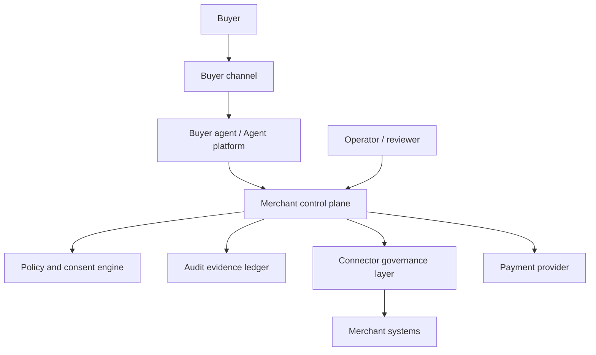

# NIST Candidate Outline - Securing Agentic Commerce

Status: internal NIST-facing whitepaper outline only.

Created: 2026-06-09.

Candidate title:

`Securing Agentic Commerce: Reference Architecture for Consent, Merchant
Policy, Audit Evidence, and Payment Safety`

This outline prepares a NIST-aligned security and risk reference architecture.
It has not been submitted to NIST, has not been accepted by NIST, has not been
accepted by NCCoE, and must not be described as NIST-approved.

## Intended Abstract

Agentic commerce introduces new risks because AI agents can discover products,
reason about offers, request carts, initiate consent flows, and request
checkout or payment actions. This paper proposes a reference architecture for
managing those risks through merchant-controlled capability exposure, scoped
buyer consent, policy enforcement, provider boundaries, connector governance,
redacted audit evidence, refusal behavior, and rollback.

## Whitepaper Goals

- Define a repeatable security architecture for agent-mediated commerce.
- Map technical controls to NIST AI RMF and cybersecurity risk-management
  concepts.
- Show how merchants can participate without exposing private systems directly
  to agents.
- Keep payment providers behind governed merchant-control-plane boundaries.
- Make audit evidence and refusal behavior explicit.
- Identify residual risk and launch gates.

## Non-Goals

- No claim of NIST endorsement.
- No claim of formal NIST publication.
- No live payment approval.
- No provider certification.
- No protocol certification.
- No replacement for legal, compliance, payment-network, or provider approval.

## Candidate Table Of Contents

1. Executive summary.
2. Problem statement.
3. Scope and assumptions.
4. Reference architecture.
5. Threat model.
6. Actor and asset inventory.
7. Trust boundaries.
8. Control objectives.
9. NIST AI RMF mapping.
10. Cybersecurity control mapping.
11. Identity, consent, and authorization controls.
12. Merchant policy and capability governance.
13. Connector governance and source-of-truth controls.
14. Payment safety and provider-boundary controls.
15. Audit evidence and evidence retention.
16. Privacy and data minimization.
17. Incident response and rollback.
18. Assurance and conformance evidence.
19. Deployment patterns.
20. Open questions for industry collaboration.
21. Appendix: implementation lessons.

## Reference Architecture

Core boundary:

Agents request commerce actions through the merchant control plane. Agents do
not directly call payment providers or merchant private systems.

## Threat Model

| Threat | Example | Control objective |
| --- | --- | --- |
| Agent goal hijacking | Agent tries to buy outside requested scope. | Scope and policy verification before protected actions. |
| Prompt injection | Product content instructs agent to bypass rules. | Treat merchant/catalog content as untrusted input. |
| Stale commerce facts | Agent promises unavailable stock or old price. | Freshness checks and refusal behavior. |
| Overbroad consent | Buyer approves more than intended. | Narrow scopes, amount caps, expiry, revocation. |
| Provider boundary bypass | Agent calls payment provider directly. | Provider credentials and calls stay in merchant control plane. |
| Merchant private API exposure | Agent calls ERP or storefront private APIs. | Connector mediation and no direct agent execution. |
| Cross-tenant data leak | One merchant sees another merchant's data. | Tenant-boundary filtering and tests. |
| Audit tampering | Protected action lacks durable evidence. | Append-only audit and redacted evidence references. |
| Unsafe public discovery | Unapproved merchant or synthetic data appears public. | Approval gates and allowlist controls. |

## NIST AI RMF Mapping Draft

| AI RMF function | Agentic commerce control theme | Evidence to collect |
| --- | --- | --- |
| Govern | Roles, responsibilities, policy owners, launch approvals. | Owner records, approval references, policy versions. |
| Map | Context, actors, channels, merchant systems, data flows. | Architecture diagrams, system inventory, trust boundaries. |
| Measure | Guardrail tests, refusal evals, stale-data checks, conformance scans. | Test results, conformance reports, scan outputs. |
| Manage | Rollback, disablement, incident response, revocation, monitoring. | Runbooks, audit events, alert/rollback evidence. |

## Cybersecurity Control Themes

| Theme | Control expectation |
| --- | --- |
| Identity and access | Agent, buyer, merchant, and operator identities are attributable. |
| Least privilege | Capabilities are scoped by merchant, channel, product, amount, and environment. |
| Data minimization | Public views exclude private merchant artifacts, raw payloads, and credentials. |
| Credential protection | Provider and connector credentials are never stored in docs, logs, fixtures, or agent systems. |
| Auditability | Protected actions are not acknowledged without durable evidence. |
| Integrity | Cart, amount, policy, and consent evidence is hashable or otherwise verifiable. |
| Availability and resilience | Stale or unavailable sources fail closed with safe refusal. |
| Incident response | Disablement, rollback, and revocation paths are documented and tested. |

## Agentic Commerce Control Objectives

1. Agents discover only approved merchant capabilities.
2. Agents do not invent products, prices, inventory, delivery, refunds, or
   payment outcomes.
3. Payment-affecting actions require scoped buyer consent.
4. Merchant policy can block or require human review.
5. Merchant private systems are accessed only through governed connectors.
6. Payment providers are accessed only through governed provider adapters.
7. Evidence is redacted, durable, and reviewable.
8. Public discovery and live payment require separate explicit approvals.

## Assurance Evidence

Expected evidence categories:

- conformance fixture results;
- refusal and no-invention tests;
- tenant-boundary tests;
- secret/private-data scans;
- public-safe preview reviews;
- connector dry-run and remediation evidence;
- audit event tests;
- rollback and disablement rehearsal;
- payment-provider sandbox evidence when available;
- live readiness approval when applicable.

## NIST/NCCoE Engagement Plan

1. Complete internal whitepaper draft.
2. Remove all private repo, merchant, and provider-specific details.
3. Map controls to AI RMF and cybersecurity risk-management categories.
4. Draft a project-description style summary for "Securing Agentic Commerce".
5. Identify external collaborators only after public-safe scope approval.
6. Seek review without claiming NIST approval.

## Stop Conditions

Stop drafting if any change:

- claims NIST approval, NIST publication, NCCoE acceptance, or public comment
  submission;
- includes private merchant artifacts, secrets, credentials, raw payloads,
  production config, concrete allowlists, or provider metadata;
- enables public discovery, production Commerce V1, checkout/payment creation,
  live provider, live Plural, provider calls, merchant private API calls, or
  production allowlists;
- treats sandbox evidence as production readiness;
- omits payment-provider, merchant-system, or buyer-consent threat boundaries.
