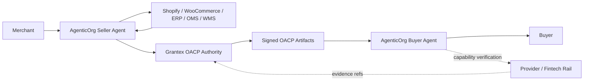
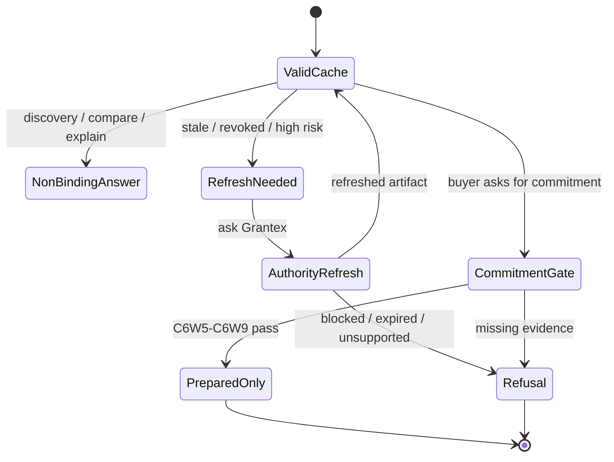
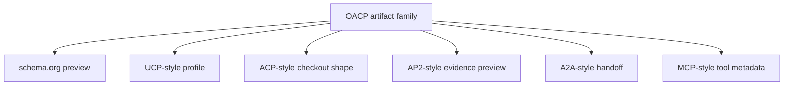
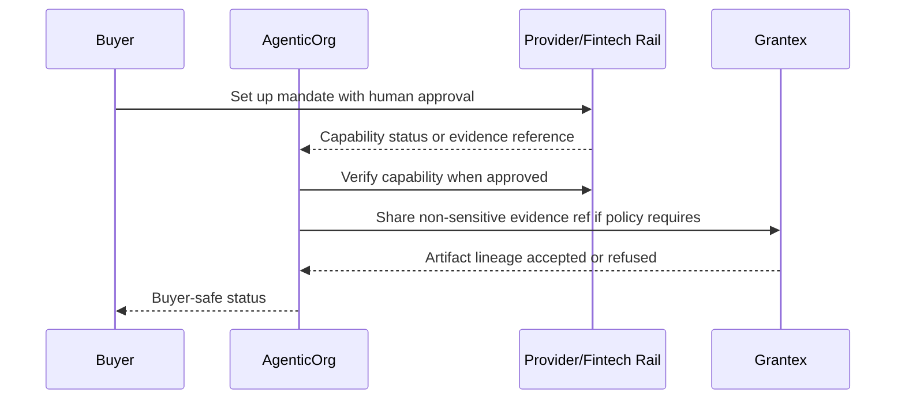

# Commerce V1 OACP Landing Page And Blog Plan

Status: internal planning only.

This plan updates the public narrative for Open Agentic Commerce Protocol work
without publishing a protocol, claiming a standard, enabling public discovery,
enabling checkout/payment, enabling live provider rails, or changing production
configuration.

## Corrected Public Position

Grantex should be presented as the trust, protocol, policy, and canonical
artifact authority for agentic commerce. It should not be presented as a
transaction toll booth that sits in every buyer/seller agent exchange.

AgenticOrg should be presented as the buyer and seller AI-agent runtime:

- seller agents onboard merchants and start connector workflows;
- buyer agents run conversations and channel UX;
- local artifact cache allows non-binding interactions to continue when valid;
- commitment-bound actions require fresh artifacts, source/provider evidence,
  and explicit risk gates.

Merchant systems remain operational sources of record. Provider and fintech
rails own mandate and payment execution.

## Current Implementation Summary

Internal OACP work is implemented through C6Z, but the production C6Z vertical
is not complete. The June 18, 2026 closure run found two production blockers:
AgenticOrg Shopify Admin GraphQL sync returns `401 Unauthorized`, and the
AgenticOrg-configured Grantex internal token returns `422 tenant_not_provisioned`.

Implementation status:

| Slice | Current result | Public posture |
| --- | --- | --- |
| C6W3 | Artifact family schemas and fixtures. | Internal only. |
| C6W4 | Protocol adapter previews for schema.org, UCP-style, ACP-style, AP2-style, A2A-style, and MCP-style targets. | Preview only; no conformance claim. |
| C6W5 | Commitment-boundary resolver over cached signed artifacts. | Non-executing. |
| C6W6 | Prepared commitment envelopes for buyer/source/merchant/provider handoff. | Prepared only. |
| C6W7 | Local response evidence reconciliation. | Reconciled only; no execution. |
| C6W8 | Eligibility and audit-readiness packets. | Eligibility only; no approval. |
| C6W9 | Dry-run verifier for future execution-controller contract shape. | Dry-run only; no readiness claim. |
| C6Z | Runtime artifact authority route and AgenticOrg vertical wiring. | Launch-closure branch expands to 11 artifact families and local non-executing runtime proof; full production vertical remains blocked until valid Shopify and Grantex tenant-token mapping are present. |

## Landing Page: Grantex

Goal: make Grantex look like the authority layer behind safe agentic commerce,
not the consumer-facing agent app.

Recommended first viewport:

- H1: "Trust Layer For Agentic Commerce"
- Supporting line: "Define policy, source freshness, signed artifacts, and
  protocol adapter previews for AI agents without becoming the transaction
  engine."
- Primary CTA: "Read the OACP architecture"
- Secondary CTA: "Review implementation status"

Required sections:

1. What Grantex owns
   - artifact authority;
   - source/freshness policy;
   - refusal semantics;
   - protocol adapter rules;
   - consent and revocation posture;
   - non-sensitive evidence references.
2. What Grantex does not own
   - buyer/seller agent runtime;
   - merchant operational systems;
   - provider mandate/payment execution;
   - every non-binding agent message.
3. Four-party architecture
   - AgenticOrg agents;
   - Grantex trust authority;
   - merchant systems;
   - provider/fintech rails.
4. OACP implementation status
   - C6W3 through C6Z complete internally;
   - the 2026-06-18 production vertical is blocked on Shopify token validity
     and AgenticOrg-to-Grantex tenant-token provisioning;
   - execution, live payments, public discovery, and standardization remain
     blocked.
5. Protocol adapter previews
   - schema.org;
   - UCP-style;
   - ACP-style;
   - AP2-style;
   - A2A-style;
   - MCP-style;
   - OpenAPI/function buyer-safe bridge schema.
6. Pending before public launch
   - persistent cache;
   - real connectors;
   - provider-owned mandate verification;
   - execution controller;
   - public protocol governance.

Visual workflow:

## Required Blog Drafts

Each draft must stay non-executing and must include the stated diagram. None may
claim certification, conformance, standardization, public discovery, merchant
approval, payment approval, or live-provider readiness.

| Draft | Core message | Required diagram |
| --- | --- | --- |
| How OACP Connects Seller Agents, Buyer Agents, Grantex, Shopify, and Plural/Pine | Four parties keep separate responsibilities: AgenticOrg runtime, Grantex authority, Shopify source of record, provider-owned execution. | Four-party architecture. |
| Why Grantex Is A Trust Authority, Not A Transaction Toll Booth | Cached Grantex-issued artifacts can support non-binding answers until TTL, revocation, risk, freshness, or commitment boundaries require refresh. | Buyer question through cache. |
| From Shopify To ChatGPT/Claude/Gemini: Buyer-Safe Commerce Through OACP | Shopify read-only sync becomes OACP artifacts, then AgenticOrg bridge adapters answer with source/freshness labels. | Shopify sync to OACP artifacts plus channel bridge flow. |
| Mandates And Payments In Agentic Commerce: Provider-Owned Execution, Agent-Owned Context | AgenticOrg can verify capability metadata where approved; providers own mandate/payment execution and Grantex stores only non-sensitive evidence refs. | Mandate capability evidence flow and refusal/fail-closed flow. |

## Landing Page: AgenticOrg

Goal: make AgenticOrg the place merchants and users experience AI agents.

Recommended first viewport:

- H1: "AI Agents That Can Work With Commerce Systems Safely"
- Supporting line: "Create seller agents, run buyer conversations, connect
  merchant systems, and consume Grantex-signed OACP artifacts without inventing
  commerce facts."
- Primary CTA: "Explore Seller Commerce Agent"
- Secondary CTA: "See OACP trust model"

Required sections:

1. Seller Commerce Agent
   - self-serve onboarding;
   - connector setup;
   - readiness and blocked-path labels.
2. Buyer Agent Runtime
   - ChatGPT-style, Claude/MCP-style, Gemini-style, Perplexity/search-style,
     web and messaging channels;
   - source/freshness labels;
   - refusal and refresh handoffs.
3. Artifact Cache
   - cached per buyer agent, seller agent, tenant, and merchant;
   - continue non-binding interactions while TTL is valid;
   - refresh/refuse by risk tier.
4. Connector Workflows
   - Shopify;
   - WooCommerce;
   - ERP/PIM;
   - OMS/WMS;
   - support and logistics.
5. Mandate And Payment Boundary
   - provider-owned setup and execution;
   - AgenticOrg may verify capability where approved;
   - Grantex receives non-sensitive evidence refs only when needed.

## Blog Series

| Blog | Thesis | Visual workflow |
| --- | --- | --- |
| The Clean Four-Party Architecture For Agentic Commerce | Autonomous commerce needs agents, trust authority, merchant systems, and provider rails as separate roles. | Four-party architecture diagram. |
| Why Grantex Must Not Be A Transaction Toll Booth | Non-binding discovery should run from valid cached artifacts; only risky commitments need authority refresh. | Cache TTL and risk gate state machine. |
| OACP Artifacts Explained | OACP is an artifact/profile layer, not a payment processor or storefront. | Artifact family graph from merchant profile to C6W9 dry-run. |
| Seller Agents And Merchant Systems | Seller agents should connect Shopify, WooCommerce, ERP, OMS, WMS, and support systems with merchant-approved custody. | Connector sync and evidence-ref workflow. |
| Provider-Owned Mandates | Mandates and payments belong to providers/fintechs; agents verify capability and carry evidence safely. | Provider mandate setup and evidence reference lifecycle. |
| Adapter Previews Without Overclaiming | schema.org, UCP-style, ACP-style, AP2-style, A2A-style, and MCP-style views should be generated from artifacts. | OACP artifact fan-out to protocol adapter previews. |
| What Still Blocks Autonomous Commerce | C6W9 is strong but not live execution; the remaining work is concrete. | Gap ladder from C6W9 to controlled pilot. |

## Example Blog Visuals

### Cache And Refresh

### Artifact To Adapter Fan-Out

### Mandate Boundary

## Approval Checklist Before Publishing

- Product owner approves positioning.
- Legal approves OACP naming, IP, licensing, and non-standardization wording.
- Security approves no secrets, no private merchant data, and no production IDs.
- Engineering confirms current implementation status is accurate.
- No claim says OACP is an IETF/NIST standard, certification, or compliance
  program.
- No claim says Grantex enables public discovery, checkout/payment, live
  provider rails, merchant approval, or production readiness.
- Landing pages include "internal preview" or "planning" posture until launch
  approval exists.
- Grantex Commerce payment-control pilot wording is kept separate from OACP
  runtime artifact protocol wording.
